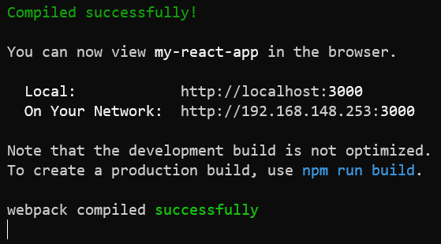
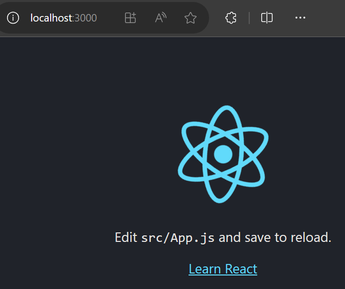
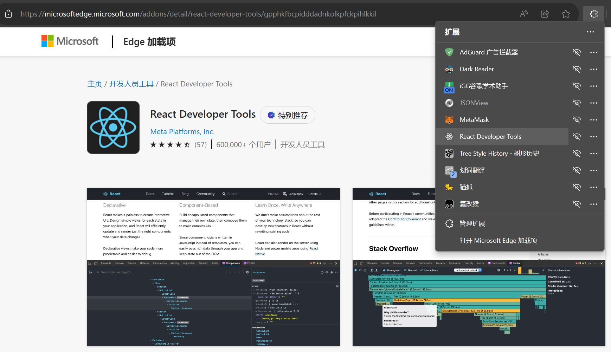

# 教程链接

[官方教程](https://react.nodejs.cn/learn)
[菜鸟教程](https://www.runoob.com/react/react-tutorial.html)
[w3schools教程](https://www.w3schools.cn/react/default.asp)
[大神笔记整理](https://blog.csdn.net/yangaoyuan1999/article/details/117605896)

# React 简介

用于构建用户界面的 JavaScript 库
> React 是一个将**数据**渲染为 **HTML视图** 的开源 JavaScript 库

## React 特点

1. 声明式设计：React 采用声明范式，可以轻松描述应用
2. 高效：React 通过对 DOM 的模拟（虚拟DOM），最大限度地减少与 DOM 的交互（DOM Diffing 算法，最小化页面重绘）
3. 灵活：React 可以与已知的库或框架很好地配合
4. JSX：JSX 是 JavaScript 语法的扩展。React 开发不一定使用 JSX，但我们建议使用它
5. 组件：通过 React 构建组件，使得代码更加容易得到复用，能够很好的应用在大项目的开发中
6. 单向响应的数据流：React 实现了单向响应的数据流，从而减少了重复代码，这也是它为什么比传统数据绑定更简单

# 使用 React

## 1. 直接在 HTML 文件中编写 React

直接使用 Staticfile CDN 的 React CDN 库，地址如下：
```html
<script src="https://cdn.staticfile.org/react/16.4.0/umd/react.development.js"></script>
<script src="https://cdn.staticfile.org/react-dom/16.4.0/umd/react-dom.development.js"></script>
<script src="https://cdn.staticfile.org/babel-standalone/6.26.0/babel.min.js"></script>
```

> 我们引入了三个库：react.development.min.js 、react-dom.development.min.js 、babel.min.js：
> - react.min.js ：React 的核心库
> - react-dom.min.js ：提供与 DOM 相关的功能
> - babel.min.js ：babel 将 jsx代码 转为 js代码

[babel在线编译器](https://babeljs.io/repl)

新建一个 .html 文件，内容如下
```html
<!DOCTYPE html>
<html>
<head>
    <meta charset="UTF-8" />
    <title>Hello React!</title>
    <script src="https://cdn.staticfile.org/react/16.4.0/umd/react.development.js"></script>
    <script src="https://cdn.staticfile.org/react-dom/16.4.0/umd/react-dom.development.js"></script>
    <script src="https://cdn.staticfile.org/babel-standalone/6.26.0/babel.min.js"></script>
</head>
<body>
 
    <div id="example"></div>
    <script type="text/babel">
        ReactDOM.render(
            <h1>Hello, world!</h1>,
            document.getElementById('example')
        );
    </script>
 
</body>
</html>
```
以上代码将一个 h1 标题，插入 id="example" 节点中

在这个html页面中，输出了 Hello, world!


这种使用 React 的方式可以用于测试目的，但不要用于生产

## 2. 通过 npm 使用 React

### 使用 create-react-app 快速构建 React 开发环境

> create-react-app 自动创建的项目是基于 Webpack + ES6

推荐不要用 npm 全局安装 create-react-app，而是用 npx 单次使用 create-react-app
```sh
npx create-react-app my-react-app
```

命令执行完成后，会在当前目录创建名为 my-react-app 的项目目录

#### npm 和 npx 的区别

[npm和npx的区别链接](https://blog.csdn.net/qq_45947664/article/details/127856736)

- npm：会在本地全局性的安装create-react-app，这个包会存储在node目录下面去。以后创建react项目直接执行create-react-app命令就可以了
- npx：会把create-react-app安装包临时安装上，等项目初始化完成以后，他就删除掉

### 运行 React 应用程序

进入项目目录，并使用如下命令运行 React 应用程序
```sh
npm start
```


终端中提示如下图


在浏览器中打开 http://localhost:3000/ ，如下图所示


### 项目目录结构

```sh
my-app/
  README.md
  node_modules/
  package.json
  .gitignore
  public/
    favicon.ico
    index.html
    manifest.json
  src/
    App.css
    App.js
    App.test.js
    index.css
    index.js
    logo.svg

```


# 安装开发者工具 React Developer Tools



## 图标颜色

### 灰色

该网页不是用react写的

### 红色


该网页是用react写的，但是没有打包，还处于开发者模式

### 蓝色


是用react脚手架打包后的网页

## 使用


在浏览器的开发者工具中，Components 可以查看嵌套的组件，Profiler 用来做性能分析


---

# 例子：井字游戏


