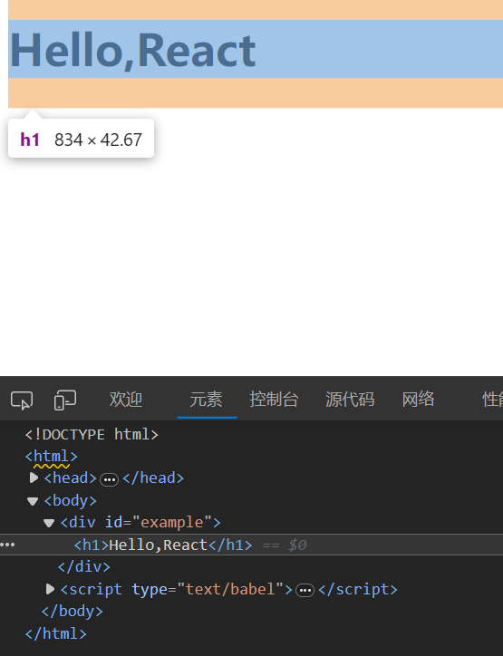
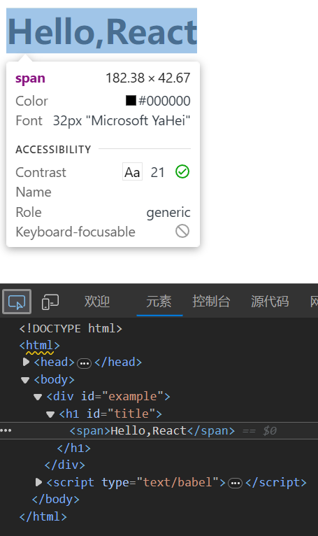
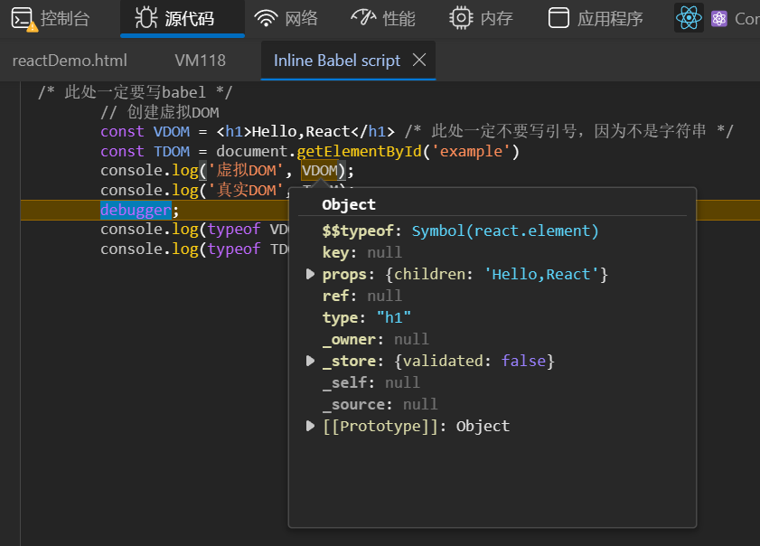
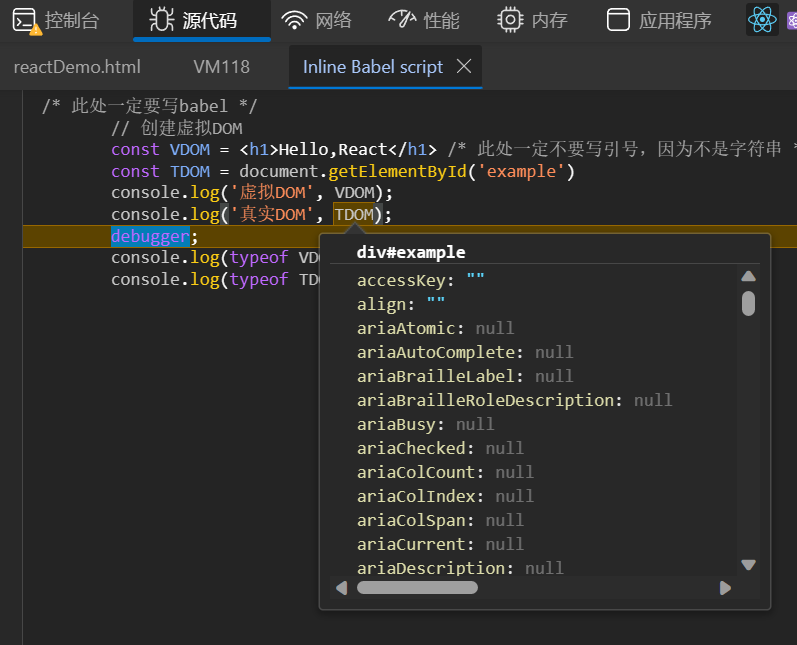

# React 元素渲染

我们使用 直接在 HTML 文件中编写 React 的方法学习，初始的 HTML 文件为：
```html
<!DOCTYPE html>
<html>
<head>
    <meta charset="UTF-8" />
    <title>Hello React!</title>
    <script src="https://cdn.staticfile.org/react/16.4.0/umd/react.development.js"></script>
    <script src="https://cdn.staticfile.org/react-dom/16.4.0/umd/react-dom.development.js"></script>
    <script src="https://cdn.staticfile.org/babel-standalone/6.26.0/babel.min.js"></script>
</head>
<body>

    <script type="text/babel"> /* 此处一定要写babel */
        
    </script>

</body>
</html>
```

## 元素

元素是构成 React 应用的最小单位，它用于描述屏幕上输出的内容
```jsx
const VDOM = <h1>Hello,React</h1>
```

## 将元素渲染到 DOM 中

首先我们在一个 HTML 页面中添加一个 id="example" 的 \<div\>：
```html
<div id="example"></div>
```
在此 div 中的所有内容都将由 React DOM 来管理，所以我们将其称为 根 DOM 节点

要将React元素渲染到根DOM节点中，我们通过把它们都传递给 **ReactDOM.render()** 的方法来将其渲染到页面上：
```jsx
// ReactDOM.render(HTML代码, 一个HTML元素) 
ReactDOM.render(VDOM, document.getElementById('example'));
```

完整的 HTML 文件内容为：
```html
<!DOCTYPE html>
<html>
<head>
    <meta charset="UTF-8" />
    <title>Hello React!</title>
    <script src="https://cdn.staticfile.org/react/16.4.0/umd/react.development.js"></script>
    <script src="https://cdn.staticfile.org/react-dom/16.4.0/umd/react-dom.development.js"></script>
    <script src="https://cdn.staticfile.org/babel-standalone/6.26.0/babel.min.js"></script>
</head>
<body>

    <div id="example"></div>
    <script type="text/babel"> /* 此处一定要写babel */
        // 创建虚拟DOM
        const VDOM = <h1>Hello,React</h1> /* 此处一定不要写引号，因为不是字符串 */
        // 渲染虚拟DOM到页面
        ReactDOM.render(VDOM, document.getElementById('example'));
    </script>

</body>
</html>
```

效果如下


## 更新元素渲染

React 元素都是不可变的。当元素被创建之后，你是无法改变其内容或属性的
目前更新界面的唯一办法是创建一个新的元素，然后将它传入 ReactDOM.render() 方法

完整的 HTML 文件内容为：
```html
<!DOCTYPE html>
<html>
<head>
    <meta charset="UTF-8" />
    <title>Hello React!</title>
    <script src="https://cdn.staticfile.org/react/16.4.0/umd/react.development.js"></script>
    <script src="https://cdn.staticfile.org/react-dom/16.4.0/umd/react-dom.development.js"></script>
    <script src="https://cdn.staticfile.org/babel-standalone/6.26.0/babel.min.js"></script>
</head>
<body>

    <div id="example"></div>
    <script type="text/babel"> /* 此处一定要写babel */
        // 创建虚拟DOM
        const VDOM = <h1>Hello,React</h1> /* 此处一定不要写引号，因为不是字符串 */
        const VDOM2 = <h1>Bye,React</h1>
        // 渲染虚拟DOM到页面
        ReactDOM.render(VDOM, document.getElementById('example'));
        ReactDOM.render(VDOM2, document.getElementById('example'));
    </script>

</body>
</html>
```
注意这里的 ReactDOM.render() 是替换的动作，而不是追加的动作
页面中只会显示后渲染的 Bye,React

# React JSX

- JSX 的全称为 JavaScript XML
- JSX 允许我们在 React 中编写 HTML
- JSX 使在 React 中编写和添加 HTML 变得更加容易

## jsx 相较于 js 的优势

jsx 允许我们在 JavaScript 中编写 HTML 元素并将它们放置在 DOM 中，而无需任何 createElement() 或 appendChild() 方法（如果多个标签嵌套，jsx的写法与js相比更简洁）

### 使用 jsx 创建虚拟DOM

和上面的代码类似

```html
<!DOCTYPE html>
<html>
<head>
    <meta charset="UTF-8" />
    <title>Hello React!</title>
    <script src="https://cdn.staticfile.org/react/16.4.0/umd/react.development.js"></script>
    <script src="https://cdn.staticfile.org/react-dom/16.4.0/umd/react-dom.development.js"></script>
    <script src="https://cdn.staticfile.org/babel-standalone/6.26.0/babel.min.js"></script>
</head>
<body>

    <div id="example"></div>
    <script type="text/babel"> /* 此处写babel */
        const VDOM = (
            <h1 id="title">
                <span>Hello,React</span>
            </h1>
        )
        ReactDOM.render(VDOM, document.getElementById('example'));
    </script>

</body>
</html>
```

效果如下


### 使用 js 创建虚拟DOM

React.createElement(标签名, 标签属性, 标签内容)
React.createElement(component,props,…children)

```html
<!DOCTYPE html>
<html>
<head>
    <meta charset="UTF-8" />
    <title>Hello React!</title>
    <script src="https://cdn.staticfile.org/react/16.4.0/umd/react.development.js"></script>
    <script src="https://cdn.staticfile.org/react-dom/16.4.0/umd/react-dom.development.js"></script>
    <!-- 不需要babel，因为不需要将 jsx 转为 js -->
</head>
<body>

    <div id="example"></div>
    <script type="text/javascript"> /* 此处写javascript */
        // const VDOM = (
        //     <h1 id="title">
        //         <span>Hello,React</span>
        //     </h1>
        // )
        const VDOM = React.createElement('h1', {id:'title'}, 
                        React.createElement('span', {}, 'Hello,React')
                     )
        ReactDOM.render(VDOM, document.getElementById('example'));
    </script>

</body>
</html>
```
这种方式实现起来更复杂

效果同上

### 总结

jsx 创建虚拟DOM的写法：
```jsx
        const VDOM = (
            <h1 id="title">
                <span>Hello,React</span>
            </h1>
        )
```
是 js 创建虚拟DOM的写法：
```js
        const VDOM = React.createElement('h1', {id:'title'}, 
                        React.createElement('span', {}, 'Hello,React')
                     )
```
的**语法糖**

## jsx 语法

1. 定义虚拟dom时，不要写引号
2. 标签中混入js**表达式**时要用{}
表达式与js语句的区别：
    1. 表达式：会产生一个值，可以放在任何需要值的地方
        ① a    //一个变量
        ② a+b   //一个算数表达式
        ③ demo(1)   //函数调用得到确认的值
        ④ arr.map()   //map函数获得一个新数组
        ⑤ function test() {}   //函数
    2. 语句：
        ① if(){}
        ② else{}
        ③ for(){}
        ④ switch(){}
3. 样式的类名指定不要用 class，要用 className
4. 内联样式，要用 style={{key:value}} 的形式去写，外层花括号，表示js的代码，内层花括号表示是一个对象
5. 虚拟dom只能有一个根标签
6. 标签必须闭合
7. 标签首字母：
    ① 若**小写**字母开头，则将该标签转为html同名元素，若HTML中无该标签对应的同名元素，则报错
    ② 若**大写**字母开头，react就去渲染对应的组件，若组件没有定义，则报错

```html
<!DOCTYPE html>
<html>
<head>
    <meta charset="UTF-8" />
    <title>Hello React!</title>
    <style>
        .title{
            background-color: orange;
            width: 200px;
        }
    </style>
    <script src="https://cdn.staticfile.org/react/16.4.0/umd/react.development.js"></script>
    <script src="https://cdn.staticfile.org/react-dom/16.4.0/umd/react-dom.development.js"></script>
    <script src="https://cdn.staticfile.org/babel-standalone/6.26.0/babel.min.js"></script>
</head>
<body>

    <div id="example"></div>
    <script type="text/babel"> /* 此处一定要写babel */
        const myId = 'bigBIRD'
        const myData = 'SMALLchick'
        // 创建虚拟DOM
        const VDOM = (
            <div>
                <h2 className="title" id={myId.toLowerCase()}>
                    <span style={{color:'white',fontSize:'30px'}}>{myData.toLowerCase()}</span>
                </h2>
                <h2 className="title" id={myId.toLowerCase()+'2'}>
                    <span style={{color:'white',fontSize:'30px'}}>{myData.toLowerCase()}</span>
                </h2>
                <input type="text"/>
            </div>
        )
        // 渲染虚拟DOM到页面
        ReactDOM.render(VDOM, document.getElementById('example'))
    </script>

</body>
</html>
```

## 动态展示数据

```html
<!DOCTYPE html>
<html>
<head>
    <meta charset="UTF-8" />
    <title>Hello React!</title>
    <script src="https://cdn.staticfile.org/react/16.4.0/umd/react.development.js"></script>
    <script src="https://cdn.staticfile.org/react-dom/16.4.0/umd/react-dom.development.js"></script>
    <script src="https://cdn.staticfile.org/babel-standalone/6.26.0/babel.min.js"></script>
</head>
<body>

    <div id="example"></div>
    <script type="text/babel">
        // 模拟一些数据
        const data = ['Angular', 'React', 'Vue']
        // 创建虚拟DOM
        const VDOM = (
            <div>
                <h1>前端js框架列表</h1>
                <ul>
                    {
                        data.map((item,index)=>{
                            return <li key={index}>{item}</li>
                        })
                    }
                </ul>
            </div>
        )
        // 渲染虚拟DOM到页面
        ReactDOM.render(VDOM, document.getElementById('example'))
    </script>

</body>
</html>
```

# 虚拟DOM 与 真实DOM

分别输出 虚拟DOM 与 真实DOM，并打断点，看他们的属性差别

```html
<!DOCTYPE html>
<html>
<head>
    <meta charset="UTF-8" />
    <title>Hello React!</title>
    <script src="https://cdn.staticfile.org/react/16.4.0/umd/react.development.js"></script>
    <script src="https://cdn.staticfile.org/react-dom/16.4.0/umd/react-dom.development.js"></script>
    <script src="https://cdn.staticfile.org/babel-standalone/6.26.0/babel.min.js"></script>
</head>
<body>

    <div id="example"></div>
    <script type="text/babel"> /* 此处一定要写babel */
        // 创建虚拟DOM
        const VDOM = <h1>Hello,React</h1> /* 此处一定不要写引号，因为不是字符串 */
        const TDOM = document.getElementById('example')
        console.log('虚拟DOM', VDOM);
        console.log('真实DOM', TDOM);
        debugger;
        console.log(typeof VDOM);
        console.log(typeof TDOM);
    </script>

</body>
</html>
```

效果如下



## 总结

1. 虚拟DOM 就是一个普通的object对象（一般对象）
2. 虚拟DOM 比较"轻"，真实DOM 比较"重"，因为 虚拟DOM 在React内部使用，无需 真实DOM 的那么多属性
3. 虚拟DOM 最终会被react转化为 真实DOM，呈现在页面上


