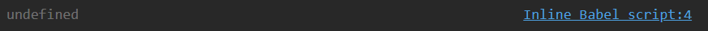
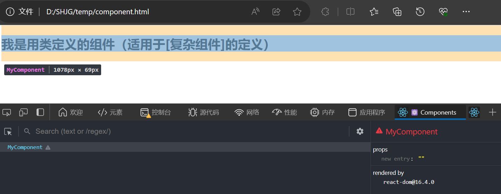

# React 组件

## 模块与组件简介

### 模块（js模块）

理解：向外提供特定功能的js程序，一般就是一个js文件
为什么要拆成模块（只拆js）：随着业务逻辑增加，代码越来越复杂
作用：复用js，简化js的编写，提高js运行效率

#### 模块化

当应用的js都是以模块来编写的，这个应用就是一个模块化应用

### 组件

理解：用来实现局部功能效果的代码和资源的集合（html、css、js、img、video、font等等）
为什么要拆成组件（都拆）：页面的功能更复杂
作用：复用编码，简化项目编码，提高运行效率

#### 组件化

当应用是以多组件的方式实现，这个应用就是一个组件化应用

## 函数式组件（Function Component）

```html
<!DOCTYPE html>
<html>
<head>
    <meta charset="UTF-8" />
    <title>React component</title>
    <script src="https://cdn.staticfile.org/react/16.4.0/umd/react.development.js"></script>
    <script src="https://cdn.staticfile.org/react-dom/16.4.0/umd/react-dom.development.js"></script>
    <script src="https://cdn.staticfile.org/babel-standalone/6.26.0/babel.min.js"></script>
</head>
<body>

    <div id="example"></div>
    <script type="text/babel">
        // 创建函数式组件
        function MyComponent() {
            console.log(this);  // 输出为undefined，因为在函数组件中写的是jsx语法, jsx语法要经过babel.js编译成js语法，而babel开启了严格模式
            return <h2>我是用函数定义的组件（适用于[简单组件]的定义）</h2>
        }
        // 渲染组件到页面
        ReactDOM.render(<MyComponent/>,document.getElementById('example'))
        // 执行ReactDOM.render(<MyComponent/>,document.getElementById('example')) 之后：
        // 1.React解析组件标签，找到了MyComponent组件
        // 2.发现组件是使用函数定义的，随后调用该函数
        // 3.将返回的虚拟DOM转为真实DOM，随后呈现在页面中
    </script>

</body>
</html>
```

注意，原生 HTML 元素名以小写字母开头，而自定义的 React 函数名以**大写**字母开头，比如 MyComponent 不能写成 myComponent，函数必须要有**返回值**，返回值就是VDOM

只要在 ReactDOM.render() 函数的参数中写好**组件标签** \<MyComponent/\>，React发现这个组件是使用函数定义的，会由React调用这个**函数**

效果如下


console.log(this) 的输出为


## 类式组件（Class Component）

```html
<!DOCTYPE html>
<html>
<head>
    <meta charset="UTF-8" />
    <title>React component</title>
    <script src="https://cdn.staticfile.org/react/16.4.0/umd/react.development.js"></script>
    <script src="https://cdn.staticfile.org/react-dom/16.4.0/umd/react-dom.development.js"></script>
    <script src="https://cdn.staticfile.org/babel-standalone/6.26.0/babel.min.js"></script>
</head>
<body>

    <div id="example"></div>
    <script type="text/babel">
        // 创建类式组件
        class MyComponent extends React.Component {
            render() {
                // render是放在哪里的？MyComponent的原型对象上，供实例使用，可是实例在哪里？
                // render中的this是谁？MyComponent的实例对象, 也称为 MyComponent组件实例对象
                console.log('render()中的this:',this);
                return <h2>我是用类定义的组件（适用于[复杂组件]的定义）</h2>
            }
        }
        // 渲染组件到页面
        ReactDOM.render(<MyComponent/>,document.getElementById('example'))
        // 执行ReactDOM.render(<MyComponent/>,document.getElementById('test')) 之后
        // 1.React解析组件标签，找到了MyComponent组件
        // 2.发现组件是使用类定义的，随后new出来该类的实例
        // 并通过该实例调用到原型上的render()方法
        // 3.将render()返回的虚拟DOM转为真实DOM，随后呈现在页面中
    </script>

</body>
</html>
```

注意，自定义的 React 类名以**大写**字母开头，必须**继承** React.Component 这个父类，必须写 render() **方法**，且这个方法要有**返回值**，返回值就是VDOM

只要在 ReactDOM.render() 函数的参数中写好**组件标签** \<MyComponent/\>，React发现这个组件是使用**类**定义的，会由React创建出这个类的**实例**，并调用该实例的render()**方法**

效果如下


console.log('render()中的this:',this) 的输出为


## 复杂组件 和 简单组件

有 state 的组件是复杂组件，无 state 的组件是简单组件

> 类比：
> 人--状态--影响--行为
> 组件--状态--驱动--页面
> 我们的数据放在放在组件的 state 里边，状态改变驱动虚拟DOM该变，从而驱动页面的改变

- **函数式组件**也叫做**无状态组件**，因为函数式组件中的 this 指向 **undefined**
- **类式组件**也叫做**有状态组件**，因为定义类组件需要继承 React.Component 父类组件，类式组件中必须要有 render() 函数，render() 函数必须要有返回值，返回值就是VDOM。但是在类式组件中的 this 指向 **类式组件创建的实例对象**。在这个实例对象中，有 state 属性、props 属性、refs 属性

### 新版React中的 hooks

通过 hooks，也能让函数式组件拥有 state 属性、props 属性、refs 属性 这三大属性

## 组件实例的三大属性

分别为 state 属性、props 属性、refs 属性

### 状态 state

注意 state 是在 **组件实例对象** 身上，而不是在 组件类 身上


### props


### refs 与 事件处理


---
P13


剩P10  js 类的知识


