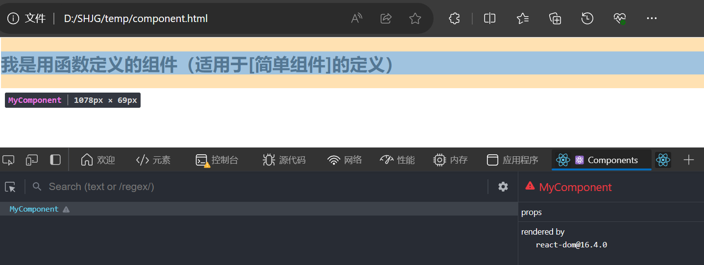

# React 组件

## 模块与组件简介

### 模块（js模块）

理解：向外提供特定功能的js程序，一般就是一个js文件
为什么要拆成模块（只拆js）：随着业务逻辑增加，代码越来越复杂
作用：复用js，简化js的编写，提高js运行效率

#### 模块化

当应用的js都是以模块来编写的，这个应用就是一个模块化应用

### 组件

理解：用来实现局部功能效果的代码和资源的集合（html、css、js、img、video、font等等）
为什么要拆成组件（都拆）：页面的功能更复杂
作用：复用编码，简化项目编码，提高运行效率

#### 组件化

当应用是以多组件的方式实现，这个应用就是一个组件化应用

## 函数式组件（Function Component）

```html
<!DOCTYPE html>
<html>
<head>
    <meta charset="UTF-8" />
    <title>React component</title>
    <script src="https://cdn.staticfile.org/react/16.4.0/umd/react.development.js"></script>
    <script src="https://cdn.staticfile.org/react-dom/16.4.0/umd/react-dom.development.js"></script>
    <script src="https://cdn.staticfile.org/babel-standalone/6.26.0/babel.min.js"></script>
</head>
<body>

    <div id="example"></div>
    <script type="text/babel">
        // 创建函数式组件
        function MyComponent(){
            console.log(this);  // 输出为undefined，因为babel开启了严格模式
            return <h2>我是用函数定义的组件（适用于[简单组件]的定义）</h2>
        }
        // 渲染组件到页面
        ReactDOM.render(<MyComponent/>,document.getElementById('example'))
        // 执行ReactDOM.render(<MyComponent/>,document.getElementById('example')) 之后：
        // 1.React解析组件标签，找到了MyComponent组件
        // 2.发现组件是使用函数定义的，随后调用该函数
        // 将返回的虚拟DOM转为真实DOM，随后呈现在页面中
    </script>

</body>
</html>
```

注意，原生 HTML 元素名以小写字母开头，而自定义的 React 函数名以**大写**字母开头，比如 MyComponent 不能写成 myComponent，函数必须要有返回值

只要在 ReactDOM.render() 函数的参数中写好组件标签 \<MyComponent/\>，会由React调用这个函数

效果如下


## 类式组件（Class Component）


---
p8


