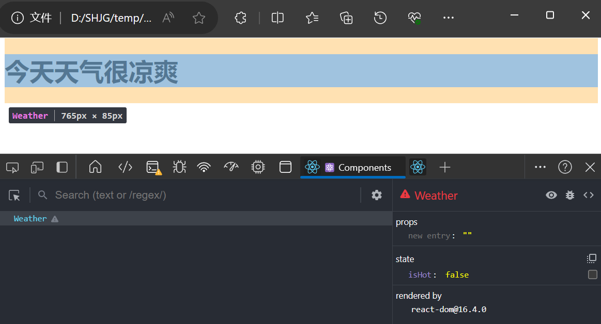

# 组件实例的三大属性

分别为 state 属性、props 属性、refs 属性

## 状态 state

注意 state 是在 **组件实例对象** 身上，而不是在 组件类 身上


```html
<!DOCTYPE html>
<html>
<head>
    <meta charset="UTF-8" />
    <title>state</title>
    <script src="https://cdn.staticfile.org/react/16.4.0/umd/react.development.js"></script>
    <script src="https://cdn.staticfile.org/react-dom/16.4.0/umd/react-dom.development.js"></script>
    <script src="https://cdn.staticfile.org/babel-standalone/6.26.0/babel.min.js"></script>
</head>
<body>

    <div id="example"></div>
    <script type="text/babel">
        // 创建组件
        class Weather extends React.Component{
            // 构造器
            constructor(props){
                super(props)
                // 初始化 state
                this.state = {isHot:false}
            }
            render(){
                // 读取 state
                const {isHot} = this.state
                return <h1>今天天气很{isHot ? '炎热' : '凉爽'}</h1>
            }
        }
        // 渲染组件到页面
        ReactDOM.render(<Weather/>,document.getElementById('example'))
    </script>

</body>
</html>
```

效果如下


### 事件绑定


## props


## refs 与 事件处理


---
P13


P14  原生绑定事件
P14


