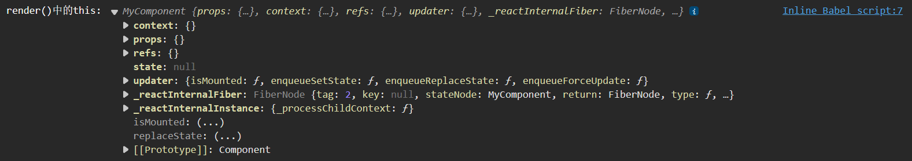

# 组件实例的三大属性

分别为 state 属性、props 属性、refs 属性

# 状态 state

注意 state 是在 **组件实例对象** 身上，而不是在 组件类 身上



## 创建和读取 state

```html
<!DOCTYPE html>
<html>
<head>
    <meta charset="UTF-8" />
    <title>state</title>
    <script src="https://cdn.staticfile.org/react/16.4.0/umd/react.development.js"></script>
    <script src="https://cdn.staticfile.org/react-dom/16.4.0/umd/react-dom.development.js"></script>
    <script src="https://cdn.staticfile.org/babel-standalone/6.26.0/babel.min.js"></script>
</head>
<body>

    <div id="example"></div>
    <script type="text/babel">
        // 创建组件
        class Weather extends React.Component{
            // 构造器
            constructor(props){
                super(props)
                // 初始化 state
                this.state = {isHot:false}
            }
            render(){
                // 读取 state
                const {isHot} = this.state
                return <h1>今天天气很{isHot ? '炎热' : '凉爽'}</h1>
            }
        }
        // 渲染组件到页面
        ReactDOM.render(<Weather/>,document.getElementById('example'))
    </script>

</body>
</html>
```

效果如下


## 事件绑定

上面例子中的 state 是写死的，下面我们想要动态地修改 state

### 原生js的事件绑定的复习

```html
<!DOCTYPE html>
<html>
<head>
    <meta charset="UTF-8" />
    <title>事件绑定</title>
    <script src="https://cdn.staticfile.org/react/16.4.0/umd/react.development.js"></script>
    <script src="https://cdn.staticfile.org/react-dom/16.4.0/umd/react-dom.development.js"></script>
    <script src="https://cdn.staticfile.org/babel-standalone/6.26.0/babel.min.js"></script>
</head>
<body>

    <button id="btn1">按钮1</button>
    <button id="btn2">按钮2</button>
    <button onClick="demo()">按钮3</button>
    <script type="text/javascript">
        // 第一种方法
        const btn1 = document.getElementById('btn1')
        btn1.addEventListener('click',()=>{
            alert('按钮1被点击')
        })
        // 第二种方法
        const btn2 = document.getElementById('btn2')
        btn2.onclick = ()=>{
            alert('按钮2被点击')
        }
        //第三种方法（推荐）
        function demo(){
            alert('按钮3被点击')
        }
    </script>

</body>
</html>
```

### react中的事件绑定

```html
<!DOCTYPE html>
<html>
<head>
    <meta charset="UTF-8" />
    <title>state</title>
    <script src="https://cdn.staticfile.org/react/16.4.0/umd/react.development.js"></script>
    <script src="https://cdn.staticfile.org/react-dom/16.4.0/umd/react-dom.development.js"></script>
    <script src="https://cdn.staticfile.org/babel-standalone/6.26.0/babel.min.js"></script>
</head>
<body>

    <div id="example"></div>
    <script type="text/babel">
        class Weather extends React.Component{
            constructor(props){
                super(props)
                this.state = {isHot:false}
            }
            render(){
                const {isHot} = this.state
                // onClick={demo()} 是错的，因为 {demo()} 是函数调用表达式，作用是把函数的返回值交给 onClick 作为回调
                // return <h1 id="title" onClick={demo()}>今天天气很{isHot ? '炎热' : '凉爽'}</h1>
                // onClick={demo} 是对的，只是指定好了 demo 这个函数，回头react帮你调用
                return <h1 id="title" onClick={demo}>今天天气很{isHot ? '炎热' : '凉爽'}</h1>
            }
        }
        ReactDOM.render(<Weather/>,document.getElementById('example'))

        // 第一种方法（不推荐）
        const title = document.getElementById('title')
        title.addEventListener('click',()=>{
            console.log('标题被点击了')
        })
        // 第二种方法（不推荐）
        const title2 = document.getElementById('title')
        title2.onclick = ()=>{
            console.log('标题被点击了')
        }
        // 第三种方法（推荐）
        function demo(){
            console.log('标题被点击了')
        }
    </script>

</body>
</html>
```

## 类中方法中的 this（难点）

### 想在函数中拿到 this.state

```html
<!DOCTYPE html>
<html>
<head>
    <meta charset="UTF-8" />
    <title>state</title>
    <script src="https://cdn.staticfile.org/react/16.4.0/umd/react.development.js"></script>
    <script src="https://cdn.staticfile.org/react-dom/16.4.0/umd/react-dom.development.js"></script>
    <script src="https://cdn.staticfile.org/babel-standalone/6.26.0/babel.min.js"></script>
</head>
<body>

    <div id="example"></div>
    <script type="text/babel">
        class Weather extends React.Component{
            constructor(props){
                super(props)
                this.state = {isHot:false}
            }
            render(){
                const {isHot} = this.state
                return <h1 onClick={changeWeather}>今天天气很{isHot ? '炎热' : '凉爽'}</h1>
            }
        }
        ReactDOM.render(<Weather/>,document.getElementById('example'))

        function changeWeather(){
            // 此处想要修改 isHot
            // 这里拿不到 this，会报错
            const {isHot} = this.state
            console.log(isHot)
        }
    </script>

</body>
</html>
```

报错


前面说过，因为babel在翻译代码的时候开启严格模式，禁止自定义的函数中的 this 指向 Window

那怎样在 demo() 函数中，修改 isHot

### 笨方法：把this交到类的外侧（不推荐）

```html
<!DOCTYPE html>
<html>
<head>
    <meta charset="UTF-8" />
    <title>state</title>
    <script src="https://cdn.staticfile.org/react/16.4.0/umd/react.development.js"></script>
    <script src="https://cdn.staticfile.org/react-dom/16.4.0/umd/react-dom.development.js"></script>
    <script src="https://cdn.staticfile.org/babel-standalone/6.26.0/babel.min.js"></script>
</head>
<body>

    <div id="example"></div>
    <script type="text/babel">
        // 在外侧定义变量
        let that
        class Weather extends React.Component{
            constructor(props){
                super(props)
                this.state = {isHot:false}
                // 把 this 交到类的外侧
                that = this
            }
            render(){
                const {isHot} = this.state
                return <h1 onClick={changeWeather}>今天天气很{isHot ? '炎热' : '凉爽'}</h1>
            }
        }
        ReactDOM.render(<Weather/>,document.getElementById('example'))

        function changeWeather(){
            // 此处想要修改 isHot
            const {isHot} = that.state
            console.log(isHot)
        }
    </script>

</body>
</html>
```

这样在 changeWeather() 函数中，就可以通过 that 拿到 Weather 对象，从而拿到 isHot

### 改进：把changeWeather()方法放入类中

```html
<!DOCTYPE html>
<html>
<head>
    <meta charset="UTF-8" />
    <title>state</title>
    <script src="https://cdn.staticfile.org/react/16.4.0/umd/react.development.js"></script>
    <script src="https://cdn.staticfile.org/react-dom/16.4.0/umd/react-dom.development.js"></script>
    <script src="https://cdn.staticfile.org/babel-standalone/6.26.0/babel.min.js"></script>
</head>
<body>

    <div id="example"></div>
    <script type="text/babel">
        class Weather extends React.Component{
            constructor(props){
                super(props)
                this.state = {isHot:false}
            }
            render(){
                const {isHot} = this.state
                // return <h1 onClick={changeWeather}>今天天气很{isHot ? '炎热' : '凉爽'}</h1>
                // {changeWeather} 是错的，因为是直接调用，调用不到
                // {this.changeWeather} 是对的，才能调用这个类的 changeWeather 方法
                return <h1 onClick={this.changeWeather}>今天天气很{isHot ? '炎热' : '凉爽'}</h1>
            }
            // changeWeather()方法放在了哪里？放在类的原型对象上，供实例使用
            // 通过Weather实例调用changeWeather()时，changeWeather()中的this就是Weather实例
            changeWeather(){
                // 此处想要修改 isHot
                const {isHot} = this.state
                console.log(isHot)
            }
        }
        ReactDOM.render(<Weather/>,document.getElementById('example'))
    </script>

</body>
</html>
```

报错


在 changeWeather() 函数中，this 又是 undefined，这里是难点

同样是在 Weather 中：
1. 构造器**constructor()** 中的 this 是 **Weather实例对象**
2. **render()** 中的 this 是 **Weather实例对象**
3. **changeWeather()** 中的 this 是 **undefined**

凭什么瞧不起 changeWeather()

**只有通过 Weather实例对象 去调用** changeWeather() 的时候，changeWeather() 中的 this 才是Weather实例对象

render() 和 构造器constructor() 都是通过 Weather实例对象 调用的，而 changeWeather() **不是通过 Weather实例对象 调用的**

凭什么 changeWeather() 不是通过 Weather实例对象 调用的

#### 原生js的类中的方法的this指向的复习

```html
<!DOCTYPE html>
<html>
<head>
    <meta charset="UTF-8" />
    <title>类中的方法的this指向</title>
    <script src="https://cdn.staticfile.org/react/16.4.0/umd/react.development.js"></script>
    <script src="https://cdn.staticfile.org/react-dom/16.4.0/umd/react-dom.development.js"></script>
    <script src="https://cdn.staticfile.org/babel-standalone/6.26.0/babel.min.js"></script>
</head>
<body>

    <script type="text/javascript">
        class Person {
            constructor(name,age){
                this.name = name
                this.age = age
            }
            speak(){
                // speak()方法放在了哪里？放在类的原型对象上，供实例使用
                // 通过Person实例调用speak()时，speak()中的this就是Person实例
                console.log(this)
            }
        }
        const p1 = new Person('tom',18)
        // 通过实例调用speak()方法
        // p1 自身没有speak()方法，是通过原型链找到的
        p1.speak()
        // 把 p1 的 speak 方法交给x
        const x = p1.speak
        // 直接调用
        x()
    </script>

</body>
</html>
```

效果如下


函数的直接调用为什么是 undefined，而不是 Window
**类中所有你定义的方法，都在局部开启了严格模式（类帮你自动开的，和babel没关系）**

通过以下例子来验证
```html
<!DOCTYPE html>
<html>
<head>
    <meta charset="UTF-8" />
    <title>类中的方法的this指向</title>
    <script src="https://cdn.staticfile.org/react/16.4.0/umd/react.development.js"></script>
    <script src="https://cdn.staticfile.org/react-dom/16.4.0/umd/react-dom.development.js"></script>
    <script src="https://cdn.staticfile.org/babel-standalone/6.26.0/babel.min.js"></script>
</head>
<body>

    <script type="text/javascript">
        function demo(){
            console.log(this)
        }
        demo()

        function demo2(){
            'use strict'
            console.log(this)
        }
        demo2()
    </script>

</body>
</html>
```

效果如下


#### changeWeather方法的调用方式

回头再看调用 changeWeather 函数的方式

onClick={this.changeWeather} **没有调用** changeWeather 函数，只是通过类的实例对象，沿着原型链查找到 changeWeather 函数，然后直接交给 onClick **作为回调**

等到点击 h1 的时候，react 直接从堆中把 changeWeather 函数拿出并执行，**不是通过Weather实例调用**

```html
<!DOCTYPE html>
<html>
<head>
    <meta charset="UTF-8" />
    <title>state</title>
    <script src="https://cdn.staticfile.org/react/16.4.0/umd/react.development.js"></script>
    <script src="https://cdn.staticfile.org/react-dom/16.4.0/umd/react-dom.development.js"></script>
    <script src="https://cdn.staticfile.org/babel-standalone/6.26.0/babel.min.js"></script>
</head>
<body>

    <div id="example"></div>
    <script type="text/babel">
        class Weather extends React.Component{
            constructor(props){
                super(props)
                this.state = {isHot:false}
            }
            render(){
                const {isHot} = this.state
                return <h1 onClick={this.changeWeather}>今天天气很{isHot ? '炎热' : '凉爽'}</h1>
            }
            // 由于 changeWeather 是作为 onClick 的回调，所以不是通过实例调用的，是直接调用
            // 类中的方法默认开启了局部的严格模式，所以 changeWeather 中的 this 为 undefined
            changeWeather(){
                console.log(this)
            }
        }
        ReactDOM.render(<Weather/>,document.getElementById('example'))
    </script>

</body>
</html>
```

效果如下


### 解决类中的 this 指向问题


---
P16


