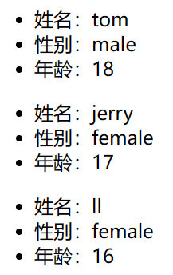

# 标签属性 props

props 是**只读**的
注意 props 是在 **组件实例对象** 身上

想从 **组件外部** 向 **组件内部** **传递**数据
而 state 都是组件自己家里的事

## 创建和读取 props

已知，**html标签**本身就可以写多个 key:value 组合
**组件标签**也可以，react会自动帮我们把多个 key:value 组合收集到 props 中

```html
<!DOCTYPE html>
<html>
<head>
    <meta charset="UTF-8" />
    <title>props</title>
    <script src="https://cdn.staticfile.org/react/16.4.0/umd/react.development.js"></script>
    <script src="https://cdn.staticfile.org/react-dom/16.4.0/umd/react-dom.development.js"></script>
    <script src="https://cdn.staticfile.org/babel-standalone/6.26.0/babel.min.js"></script>
</head>
<body>

    <div id="example"></div>
    <div id="example2"></div>
    <div id="example3"></div>
    <script type="text/babel">
        class Person extends React.Component{
            render(){
                console.log(this)
                // 解构赋值
                const {name,age,sex} = this.props
                // props 是只读的
                // 下面这行代码会报错
                // this.props.name = 'jack'
                return (
                    <ul>
                        <li>姓名：{name}</li>
                        <li>性别：{sex}</li>
                        <li>年龄：{age}</li>
                    </ul>
                )
            }
        }
        ReactDOM.render(<Person name="tom" age="18" sex="male"/>,document.getElementById('example'))
        ReactDOM.render(<Person name="jerry" age="17" sex="female"/>,document.getElementById('example2'))
        ReactDOM.render(<Person name="ll" age="16" sex="female"/>,document.getElementById('example3'))
    </script>

</body>
</html>
```

html页面效果如下


打印的三个Person实例对象如下


## 批量传递 props

上面例子中的问题：
1. 如果传递更多信息怎么办，代码 **\<Person name="tom" age="18" sex="male"/\>** 将会很长
2. 真实的项目开发中，信息是服务器返回的，难道要**手动解析**每一对 key:value

解决方法：
使用 **展开运算符**

```html
<!DOCTYPE html>
<html>
<head>
    <meta charset="UTF-8" />
    <title>props</title>
    <script src="https://cdn.staticfile.org/react/16.4.0/umd/react.development.js"></script>
    <script src="https://cdn.staticfile.org/react-dom/16.4.0/umd/react-dom.development.js"></script>
    <script src="https://cdn.staticfile.org/babel-standalone/6.26.0/babel.min.js"></script>
</head>
<body>

    <div id="example"></div>
    <div id="example2"></div>
    <div id="example3"></div>
    <script type="text/babel">
        class Person extends React.Component{
            render(){
                console.log(this)
                // 解构赋值
                const {name,age,sex} = this.props
                return (
                    <ul>
                        <li>姓名：{name}</li>
                        <li>性别：{sex}</li>
                        <li>年龄：{age}</li>
                    </ul>
                )
            }
        }
        ReactDOM.render(<Person name="tom" age="18" sex="male"/>,document.getElementById('example'))
        ReactDOM.render(<Person name="jerry" age="17" sex="female"/>,document.getElementById('example2'))
        // ReactDOM.render(<Person name="ll" age="16" sex="female"/>,document.getElementById('example3'))
        // 模拟服务器返回的信息
        const p = {name:'ll',age:'16',sex:'female'}
        // 批量传递props的方式
        ReactDOM.render(<Person {...p}/>,document.getElementById('example3'))

    </script>

</body>
</html>
```

效果不变

其实 **\<Person {...p}/\>** 就是 **\<Person name="jerry" age="17" sex="female"/\>** 的语法糖

### 原生js中展开运算符（三点运算符）的复习

[js开发者文档](https://developer.mozilla.org/zh-CN/docs/Web/JavaScript)

```html
<!DOCTYPE html>
<html>
<head>
    <meta charset="UTF-8" />
    <title>展开运算符</title>
    <script src="https://cdn.staticfile.org/react/16.4.0/umd/react.development.js"></script>
    <script src="https://cdn.staticfile.org/react-dom/16.4.0/umd/react-dom.development.js"></script>
    <script src="https://cdn.staticfile.org/babel-standalone/6.26.0/babel.min.js"></script>
</head>
<body>

    <script type="text/javascript">
        let arr1 = [1,3,5,7,9]
        let arr2 = [2,4,6,8,10]
        // 展开数组
        console.log(...arr1)
        // 拼接数组
        let arr3 = [...arr1,...arr2]
        // 函数传参（不确定有几个参数）
        function sum(...numbers){
            return numbers.reduce( (preValue,currentValue)=>{
                return preValue + currentValue
            } )
        }
        console.log(sum(...arr1))

        // 构造字面量对象
        let person = {name:'tom',age:18}
        // 不能展开一个对象（语法错误）
        // console.log(...person)
        // 不是复制对象，只是引用关系的传递
        let person2 = person
        // 复制对象，直接用...想展开对象是不行的，但是如果外面包了{}，代表复制对象（语法正确）
        let person3 = {...person}
        person.name = 'changename'
        console.log(person3)
        console.log(person2)

        // 复制对象的同时，修改其属性（不是替换，是合并）
        let person4 = {...person,age:25,address:'suzhou'}
        console.log(person4)
    </script>

</body>
</html>
```

效果如下


### 用 \{...p\} 展开对象

在上面 **原生js** 的例子中，\{...p\} 可以复制对象
但是在 **react** 中，\{...p\} 不是复制对象
> **react** 中的 \{...p\} 的**花括号**，表达的意思和 **原生js** 中 \{...p\} 的**花括号** 不同
> **原生js** 中的 \{...p\} 是提前定义好的语法结构
> **react** 中的 \{\} 表示花括号中要写js表达式

所以 react 中的 \{...p\}，我们真正写的js只是 **...p**，但是这里的 ... 为什么能**展开对象**？
react + babel 就可以允许用 ... 展开对象，但也仅适用于 props 的传递

## 对 props 进行限制

想对组件标签属性进行限制

### 使用 prop-types 全局引入 PropTypes

[prop-types官网](https://www.npmjs.com/package/prop-types)

在head标签中添加如下行
```html
<script src="https://unpkg.com/prop-types@15.6/prop-types.js"></script>
```

### 使用 PropTypes

```html
<!DOCTYPE html>
<html>
<head>
    <meta charset="UTF-8" />
    <title>props</title>
    <script src="https://cdn.staticfile.org/react/16.4.0/umd/react.development.js"></script>
    <script src="https://cdn.staticfile.org/react-dom/16.4.0/umd/react-dom.development.js"></script>
    <script src="https://cdn.staticfile.org/babel-standalone/6.26.0/babel.min.js"></script>
    <!-- 用于引入PropTypes -->
    <script src="https://unpkg.com/prop-types@15.6/prop-types.js"></script>
</head>
<body>

    <div id="example"></div>
    <div id="example2"></div>
    <div id="example3"></div>
    <script type="text/babel">
        class Person extends React.Component{
            render(){
                // 解构赋值
                const {name,age,sex} = this.props
                return (
                    <ul>
                        <li>姓名：{name}</li>
                        <li>性别：{sex}</li>
                        <li>年龄：{age+1}</li>
                    </ul>
                )
            }
        }
        // 对 props 进行类型、必要性的限制
        Person.propTypes = {
            // name 必须指定，且为字符串类型
            name:PropTypes.string.isRequired,
            sex:PropTypes.string,
            age:PropTypes.number,
            // 因为 function 是关键字，所以这里是 func
            speak:PropTypes.func,
        }
        // 指定 props 的默认值
        Person.defaultProps = {
            sex:'不男不女',
            age:18,
        }
        function speak(){
            console.log('haha')
        }
        ReactDOM.render(<Person name="tom" age={18} sex="male" speak={speak}/>,document.getElementById('example'))
        ReactDOM.render(<Person name="jerry"/>,document.getElementById('example2'))
        // ReactDOM.render(<Person name="ll" age="16" sex="female"/>,document.getElementById('example3'))
        // 模拟服务器返回的信息
        const p = {name:'ll',age:16,sex:'female'}
        // 批量传递props的方式
        ReactDOM.render(<Person {...p}/>,document.getElementById('example3'))
    </script>

</body>
</html>
```

html页面效果如下


## props 的简写方式

上面代码的问题：对组件 props 的限制（Person.propTypes）和默认值（Person.defaultProps）还要放在组件外面，不太好，能不能放在类中

```html
<!DOCTYPE html>
<html>
<head>
    <meta charset="UTF-8" />
    <title>props</title>
    <script src="https://cdn.staticfile.org/react/16.4.0/umd/react.development.js"></script>
    <script src="https://cdn.staticfile.org/react-dom/16.4.0/umd/react-dom.development.js"></script>
    <script src="https://cdn.staticfile.org/babel-standalone/6.26.0/babel.min.js"></script>
    <!-- 用于引入PropTypes -->
    <script src="https://unpkg.com/prop-types@15.6/prop-types.js"></script>
</head>
<body>

    <div id="example"></div>
    <div id="example2"></div>
    <div id="example3"></div>
    <script type="text/babel">
        class Person extends React.Component{
            render(){
                // 解构赋值
                const {name,age,sex} = this.props
                return (
                    <ul>
                        <li>姓名：{name}</li>
                        <li>性别：{sex}</li>
                        <li>年龄：{age+1}</li>
                    </ul>
                )
            }
            // 拿到类里面，前面加 static
            static propTypes = {
                name:PropTypes.string.isRequired,
                sex:PropTypes.string,
                age:PropTypes.number,
                speak:PropTypes.func,
            }
            // 拿到类里面，前面加 static
            static defaultProps = {
                sex:'不男不女',
                age:18,
            }
        }
        function speak(){
            console.log('haha')
        }
        ReactDOM.render(<Person name="tom" age={18} sex="male" speak={speak}/>,document.getElementById('example'))
        ReactDOM.render(<Person name="jerry"/>,document.getElementById('example2'))
        // ReactDOM.render(<Person name="ll" age="16" sex="female"/>,document.getElementById('example3'))
        // 模拟服务器返回的信息
        const p = {name:'ll',age:16,sex:'female'}
        // 批量传递props的方式
        ReactDOM.render(<Person {...p}/>,document.getElementById('example3'))
    </script>

</body>
</html>
```

效果不变

## 类式组件中的构造器与props

构造器接收的 props 参数，是否传递给 super，取决于：是否希望在构造器中通过 this 访问 props

```html
<!DOCTYPE html>
<html>
<head>
    <meta charset="UTF-8" />
    <title>props</title>
    <script src="https://cdn.staticfile.org/react/16.4.0/umd/react.development.js"></script>
    <script src="https://cdn.staticfile.org/react-dom/16.4.0/umd/react-dom.development.js"></script>
    <script src="https://cdn.staticfile.org/babel-standalone/6.26.0/babel.min.js"></script>
    <script src="https://unpkg.com/prop-types@15.6/prop-types.js"></script>
</head>
<body>

    <div id="example"></div>
    <div id="example2"></div>
    <div id="example3"></div>
    <script type="text/babel">
        class Person extends React.Component{
            constructor(props){
                console.log('constructor传入的参数：',props)
                // props 传递给 super
                // super(props)
                // 在构造器中能访问到 this.props
                // console.log('this.props：',this.props)
                
                // props 不传递给 super
                super()
                // 在构造器中不能访问到 this.props
                console.log('this.props：',this.props)
            }
            render(){
                const {name,age,sex} = this.props
                return (
                    <ul>
                        <li>姓名：{name}</li>
                        <li>性别：{sex}</li>
                        <li>年龄：{age+1}</li>
                    </ul>
                )
            }
            static propTypes = {
                name:PropTypes.string.isRequired,
                sex:PropTypes.string,
                age:PropTypes.number,
            }
            static defaultProps = {
                sex:'不男不女',
                age:18,
            }
        }
        ReactDOM.render(<Person name="tom"/>,document.getElementById('example'))
    </script>

</body>
</html>
```

但是，想在构造器中访问 props 可以直接访问 props 参数，不用通过 this.props
真实的开发中，类中的构造器能省略就省略

## 


---


P25

