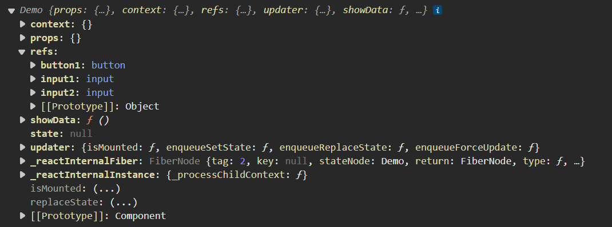
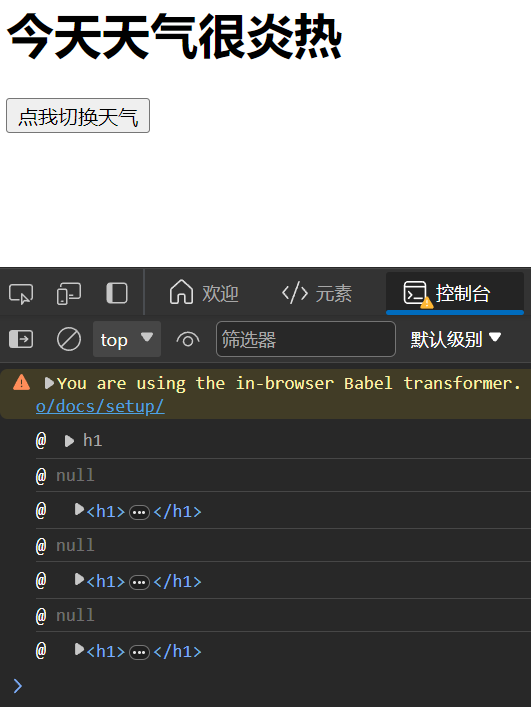
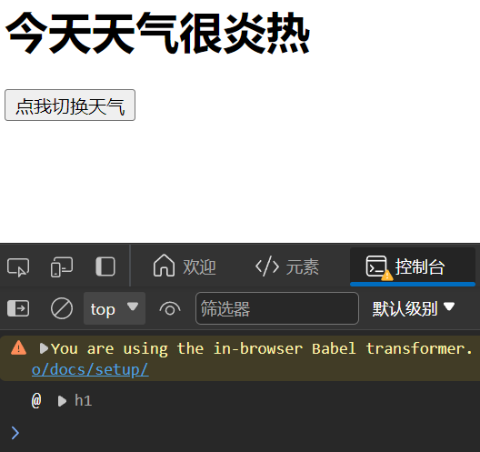
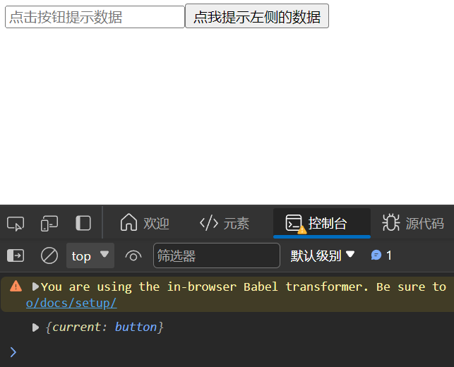

# refs

组件内的标签可以定义 **ref 属性**来**标识**自己（类似与原生里的 id）

## 引入

需求：
1. 点击按钮，提示第一个输入框中的值
2. 当第二个输入框失去焦点时，提示这个输入框的值

```html
<!DOCTYPE html>
<html>
<head>
    <meta charset="UTF-8" />
    <title>refs</title>
    <script src="https://cdn.staticfile.org/react/16.4.0/umd/react.development.js"></script>
    <script src="https://cdn.staticfile.org/react-dom/16.4.0/umd/react-dom.development.js"></script>
    <script src="https://cdn.staticfile.org/babel-standalone/6.26.0/babel.min.js"></script>
</head>
<body>

    <div id="example"></div>
    <script type="text/babel">
        class Demo extends React.Component{
            // 展示左侧输入框的数据
            showData = ()=>{
                const input1 = document.getElementById('input1');
                alert(input1.value);
            }
            render(){
                return (
                    <div>
                        <input id="input1" type="text" placeholder="点击按钮提示数据" />
                        <button onClick={this.showData}>点我提示左侧的数据</button>
                        <input type="text" placeholder="失去焦点提示数据" />
                    </div>
                )
            }   
        }
        ReactDOM.render(<Demo />, document.getElementById('example'));
    </script>

</body>
</html>
```

用 id 属性可以实现，但没有必要，react 里面封装了类似的东西：**ref 属性**

## 字符串形式的 ref（过时）

### 使用 ref 属性来标识标签

```html
<!DOCTYPE html>
<html>
<head>
    <meta charset="UTF-8" />
    <title>refs</title>
    <script src="https://cdn.staticfile.org/react/16.4.0/umd/react.development.js"></script>
    <script src="https://cdn.staticfile.org/react-dom/16.4.0/umd/react-dom.development.js"></script>
    <script src="https://cdn.staticfile.org/babel-standalone/6.26.0/babel.min.js"></script>
</head>
<body>

    <div id="example"></div>
    <script type="text/babel">
        class Demo extends React.Component{
            // 展示左侧输入框的数据
            showData = ()=>{
                console.log(this);
            }
            render(){
                return (
                    <div>
                        <input ref="input1" type="text" placeholder="点击按钮提示数据" />
                        <button ref="button1" onClick={this.showData}>点我提示左侧的数据</button>
                        <input ref="input2" type="text" placeholder="失去焦点提示数据" />
                    </div>
                )
            }   
        }
        ReactDOM.render(<Demo />, document.getElementById('example'));
    </script>

</body>
</html>
```

输出的组件实例对象如下

只要敢**用 ref 属性来给标签打标识**，React 都会将其**收集到组件的 refs 属性里**（注意 ref 与 refs 的区别）
refs 属性包含多个 key:value 组合，其中 **key** 是我们定义的**字符串**，**value** 就是当前**标签对应的 DOM 元素**

### 从 this 中获取 refs

```html
<!DOCTYPE html>
<html>
<head>
    <meta charset="UTF-8" />
    <title>refs</title>
    <script src="https://cdn.staticfile.org/react/16.4.0/umd/react.development.js"></script>
    <script src="https://cdn.staticfile.org/react-dom/16.4.0/umd/react-dom.development.js"></script>
    <script src="https://cdn.staticfile.org/babel-standalone/6.26.0/babel.min.js"></script>
</head>
<body>

    <div id="example"></div>
    <script type="text/babel">
        class Demo extends React.Component{
            // 展示左侧输入框的数据
            showData = ()=>{
                const {input1} = this.refs
                alert(input1.value)
            }
            // 展示右侧输入框的数据
            showData2 = ()=>{
                const {input2} = this.refs
                alert(input2.value)
            }
            render(){
                return (
                    <div>
                        <input ref="input1" type="text" placeholder="点击按钮提示数据" />
                        <button onClick={this.showData}>点我提示左侧的数据</button>
                        <input ref="input2" onBlur={this.showData2} type="text" placeholder="失去焦点提示数据" />
                    </div>
                )
            }   
        }
        ReactDOM.render(<Demo />, document.getElementById('example'));
    </script>

</body>
</html>
```

实现了前面所提的需求

## 回调形式的 ref

因为字符串形式的 ref 的效率低，所以 React 建议使用回调形式的 ref

回调形式的 ref 接收一个回调函数，这个**回调函数在组件挂载或者卸载的时候被调用**。当 ref 用于一个HTML元素的时候，ref 指定的回调函数在调用的时候会接收一个参数，该参数就是指定的 DOM 元素

当组件**挂载**的时候 React 会给 ref 回调函数传入当前的 DOM，在组件**卸载**的时候会传入 null

```html
<!DOCTYPE html>
<html>
<head>
    <meta charset="UTF-8" />
    <title>refs</title>
    <script src="https://cdn.staticfile.org/react/16.4.0/umd/react.development.js"></script>
    <script src="https://cdn.staticfile.org/react-dom/16.4.0/umd/react-dom.development.js"></script>
    <script src="https://cdn.staticfile.org/babel-standalone/6.26.0/babel.min.js"></script>
</head>
<body>

    <div id="example"></div>
    <script type="text/babel">
        class Demo extends React.Component{
            // 展示左侧输入框的数据
            showData = ()=>{
                const {input1} = this
                alert(input1.value)
            }
            // 展示右侧输入框的数据
            showData2 = ()=>{
                const {input2} = this
                alert(input2.value)
            }
            render(){
                return (
                    <div>
                        <input ref={(currentNode) => {this.input1 = currentNode}} type="text" placeholder="点击按钮提示数据" />
                        <button onClick={this.showData}>点我提示左侧的数据</button>
                        <input ref={c => this.input2 = c} onBlur={this.showData2} type="text" placeholder="失去焦点提示数据" />
                    </div>
                )
            }   
        }
        ReactDOM.render(<Demo />, document.getElementById('example'));
    </script>

</body>
</html>
```

**ref={(currentNode) => {this.input1 = currentNode}}** 的意思是：
把这个 ref 所在的 **DOM 节点**，起了名字 input1，然后**挂载到组件实例自身上**，然后就可以通过组件实例，来访问到这个 DOM 节点，进行操作了
**ref={(currentNode) => {this.input1 = currentNode}}** 可以简写为 **ref={c => this.input1 = c}**

效果和之前相同

### 回调 ref 中的回调执行次数问题

[关于回调 refs 的说明-官网](https://www.bookstack.cn/read/react-17.0-zh/bea7c60ba4ba6103.md)

> 如果 ref 回调函数是以**内联函数**的方式定义的，在**更新**过程中它会被执行**两次**，第一次传入参数 null，然后第二次会传入参数 DOM 元素。这是因为在**每次渲染时会创建一个新的函数实例**，所以 React **清空旧的 ref 并且设置新的**。**通过将 ref 的回调函数定义成 class 的绑定函数的方式可以避免上述问题**，但是大多数情况下它是无关紧要的

回到之前天气炎热凉爽的例子

```html
<!DOCTYPE html>
<html>
<head>
    <meta charset="UTF-8" />
    <title>refs</title>
    <script src="https://cdn.staticfile.org/react/16.4.0/umd/react.development.js"></script>
    <script src="https://cdn.staticfile.org/react-dom/16.4.0/umd/react-dom.development.js"></script>
    <script src="https://cdn.staticfile.org/babel-standalone/6.26.0/babel.min.js"></script>
</head>
<body>

    <div id="example"></div>
    <script type="text/babel">
        class Weather extends React.Component{
            state = {isHot:false}
            render(){
                const {isHot,wind} = this.state
                return(
                    <div>
                        <h1 ref={(currentNode) => {this.h1 = currentNode; console.log('@',currentNode)}}>今天天气很{isHot ? '炎热' : '凉爽'}</h1>
                        <button onClick={this.changeWeather}>点我切换天气</button>
                    </div>
                ) 
            }
            changeWeather = ()=>{
                const {isHot} = this.state
                this.setState({isHot:!isHot})
            }
        }
        ReactDOM.render(<Weather/>,document.getElementById('example'))
    </script>

</body>
</html>
```

效果如下


#### 将 ref 的回调函数定义成 class 的绑定函数

```html
<!DOCTYPE html>
<html>
<head>
    <meta charset="UTF-8" />
    <title>refs</title>
    <script src="https://cdn.staticfile.org/react/16.4.0/umd/react.development.js"></script>
    <script src="https://cdn.staticfile.org/react-dom/16.4.0/umd/react-dom.development.js"></script>
    <script src="https://cdn.staticfile.org/babel-standalone/6.26.0/babel.min.js"></script>
</head>
<body>

    <div id="example"></div>
    <script type="text/babel">
        class Weather extends React.Component{
            state = {isHot:false}
            render(){
                const {isHot,wind} = this.state
                return(
                    <div>
                        {/*<h1 ref={(currentNode) => {this.h1 = currentNode; console.log('@',currentNode)}}>今天天气很{isHot ? '炎热' : '凉爽'}</h1>*/}
                        <h1 ref={this.h1ref}>今天天气很{isHot ? '炎热' : '凉爽'}</h1>
                        <button onClick={this.changeWeather}>点我切换天气</button>
                    </div>
                ) 
            }
            // 绑定到 class
            h1ref = (currentNode) => {
                this.h1 = currentNode;
                console.log('@',currentNode);
            }
            changeWeather = ()=>{
                const {isHot} = this.state
                this.setState({isHot:!isHot})
            }
        }
        ReactDOM.render(<Weather/>,document.getElementById('example'))
    </script>

</body>
</html>
```

效果如下


无论怎么更新 DOM 元素，都**不会频繁调用** 已经放在实例自身的 h1ref，因为 React 知道之前**调用过**实例自身的 h1ref，它**不再是一个新的函数**

但是，使用内联函数，还是定义成 class 的绑定函数，在实际使用中的差别忽略不计

## createRef（推荐）

```html
<!DOCTYPE html>
<html>
<head>
    <meta charset="UTF-8" />
    <title>refs</title>
    <script src="https://cdn.staticfile.org/react/16.4.0/umd/react.development.js"></script>
    <script src="https://cdn.staticfile.org/react-dom/16.4.0/umd/react-dom.development.js"></script>
    <script src="https://cdn.staticfile.org/babel-standalone/6.26.0/babel.min.js"></script>
</head>
<body>

    <div id="example"></div>
    <script type="text/babel">
        class Demo extends React.Component{
            // React.createRef()调用后可以返回一个容器，该容器可以存储被ref所标识的节点，该容器是专人专用的
            myRef = React.createRef()
            // 展示左侧输入框的数据
            showData = ()=>{
                alert(this.myRef.current.value)
            }
            render(){
                return (
                    <div>
                        <input ref={this.myRef} type="text" placeholder="点击按钮提示数据" />
                        <button onClick={this.showData}>点我提示左侧的数据</button>
                    </div>
                )
            }   
        }
        ReactDOM.render(<Demo />, document.getElementById('example'));
    </script>

</body>
</html>
```

### React.createRef() 返回的容器是专人专用的

```html
<!DOCTYPE html>
<html>
<head>
    <meta charset="UTF-8" />
    <title>refs</title>
    <script src="https://cdn.staticfile.org/react/16.4.0/umd/react.development.js"></script>
    <script src="https://cdn.staticfile.org/react-dom/16.4.0/umd/react-dom.development.js"></script>
    <script src="https://cdn.staticfile.org/babel-standalone/6.26.0/babel.min.js"></script>
</head>
<body>

    <div id="example"></div>
    <script type="text/babel">
        class Demo extends React.Component{
            // React.createRef()调用后可以返回一个容器，该容器可以存储被ref所标识的节点，该容器是专人专用的
            myRef = React.createRef()
            // 展示左侧输入框的数据
            showData = ()=>{
                console.log(this.myRef)
            }
            render(){
                return (
                    <div>
                        <input ref={this.myRef} type="text" placeholder="点击按钮提示数据" />
                        <button ref={this.myRef} onClick={this.showData}>点我提示左侧的数据</button>
                    </div>
                )
            }   
        }
        ReactDOM.render(<Demo />, document.getElementById('example'));
    </script>

</body>
</html>
```

效果如下


如果在多个标签中都使用 **ref={this.myRef}**，后来者将会把前者**覆盖**掉，导致数据丢失，所以 **ref={this.myRef}** 最好**只给一个标签使用**

### 多次使用 createRef

```html
<!DOCTYPE html>
<html>
<head>
    <meta charset="UTF-8" />
    <title>refs</title>
    <script src="https://cdn.staticfile.org/react/16.4.0/umd/react.development.js"></script>
    <script src="https://cdn.staticfile.org/react-dom/16.4.0/umd/react-dom.development.js"></script>
    <script src="https://cdn.staticfile.org/babel-standalone/6.26.0/babel.min.js"></script>
</head>
<body>

    <div id="example"></div>
    <script type="text/babel">
        class Demo extends React.Component{
            // React.createRef()调用后可以返回一个容器，该容器可以存储被ref所标识的节点，该容器是专人专用的
            myRef = React.createRef()
            myRef2 = React.createRef()
            // 展示左侧输入框的数据
            showData = ()=>{
                alert(this.myRef.current.value)
            }
            // 展示右侧输入框的数据
            showData2 = ()=>{
                alert(this.myRef2.current.value)
            }
            render(){
                return (
                    <div>
                        <input ref={this.myRef} type="text" placeholder="点击按钮提示数据" />
                        <button onClick={this.showData}>点我提示左侧的数据</button>
                        <input ref={this.myRef2} onBlur={this.showData2} type="text" placeholder="失去焦点提示数据" />
                    </div>
                )
            }   
        }
        ReactDOM.render(<Demo />, document.getElementById('example'));
    </script>

</body>
</html>
```

效果和之前相同

# 事件处理

1. 通过 **onXxx** 属性指定事件处理函数（注意大小写）
    1. React 使用的是**自定义（合成）事件**，而不是使用原生DOM事件（为了更好的**兼容性**）
    2. React 中的事件是通过**事件委托**方式处理的（委托给组件最外层的元素，为了**高效**）
2. 通过 **event.target** 得到发生事件的DOM元素对象（自身的事件，自身的操作，可以使用**事件处理**）（不要过度使用 ref）

## 通过 event.target 得到发生事件的DOM元素对象（不要过度使用 ref）

```html
<!DOCTYPE html>
<html>
<head>
    <meta charset="UTF-8" />
    <title>refs</title>
    <script src="https://cdn.staticfile.org/react/16.4.0/umd/react.development.js"></script>
    <script src="https://cdn.staticfile.org/react-dom/16.4.0/umd/react-dom.development.js"></script>
    <script src="https://cdn.staticfile.org/babel-standalone/6.26.0/babel.min.js"></script>
</head>
<body>

    <div id="example"></div>
    <script type="text/babel">
        class Demo extends React.Component{
            // 创建 ref 容器
            myRef = React.createRef()
            // 展示左侧输入框的数据
            showData = ()=>{
                alert(this.myRef.current.value)
            }
            // 展示右侧输入框的数据
            showData2 = (event)=>{
                // event.target 就是调用函数的input元素
                alert(event.target.value)
            }
            render(){
                return (
                    <div>
                        <input ref={this.myRef} type="text" placeholder="点击按钮提示数据" />
                        <button onClick={this.showData}>点我提示左侧的数据</button>
                        {/*<input ref={this.myRef2} onBlur={this.showData2} type="text" placeholder="失去焦点提示数据" />*/}
                        <input onBlur={this.showData2} type="text" placeholder="失去焦点提示数据" />
                    </div>
                )
            }   
        }
        ReactDOM.render(<Demo />, document.getElementById('example'));
    </script>

</body>
</html>
```

不要过度使用 ref，有些时候，ref 是可以省略的
对于 **\<input ref={this.myRef2} onBlur={this.showData2} type="text" placeholder="失去焦点提示数据" /\>**，ref 就可以省略，因为 **发生事件的DOM元素 和 要操作的DOM元素 是同一个**

其中 **onBlur={this.showData2}** 指定 this.showData2 作为元素失去焦点的回调，React 在调用函数的同时，还传入了 **event事件对象** 作为参数，通过 **event.target** 得到发生事件的DOM元素对象

