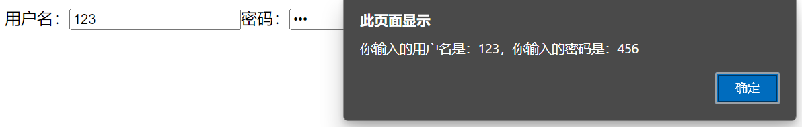
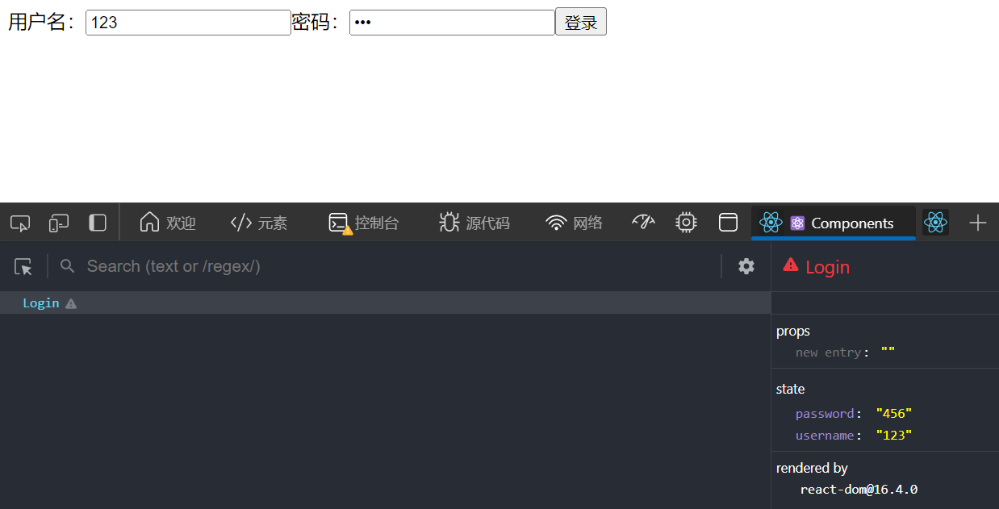

# 非受控组件 与 受控组件

需求：定义一个包含表单的组件，输入用户名和密码，点击登录，提示输入信息

## 非受控组件

```html
<!DOCTYPE html>
<html>
<head>
    <meta charset="UTF-8" />
    <title>非受控组件</title>
    <script src="https://cdn.staticfile.org/react/16.4.0/umd/react.development.js"></script>
    <script src="https://cdn.staticfile.org/react-dom/16.4.0/umd/react-dom.development.js"></script>
    <script src="https://cdn.staticfile.org/babel-standalone/6.26.0/babel.min.js"></script>
</head>
<body>

    <div id="example"></div>
    <script type="text/babel">
        // 创建组件
        class Login extends React.Component{
            handleSubmit = (event)=>{
                // 阻止默认事件（阻止表单提交）
                event.preventDefault();
                const {username,password} = this;
                alert(`你输入的用户名是：${username.value}，你输入的密码是：${password.value}`);
            }
            render(){
                return(
                    <form onSubmit={this.handleSubmit}>
                        用户名：<input ref={c => this.username = c} type="text" name="username"/>
                        密码：<input ref={c => this.password = c} type="password" name="password"/>
                        <button>登录</button>
                    </form>
                )
            }
        }
        ReactDOM.render(<Login/>, document.getElementById('example'))
    </script>

</body>
</html>
```

效果如下


页面中**所有输入类的DOM**，是**现用现取**的，所以叫非受控组件

## 受控组件

```html
<!DOCTYPE html>
<html>
<head>
    <meta charset="UTF-8" />
    <title>受控组件</title>
    <script src="https://cdn.staticfile.org/react/16.4.0/umd/react.development.js"></script>
    <script src="https://cdn.staticfile.org/react-dom/16.4.0/umd/react-dom.development.js"></script>
    <script src="https://cdn.staticfile.org/babel-standalone/6.26.0/babel.min.js"></script>
</head>
<body>

    <div id="example"></div>
    <script type="text/babel">
        // 创建组件
        class Login extends React.Component{
            // 初始化状态
            state = {
                username:'',
                password:''
            }
            // 保存用户名到状态中
            saveUsername = (event)=>{
                this.setState({username:event.target.value});
            }
            // 保存密码到状态中
            savePassword = (event)=>{
                this.setState({password:event.target.value});
            }
            // 表单提交的回调
            handleSubmit = (event)=>{
                event.preventDefault();
                const {username,password}  = this.state;
                alert(`你输入的用户名是：${username}，你输入的密码是：${password}`);
            }
            render(){
                return(
                    <form onSubmit={this.handleSubmit}>
                        用户名：<input onChange={this.saveUsername} type="text" name="username"/>
                        密码：<input onChange={this.savePassword} type="password" name="password"/>
                        <button>登录</button>
                    </form>
                )
            }
        }
        ReactDOM.render(<Login/>, document.getElementById('example'))
    </script>

</body>
</html>
```

效果如下


页面中**所有输入类的DOM**，随着你的输入，会**把值维护到 state 中**，等需要用的时候，直接从 state 中取出来（类似Vue中的**双向数据绑定**）

# 高阶函数

## 引入

继续使用上面的受控组件的代码来讲解，其中
```js
            // 保存用户名到状态中
            saveUsername = (event)=>{
                this.setState({username:event.target.value});
            }
            // 保存密码到状态中
            savePassword = (event)=>{
                this.setState({password:event.target.value});
            }
```
两个函数功能雷同，有必要写两个吗？
如果输入框更多，会写出更多这样雷同的函数，怎们优化？

那就抽象这个函数

## 必须拿一个函数作为事件的回调

事件的调用由
```js
                        用户名：<input onChange={this.saveUsername} type="text" name="username"/>
                        密码：<input onChange={this.savePassword} type="password" name="password"/>
```
改为
```js
                        用户名：<input onChange={this.saveFormData('username')} type="text" name="username"/>
                        密码：<input onChange={this.saveFormData('password')} type="password" name="password"/>
```

把上面的受控组件的代码修改如下
```html
<!DOCTYPE html>
<html>
<head>
    <meta charset="UTF-8" />
    <title>高阶函数</title>
    <script src="https://cdn.staticfile.org/react/16.4.0/umd/react.development.js"></script>
    <script src="https://cdn.staticfile.org/react-dom/16.4.0/umd/react-dom.development.js"></script>
    <script src="https://cdn.staticfile.org/babel-standalone/6.26.0/babel.min.js"></script>
</head>
<body>

    <div id="example"></div>
    <script type="text/babel">
        // 创建组件
        class Login extends React.Component{
            // 初始化状态
            state = {
                username:'',
                password:''
            }
            // 保存表单数据到状态中
            // 作为回调函数时，React默认传递event
            // saveFormData = (event)=>{
            // 显式调用这个函数并传递参数时，React即传递此参数，不再传递event
            saveFormData = (dataType)=>{
                // saveFormData函数的返回值，依然是一个函数，这个函数才是onChange事件真正的回调，React默认传递event
                return (event)=>{
                    this.setState({ [dataType]:event.target.value })
                }
            }
            // 表单提交的回调
            handleSubmit = (event)=>{
                event.preventDefault();
                const {username,password}  = this.state;
                alert(`你输入的用户名是：${username}，你输入的密码是：${password}`);
            }
            render(){
                return(
                    <form onSubmit={this.handleSubmit}>
                        {/* onChange={this.saveFormData('username')} 的意思是，把函数的返回值作为onChange事件的回调 */}
                        用户名：<input onChange={this.saveFormData('username')} type="text" name="username"/>
                        密码：<input onChange={this.saveFormData('password')} type="password" name="password"/>
                        <button>登录</button>
                    </form>
                )
            }
        }
        ReactDOM.render(<Login/>, document.getElementById('example'))
    </script>

</body>
</html>
```

其中的
```js
            saveFormData = (dataType)=>{
                // saveFormData函数的返回值，依然是一个函数，这个函数才是onChange事件真正的回调，React默认传递event
                return (event)=>{
                    this.setState({ [dataType]:event.target.value })
                }
            }
```
就是**高阶函数**

总结：
1. 如果一个函数符合下面两个规范中的任何一个，那么该函数就称之为高阶函数
	1. 若A函数，接收的**参数是一个函数**，那么A函数就称为高阶函数
	2. 若A函数，调用的**返回值依然是一个函数**，那么A函数就可以称为高阶函数

2. 常见的高阶函数有 Promise、setTimeout、arr.map() 等

## 函数的柯里化（Currying）

通过函数调用继续返回函数的方式，实现多次接受参数最后统一处理的函数编码方式

```html
<!DOCTYPE html>
<html>
<head>
    <meta charset="UTF-8" />
    <title>函数的柯里化</title>
    <script src="https://cdn.staticfile.org/react/16.4.0/umd/react.development.js"></script>
    <script src="https://cdn.staticfile.org/react-dom/16.4.0/umd/react-dom.development.js"></script>
    <script src="https://cdn.staticfile.org/babel-standalone/6.26.0/babel.min.js"></script>
</head>
<body>

    <script type="text/javascript">
        function sum(a,b,c){
            return a + b + c;
        }
        const result = sum(1,2,3);
        console.log(result);
        // 柯里化
        function sum2(a){
            return (b)=>{
                return (c)=>{
                    return a + b + c;
                }
            }
        }
        const result2 = sum2(1)(2)(3);
        console.log(result2);
    </script>

</body>
</html>
```

其实前面的
```js
            saveFormData = (dataType)=>{
                // saveFormData函数的返回值，依然是一个函数，这个函数才是onChange事件真正的回调，React默认传递event
                return (event)=>{
                    this.setState({ [dataType]:event.target.value })
                }
            }
```
就是**函数的柯里化**
为了能**多次接收参数**（dataType 和 event）进行**统一处理**

## 不用函数的柯里化，同时接收 dataType 和 event 参数

```html
<!DOCTYPE html>
<html>
<head>
    <meta charset="UTF-8" />
    <title>不用柯里化</title>
    <script src="https://cdn.staticfile.org/react/16.4.0/umd/react.development.js"></script>
    <script src="https://cdn.staticfile.org/react-dom/16.4.0/umd/react-dom.development.js"></script>
    <script src="https://cdn.staticfile.org/babel-standalone/6.26.0/babel.min.js"></script>
</head>
<body>

    <div id="example"></div>
    <script type="text/babel">
        // 创建组件
        class Login extends React.Component{
            // 初始化状态
            state = {
                username:'',
                password:''
            }
            // 保存表单数据到状态中
            // saveFormData = (dataType)=>{
            saveFormData = (dataType,event)=>{
                this.setState({ [dataType]:event.target.value })
            }
            // 表单提交的回调
            handleSubmit = (event)=>{
                event.preventDefault();
                const {username,password}  = this.state;
                alert(`你输入的用户名是：${username}，你输入的密码是：${password}`);
            }
            render(){
                return(
                    <form onSubmit={this.handleSubmit}>
                        {/* 用户名：<input onChange={this.saveFormData('username')} type="text" name="username"/> */}
                        用户名：<input onChange={ (event) => {this.saveFormData('username',event)} } type="text" name="username"/>
                        密码：<input onChange={ event => this.saveFormData('password',event) } type="password" name="password"/>
                        <button>登录</button>
                    </form>
                )
            }
        }
        ReactDOM.render(<Login/>, document.getElementById('example'))
    </script>

</body>
</html>
```

直接就写一个函数 **(event) => {this.saveFormData('username',event)}** 作为onChange事件的回调，这个函数能接收 event 参数，在这个函数中调用 saveFormData() 函数，把 dataType 和 event 作为**参数同时传递**给 saveFormData() 函数

没有使用函数的柯里化，但依旧实现了功能
