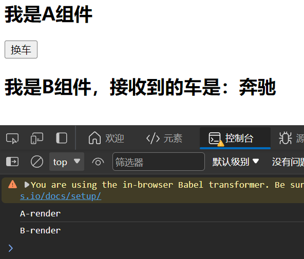
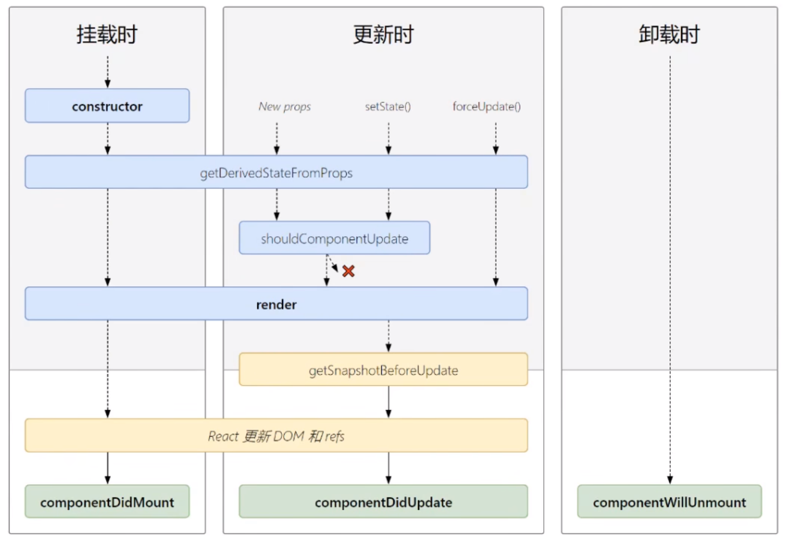
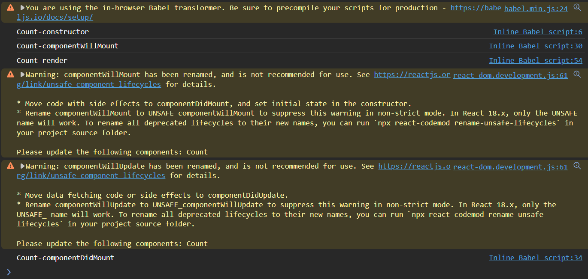
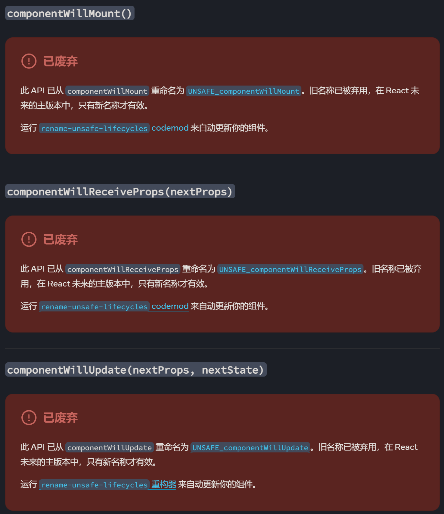
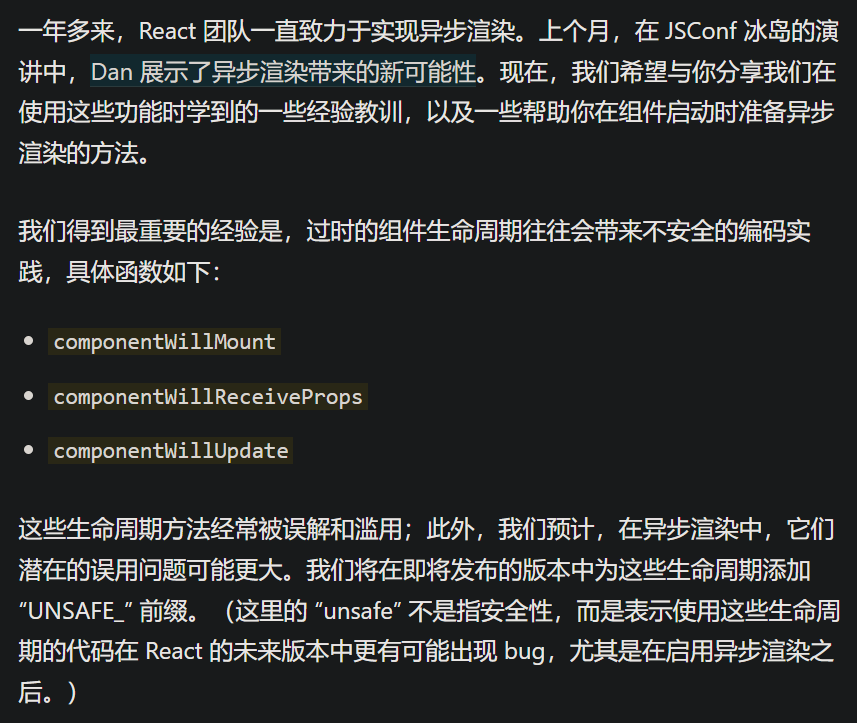
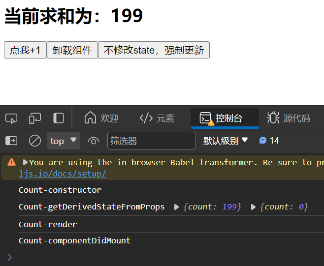
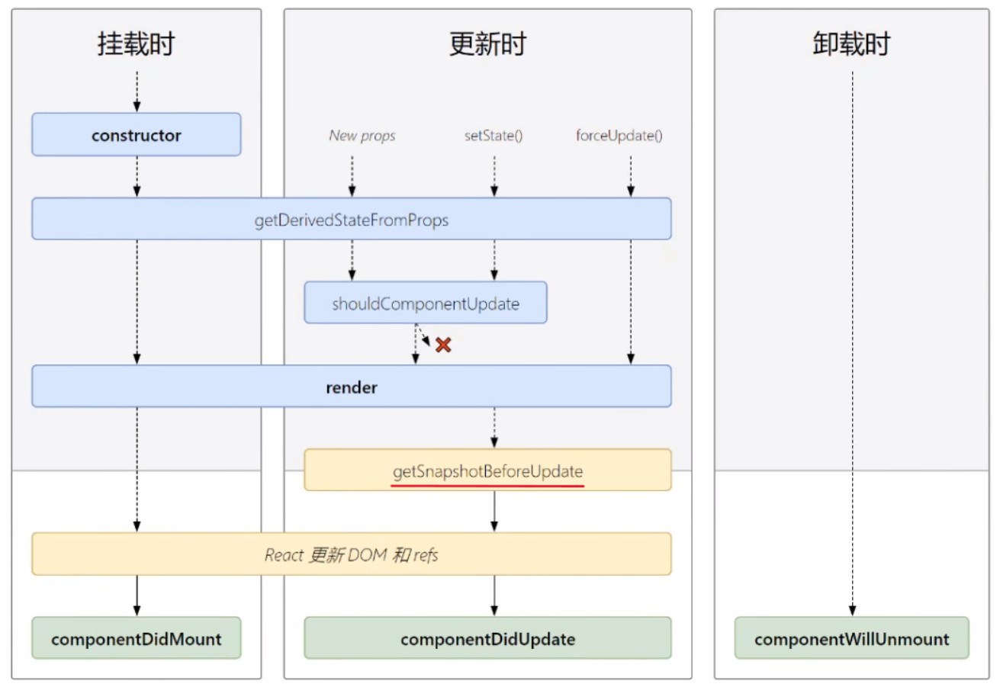
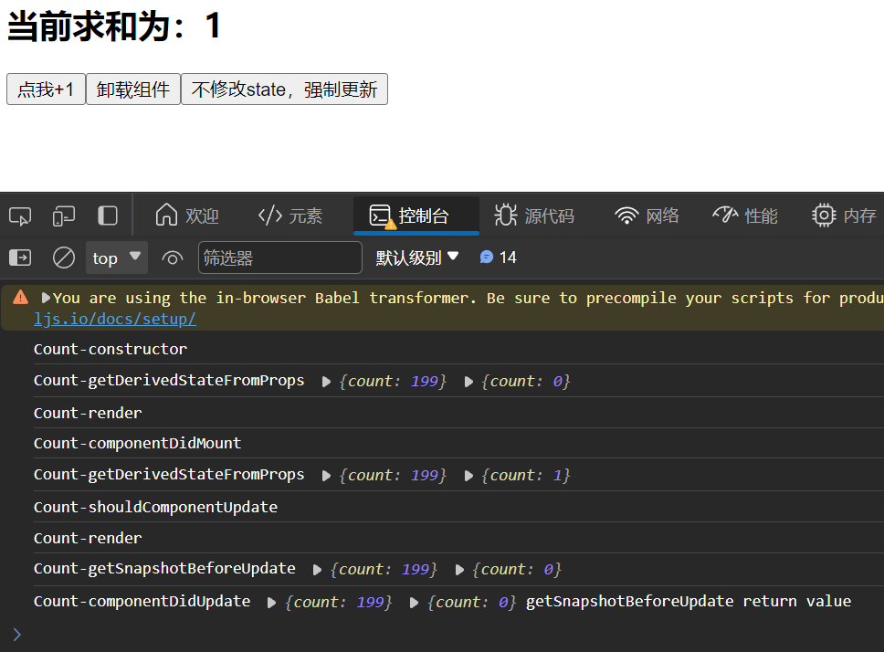
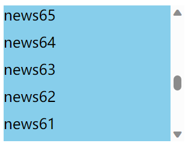
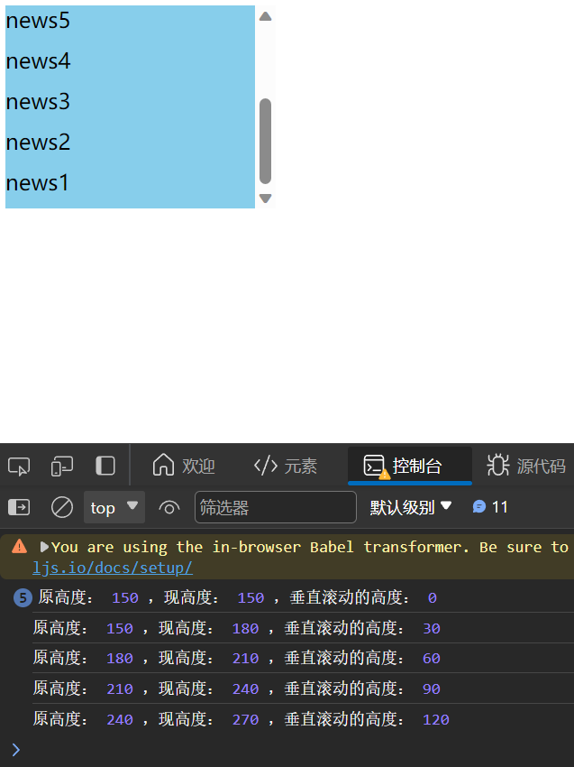

# 生命周期

## 引入

### 组件的 挂载（mount）与 卸载（unmount）

当组件第一次被渲染到DOM中的时候，称为 **挂载（mount）**
当组件从DOM中移除的时候，称为 **卸载（unmount）**

要将React元素渲染到根DOM节点中，我们通过把它传递给 **ReactDOM.render()** 的方法来将其渲染到页面上：
```jsx
// ReactDOM.render(HTML代码, 一个HTML元素) 
ReactDOM.render(VDOM, document.getElementById('example'));
```

要将React元素卸载掉，我们通过把它传递给 **ReactDOM.unmountComponentAtNode()** 的方法来将其卸载：
```jsx
// ReactDOM.unmountComponentAtNode(一个HTML元素)
ReactDOM.unmountComponentAtNode(document.getElementById('example'));
```

```html
<!DOCTYPE html>
<html>
<head>
    <meta charset="UTF-8" />
    <title>引出生命周期</title>
    <script src="https://cdn.staticfile.org/react/16.4.0/umd/react.development.js"></script>
    <script src="https://cdn.staticfile.org/react-dom/16.4.0/umd/react-dom.development.js"></script>
    <script src="https://cdn.staticfile.org/babel-standalone/6.26.0/babel.min.js"></script>
</head>
<body>

    <div id="example"></div>
    <script type="text/babel">
        class Life extends React.Component{
            death = ()=>{
                // 卸载组件
                ReactDOM.unmountComponentAtNode(document.getElementById('example'))
            }
            render() {
                return (
                    <div>
                        <h2>React学不会怎么办？</h2>
                        <button onClick={this.death}>不活了</button>
                    </div>
                )
            }
        }
        // 挂载组件
        ReactDOM.render(<Life/>, document.getElementById('example'))
    </script>

</body>
</html>
```

在html页面中点击按钮，就可以卸载组件

### 循环定时器（setInterval）

继续上面的例子，想进一步改成，每点一次按钮，文字变得越来越透明

```html
<!DOCTYPE html>
<html>
<head>
    <meta charset="UTF-8" />
    <title>引出生命周期</title>
    <script src="https://cdn.staticfile.org/react/16.4.0/umd/react.development.js"></script>
    <script src="https://cdn.staticfile.org/react-dom/16.4.0/umd/react-dom.development.js"></script>
    <script src="https://cdn.staticfile.org/babel-standalone/6.26.0/babel.min.js"></script>
</head>
<body>

    <div id="example"></div>
    <script type="text/babel">
        class Life extends React.Component{
            state = {opacity:1}
            death = ()=>{
                // 卸载组件
                ReactDOM.unmountComponentAtNode(document.getElementById('example'))
            }
            render() {
                console.log('render');
                // 循环定时器
                setInterval(()=>{
                    let {opacity} = this.state;
                    opacity -= 0.1;
                    if(opacity<=0){
                        opacity = 1
                    }
                    this.setState({
                        opacity:opacity
                    })
                },200);
                return (
                    <div>
                        <h2 style={{opacity:this.state.opacity}}>React学不会怎么办？</h2>
                        <button onClick={this.death}>不活了</button>
                    </div>
                )
            }
        }
        // 挂载组件
        ReactDOM.render(<Life/>, document.getElementById('example'))
    </script>

</body>
</html>
```

引发了无线循环的递归，而且递归越来越快


render() 函数在第一次挂载时调用，然后开了一个循环定时器，每隔200毫秒执行一次，修改了状态，然后又会调用 render() 函数，又开启了一个循环定时器，就会有越来越多的循环定时器
**render() 里面就不能写 setState**，说明循环定时器 setInterval 放的位置不对

那就把循环定时器放到一个函数中，按钮的onClick事件触发这个函数

```html
<!DOCTYPE html>
<html>
<head>
    <meta charset="UTF-8" />
    <title>引出生命周期</title>
    <script src="https://cdn.staticfile.org/react/16.4.0/umd/react.development.js"></script>
    <script src="https://cdn.staticfile.org/react-dom/16.4.0/umd/react-dom.development.js"></script>
    <script src="https://cdn.staticfile.org/babel-standalone/6.26.0/babel.min.js"></script>
</head>
<body>

    <div id="example"></div>
    <script type="text/babel">
        class Life extends React.Component{
            state = {opacity:1}
            death = ()=>{
                // 卸载组件
                ReactDOM.unmountComponentAtNode(document.getElementById('example'))
            }
            action = ()=>{
                // 循环定时器
                setInterval(()=>{
                    let {opacity} = this.state;
                    opacity -= 0.1;
                    if(opacity<=0){
                        opacity = 1
                    }
                    this.setState({
                        opacity:opacity
                    })
                },200);
            }
            render() {
                console.log('render');
                return (
                    <div>
                        <h2 style={{opacity:this.state.opacity}}>React学不会怎么办？</h2>
                        <button onClick={this.death}>不活了</button>
                        <button onClick={this.action}>开始变化</button>
                    </div>
                )
            }
        }
        // 挂载组件
        ReactDOM.render(<Life/>, document.getElementById('example'))
    </script>

</body>
</html>
```

现在，点击一次按钮触发透明度变化，且透明度变化的频率就不会越来越快了


但还是有问题，想要的是，打开html页面，透明度就可以自己变化，不需要手动点击按钮
我们现在要的是一个时间点，即**组件挂载到页面后的那个时刻**，启用循环定时器

### 引入 componentDidMount

组件的 componentDidMount 函数，在组件挂载到页面后的那个时刻，被React调用

```html
<!DOCTYPE html>
<html>
<head>
    <meta charset="UTF-8" />
    <title>引出生命周期</title>
    <script src="https://cdn.staticfile.org/react/16.4.0/umd/react.development.js"></script>
    <script src="https://cdn.staticfile.org/react-dom/16.4.0/umd/react-dom.development.js"></script>
    <script src="https://cdn.staticfile.org/babel-standalone/6.26.0/babel.min.js"></script>
</head>
<body>

    <div id="example"></div>
    <script type="text/babel">
        class Life extends React.Component{
            state = {opacity:1}
            death = ()=>{
                ReactDOM.unmountComponentAtNode(document.getElementById('example'))
            }
            // 组件挂载完毕调用
            componentDidMount() {
                // 循环定时器
                setInterval(()=>{
                    let {opacity} = this.state;
                    opacity -= 0.1;
                    if(opacity<=0){
                        opacity = 1
                    }
                    this.setState({
                        opacity:opacity
                    })
                },200);
            }
            // 初始化渲染、state更新后调用
            render() {
                console.log('render');
                return (
                    <div>
                        <h2 style={{opacity:this.state.opacity}}>React学不会怎么办？</h2>
                        <button onClick={this.death}>不活了</button>
                    </div>
                )
            }
        }
        ReactDOM.render(<Life/>, document.getElementById('example'))
    </script>

</body>
</html>
```

现在，只要打开html页面，透明度就可以自己变化

但是还有个小问题，点击按钮，想要卸载组件，会报错（组件都没了，就不能更新状态了）


在卸载组件之前，**清除定时器**

```html
<!DOCTYPE html>
<html>
<head>
    <meta charset="UTF-8" />
    <title>引出生命周期</title>
    <script src="https://cdn.staticfile.org/react/16.4.0/umd/react.development.js"></script>
    <script src="https://cdn.staticfile.org/react-dom/16.4.0/umd/react-dom.development.js"></script>
    <script src="https://cdn.staticfile.org/babel-standalone/6.26.0/babel.min.js"></script>
</head>
<body>

    <div id="example"></div>
    <script type="text/babel">
        class Life extends React.Component{
            state = {opacity:1}
            death = ()=>{
                // 清除定时器
                clearInterval(this.timer)
                ReactDOM.unmountComponentAtNode(document.getElementById('example'))
            }
            // 组件挂载完毕调用
            componentDidMount() {
                // 循环定时器
                this.timer = setInterval(()=>{
                    let {opacity} = this.state;
                    opacity -= 0.1;
                    if(opacity<=0){
                        opacity = 1
                    }
                    this.setState({
                        opacity:opacity
                    })
                },200);
            }
            // 初始化渲染、state更新后调用
            render() {
                console.log('render');
                return (
                    <div>
                        <h2 style={{opacity:this.state.opacity}}>React学不会怎么办？</h2>
                        <button onClick={this.death}>不活了</button>
                    </div>
                )
            }
        }
        ReactDOM.render(<Life/>, document.getElementById('example'))
    </script>

</body>
</html>
```

这样就不会报错了

但是有更好的方法，我们现在要的是一个时间点，即**组件将要被卸载之前的那个时刻**，清除定时器

### 引入 componentWillUnmount

组件的 componentWillUnmount 函数，在组件将要被卸载之前的那个时刻，被React调用

```html
<!DOCTYPE html>
<html>
<head>
    <meta charset="UTF-8" />
    <title>引出生命周期</title>
    <script src="https://cdn.staticfile.org/react/16.4.0/umd/react.development.js"></script>
    <script src="https://cdn.staticfile.org/react-dom/16.4.0/umd/react-dom.development.js"></script>
    <script src="https://cdn.staticfile.org/babel-standalone/6.26.0/babel.min.js"></script>
</head>
<body>

    <div id="example"></div>
    <script type="text/babel">
        class Life extends React.Component{
            state = {opacity:1}
            death = ()=>{
                ReactDOM.unmountComponentAtNode(document.getElementById('example'))
            }
            // 组件挂载完毕调用
            componentDidMount() {
                // 循环定时器
                this.timer = setInterval(()=>{
                    let {opacity} = this.state;
                    opacity -= 0.1;
                    if(opacity<=0){
                        opacity = 1
                    }
                    this.setState({
                        opacity:opacity
                    })
                },200);
            }
            // 组件将要被卸载时调用
            componentWillUnmount() {
                // 清除定时器
                clearInterval(this.timer)
            }
            // 初始化渲染、state更新后调用
            render() {
                console.log('render');
                return (
                    <div>
                        <h2 style={{opacity:this.state.opacity}}>React学不会怎么办？</h2>
                        <button onClick={this.death}>不活了</button>
                    </div>
                )
            }
        }
        ReactDOM.render(<Life/>, document.getElementById('example'))
    </script>

</body>
</html>
```

效果和之前相同

### 收获

组件的 挂载（mount）与 卸载（unmount）过程中，React会在合适的时间点去做一些事（例如componentDidMount、componentWillUnmount，这些函数称为 **生命周期回调函数** 或 **生命周期钩子函数**）

## 简介

1. 组件从创建到死亡它会经历一些特定的阶段
2. React组件中包含一系列的钩子函数（生命周期回调函数），会在特定时刻调用
3. 我们在定义组件时，会在特定的生命周期回调函数中，做特定的工作
4. render()函数，被调用1+n次，1次是页面初次渲染，n次是页面更新的次数

## 生命周期（旧）


### 挂载时的流程

如图中红线所示


#### constructor -> componentWillMount -> render -> componentDidMount -> componentWillUnmount

```html
<!DOCTYPE html>
<html>
<head>
    <meta charset="UTF-8" />
    <title>生命周期（旧）</title>
    <script src="https://cdn.staticfile.org/react/16.4.0/umd/react.development.js"></script>
    <script src="https://cdn.staticfile.org/react-dom/16.4.0/umd/react-dom.development.js"></script>
    <script src="https://cdn.staticfile.org/babel-standalone/6.26.0/babel.min.js"></script>
</head>
<body>

    <div id="example"></div>
    <script type="text/babel">
        // 创建组件
        class Count extends React.Component{
            // 构造器
            constructor(props){
                console.log('Count-constructor');
                super(props);
                // 初始化状态
                this.state = {
                    count: 0
                }
            }
            // 点我+1 按钮的回调
            add = ()=>{
                const {count} = this.state
                this.setState({
                    count: count+1
                })
            }
            // 卸载组件 按钮的回调
            death = ()=>{
                ReactDOM.unmountComponentAtNode(document.getElementById('example'));
            }
            // 组件将要挂载的钩子
            componentWillMount(){
                console.log('Count-componentWillMount');
            }
            // 组件挂载完毕的钩子
            componentDidMount(){
                console.log('Count-componentDidMount');
            }
            // 组件将要卸载的钩子
            componentWillUnmount(){
                console.log('Count-componentWillUnmount');
            }
            render(){
                console.log('Count-render');
                const {count} = this.state;
                return(
                    <div>
                        <h2>当前求和为：{this.state.count}</h2>
                        <button onClick={this.add}>点我+1</button>
                        <button onClick={this.death}>卸载组件</button>
                    </div>
                )
            }
        }
        // 渲染组件
        ReactDOM.render(<Count/>,document.getElementById('example'))
    </script>

</body>
</html>
```

效果如下


### setState()的流程

如图中圈2所示


#### shouldComponentUpdate 简介

执行setState()之后，React调用 shouldComponentUpdate 这个钩子，shouldComponentUpdate 是一个**阀门**，控制是否走这个流程，如果 shouldComponentUpdate 返回 true，则继续走流程；如果返回 false，则不继续走流程

如果自己不写 shouldComponentUpdate 这个钩子，它的返回值永远是 true

##### 返回值为 true

shouldComponentUpdate 这个钩子的返回值为 **true** 时：
```html
<!DOCTYPE html>
<html>
<head>
    <meta charset="UTF-8" />
    <title>生命周期（旧）</title>
    <script src="https://cdn.staticfile.org/react/16.4.0/umd/react.development.js"></script>
    <script src="https://cdn.staticfile.org/react-dom/16.4.0/umd/react-dom.development.js"></script>
    <script src="https://cdn.staticfile.org/babel-standalone/6.26.0/babel.min.js"></script>
</head>
<body>

    <div id="example"></div>
    <script type="text/babel">
        // 创建组件
        class Count extends React.Component{
            // 构造器
            constructor(props){
                console.log('Count-constructor');
                super(props);
                // 初始化状态
                this.state = {
                    count: 0
                }
            }
            // 点我+1 按钮的回调
            add = ()=>{
                const {count} = this.state
                this.setState({
                    count: count+1
                })
            }
            // 卸载组件 按钮的回调
            death = ()=>{
                ReactDOM.unmountComponentAtNode(document.getElementById('example'));
            }
            // 组件将要挂载的钩子
            componentWillMount(){
                console.log('Count-componentWillMount');
            }
            // 组件挂载完毕的钩子
            componentDidMount(){
                console.log('Count-componentDidMount');
            }
            // 组件将要卸载的钩子
            componentWillUnmount(){
                console.log('Count-componentWillUnmount');
            }
            // 控制组件更新的阀门
            shouldComponentUpdate(){
                console.log('Count-shouldComponentUpdate');
                return true;
            }
            render(){
                console.log('Count-render');
                const {count} = this.state;
                return(
                    <div>
                        <h2>当前求和为：{this.state.count}</h2>
                        <button onClick={this.add}>点我+1</button>
                        <button onClick={this.death}>卸载组件</button>
                    </div>
                )
            }
        }
        // 渲染组件
        ReactDOM.render(<Count/>,document.getElementById('example'))
    </script>

</body>
</html>
```

效果如下


##### 返回值为 false

shouldComponentUpdate 这个钩子的返回值为 **false** 时：
```jsx
// 其他部分与上面的例子中相同
            // 控制组件更新的阀门
            shouldComponentUpdate(){
                console.log('Count-shouldComponentUpdate');
                return false;
            }
```

效果如下


#### shouldComponentUpdate -> componentWillUpdate -> render -> componentDidUpdate

```html
<!DOCTYPE html>
<html>
<head>
    <meta charset="UTF-8" />
    <title>生命周期（旧）</title>
    <script src="https://cdn.staticfile.org/react/16.4.0/umd/react.development.js"></script>
    <script src="https://cdn.staticfile.org/react-dom/16.4.0/umd/react-dom.development.js"></script>
    <script src="https://cdn.staticfile.org/babel-standalone/6.26.0/babel.min.js"></script>
</head>
<body>

    <div id="example"></div>
    <script type="text/babel">
        // 创建组件
        class Count extends React.Component{
            // 构造器
            constructor(props){
                console.log('Count-constructor');
                super(props);
                // 初始化状态
                this.state = {
                    count: 0
                }
            }
            // 点我+1 按钮的回调
            add = ()=>{
                const {count} = this.state
                this.setState({
                    count: count+1
                })
            }
            // 卸载组件 按钮的回调
            death = ()=>{
                ReactDOM.unmountComponentAtNode(document.getElementById('example'));
            }
            // 组件将要挂载的钩子
            componentWillMount(){
                console.log('Count-componentWillMount');
            }
            // 组件挂载完毕的钩子
            componentDidMount(){
                console.log('Count-componentDidMount');
            }
            // 组件将要卸载的钩子
            componentWillUnmount(){
                console.log('Count-componentWillUnmount');
            }
            // 控制组件更新的阀门
            shouldComponentUpdate(){
                console.log('Count-shouldComponentUpdate');
                return true;
            }
            // 组件将要更新的钩子
            componentWillUpdate(){
                console.log('Count-componentWillUpdate');
            }
            // 组件更新完毕的钩子
            componentDidUpdate(){
                console.log('Count-componentDidUpdate');
            }
            render(){
                console.log('Count-render');
                const {count} = this.state;
                return(
                    <div>
                        <h2>当前求和为：{this.state.count}</h2>
                        <button onClick={this.add}>点我+1</button>
                        <button onClick={this.death}>卸载组件</button>
                    </div>
                )
            }
        }
        // 渲染组件
        ReactDOM.render(<Count/>,document.getElementById('example'))
    </script>

</body>
</html>
```

效果如下


### forceUpdate()的流程

如图中圈3所示


forceUpdate() 即强制更新，不用对 state 进行任何修改，直接调用 render 方法，重新渲染组件
所以 forceUpdate() 会跳过 shouldComponentUpdate 方法，即不受阀门的控制

#### componentWillUpdate -> render -> componentDidUpdate

```html
<!DOCTYPE html>
<html>
<head>
    <meta charset="UTF-8" />
    <title>生命周期（旧）</title>
    <script src="https://cdn.staticfile.org/react/16.4.0/umd/react.development.js"></script>
    <script src="https://cdn.staticfile.org/react-dom/16.4.0/umd/react-dom.development.js"></script>
    <script src="https://cdn.staticfile.org/babel-standalone/6.26.0/babel.min.js"></script>
</head>
<body>

    <div id="example"></div>
    <script type="text/babel">
        // 创建组件
        class Count extends React.Component{
            // 构造器
            constructor(props){
                console.log('Count-constructor');
                super(props);
                // 初始化状态
                this.state = {
                    count: 0
                }
            }
            // 点我+1 按钮的回调
            add = ()=>{
                const {count} = this.state
                this.setState({
                    count: count+1
                })
            }
            // 卸载组件 按钮的回调
            death = ()=>{
                ReactDOM.unmountComponentAtNode(document.getElementById('example'));
            }
            // 强制更新 按钮的回调
            force = ()=>{
                this.forceUpdate();
            }
            // 组件将要挂载的钩子
            componentWillMount(){
                console.log('Count-componentWillMount');
            }
            // 组件挂载完毕的钩子
            componentDidMount(){
                console.log('Count-componentDidMount');
            }
            // 组件将要卸载的钩子
            componentWillUnmount(){
                console.log('Count-componentWillUnmount');
            }
            // 控制组件更新的阀门
            shouldComponentUpdate(){
                console.log('Count-shouldComponentUpdate');
                return true;
            }
            // 组件将要更新的钩子
            componentWillUpdate(){
                console.log('Count-componentWillUpdate');
            }
            // 组件更新完毕的钩子
            componentDidUpdate(){
                console.log('Count-componentDidUpdate');
            }
            render(){
                console.log('Count-render');
                const {count} = this.state;
                return(
                    <div>
                        <h2>当前求和为：{this.state.count}</h2>
                        <button onClick={this.add}>点我+1</button>
                        <button onClick={this.death}>卸载组件</button>
                        <button onClick={this.force}>不修改state，强制更新</button>
                    </div>
                )
            }
        }
        // 渲染组件
        ReactDOM.render(<Count/>,document.getElementById('example'))
    </script>

</body>
</html>
```

效果如下


### 父组件render的流程

如图中圈1所示


父组件一但重新 render()，子组件就会调用 componentWillReceiveProps 钩子

#### componentWillReceiveProps

坑：**第一次传的props不算**，更新props才算（调用的时机）
而且能接收 props 参数

```html
<!DOCTYPE html>
<html>
<head>
    <meta charset="UTF-8" />
    <title>生命周期（旧）</title>
    <script src="https://cdn.staticfile.org/react/16.4.0/umd/react.development.js"></script>
    <script src="https://cdn.staticfile.org/react-dom/16.4.0/umd/react-dom.development.js"></script>
    <script src="https://cdn.staticfile.org/babel-standalone/6.26.0/babel.min.js"></script>
</head>
<body>

    <div id="example"></div>
    <script type="text/babel">
        // 父组件
        class A extends React.Component{
            state = {carName:'奔驰'}
            changeCar = ()=>{
                this.setState({carName:'奥拓'})
            }
            render(){
                console.log('A-render');
                return(
                    <div>
                        <h2>我是A组件</h2>
                        <button onClick={this.changeCar}>换车</button>
                        <B carName={this.state.carName}/>{/* 子组件 */}
                    </div>
                )
            }
        }
        // 子组件
        class B extends React.Component{
            // 组件将要接收新的props的钩子
            componentWillReceiveProps(nextProps){
                console.log('B-componentWillReceiveProps',nextProps)
            }
            // 控制组件更新的阀门
            shouldComponentUpdate(nextProps,nextState){
                console.log('B-shouldComponentUpdate',nextProps,nextState)
                return true
            }
            // 组件将要更新的钩子
            componentWillUpdate(nextProps,nextState){
                console.log('B-componentWillUpdate',nextProps,nextState)
            }
            // 组件更新完毕的钩子
            componentDidUpdate(prevProps,prevState){
                console.log('B-componentDidUpdate',prevProps,prevState)
            }
            render(){
                console.log('B-render');
                return(
                    <div>
                        <h2>我是B组件，接收到的车是：{this.props.carName}</h2>
                    </div>
                )
            }
        }
        // 渲染组件
        ReactDOM.render(<A/>,document.getElementById('example'))
    </script>

</body>
</html>
```

效果如下
点击按钮之前：

点击按钮之后：


### 总结

1. 初始化阶段：由 ReactDOM.render() 触发，组件第一次挂载
    1. constructor()
    2. componentWillMount()
    3. render()
    4. componentDidMount()
2. 更新阶段：由组件内部 this.setState() 或父组件重新触发 render()
    1. shouldComponentUpdate()
    2. componentWillUpdate()
    3. render()
    4. componentDidUpdate()
3. 卸载组件：由 ReactDOM.unmountComponentAtNode() 触发
    1. componentWillUnmount()

最常用的三个钩子：
1. componentDidMount()：一般用这个钩子，做初始化的事，例如开启定时器、发送网络请求、订阅信息
2. componentWillUnmount()，一般在这个钩子中做一些收尾的事，例如：关闭定时器、取消订阅信息
3. render()：初始化渲染或更新渲染调用

## 生命周期（新）



### 引入React新版本（17）

要更新 react、react-dom、babel 的版本
推荐使用 [bootcdn前端常用js库的线上地址查询](https://www.bootcdn.cn/)

在html代码中，把旧的
```html
    <script src="https://cdn.staticfile.org/react/16.4.0/umd/react.development.js"></script>
    <script src="https://cdn.staticfile.org/react-dom/16.4.0/umd/react-dom.development.js"></script>
    <script src="https://cdn.staticfile.org/babel-standalone/6.26.0/babel.min.js"></script>
```

换成新的
```html
    <script src="https://cdn.bootcdn.net/ajax/libs/react/17.0.2/umd/react.development.js"></script>
    <script src="https://cdn.bootcdn.net/ajax/libs/react-dom/17.0.2/umd/react-dom.development.js"></script>
    <script src="https://cdn.staticfile.org/babel-standalone/6.26.0/babel.min.js"></script>
```

### 对比新旧生命周期

#### 废弃3个

在新版本中，即将废弃的三个钩子函数：
1. componentWillMount
2. componentWillReceiveProps 
3. componentWillUpdate

现在使用会出现警告，下一个大版本需要加上 **UNSAFE_ 前缀**才能使用，以后可能会被彻底废弃，不建议使用




[过时的 React API](https://zh-hans.react.dev/reference/react/Component#componentwillmount)

废弃的原因：


[废弃的原因网址链接](https://zh-hans.legacy.reactjs.org/blog/2018/03/27/update-on-async-rendering.html)

#### 新增2个

##### getDerivedStateFromProps（从props得到派生状态）

getDerivedStateFromProps 横跨挂载和更新，只要他在前面拦着，所有的 state 都要听 props 的


注意：
1. getDerivedStateFromProps 要用 **static** 修饰
2. 此方法适用于**罕见**的用例，即 **state 的值在任何时候都取决于 props**
3. 接收2个参数，分别是 **(nextProps, prevState)**
4. 要**返回一个状态对象**，这个对象会**与组件的 state 合并**（如果返回null，则对 state 没有影响）

```html
<!DOCTYPE html>
<html>
<head>
    <meta charset="UTF-8" />
    <title>生命周期（新）</title>
    <script src="https://cdn.bootcdn.net/ajax/libs/react/17.0.2/umd/react.development.js"></script>
    <script src="https://cdn.bootcdn.net/ajax/libs/react-dom/17.0.2/umd/react-dom.development.js"></script>
    <script src="https://cdn.staticfile.org/babel-standalone/6.26.0/babel.min.js"></script>
</head>
<body>

    <div id="example"></div>
    <script type="text/babel">
        // 创建组件
        class Count extends React.Component{
            // 构造器
            constructor(props){
                console.log('Count-constructor');
                super(props);
                // 初始化状态
                this.state = {
                    count: 0
                }
            }
            // 点我+1 按钮的回调
            add = ()=>{
                const {count} = this.state
                this.setState({
                    count: count+1
                })
            }
            // 卸载组件 按钮的回调
            death = ()=>{
                ReactDOM.unmountComponentAtNode(document.getElementById('example'));
            }
            // 强制更新 按钮的回调
            force = ()=>{
                this.forceUpdate();
            }
            // 从props得到派生状态
            static getDerivedStateFromProps(nextProps, prevState){
                console.log('Count-getDerivedStateFromProps',nextProps,prevState);
                return nextProps;
            }
            // 组件挂载完毕的钩子
            componentDidMount(){
                console.log('Count-componentDidMount');
            }
            // 组件将要卸载的钩子
            componentWillUnmount(){
                console.log('Count-componentWillUnmount');
            }
            // 控制组件更新的阀门
            shouldComponentUpdate(){
                console.log('Count-shouldComponentUpdate');
                return true;
            }
            // 组件更新完毕的钩子
            componentDidUpdate(){
                console.log('Count-componentDidUpdate');
            }
            render(){
                console.log('Count-render');
                const {count} = this.state;
                return(
                    <div>
                        <h2>当前求和为：{this.state.count}</h2>
                        <button onClick={this.add}>点我+1</button>
                        <button onClick={this.death}>卸载组件</button>
                        <button onClick={this.force}>不修改state，强制更新</button>
                    </div>
                )
            }
        }
        // 渲染组件
        ReactDOM.render(<Count count={199}/>,document.getElementById('example'))
    </script>

</body>
</html>
```

效果如下


##### getSnapshotBeforeUpdate（在更新之前获取快照）

getSnapshotBeforeUpdate 插在了之前的 render 和 componentDidUpdate 之间
getSnapshotBeforeUpdate 在最近一次渲染输出（提交到DOM节点）之前调用，获取组件更新之前的信息



注意：
1. getSnapshotBeforeUpdate 使得组件能**在发生更改前从DOM中捕获一些信息**，使用较**罕见**
2. 接收2个参数，分别是 **(prevProps, prevState)**
3. 任何的**返回值将作为参数传递给 componentDidUpdate()**
    1. componentDidUpdate 接收3个参数，分别是 (prevProps, prevState,snapshotValue)

```html
<!DOCTYPE html>
<html>
<head>
    <meta charset="UTF-8" />
    <title>生命周期（新）</title>
    <script src="https://cdn.bootcdn.net/ajax/libs/react/17.0.2/umd/react.development.js"></script>
    <script src="https://cdn.bootcdn.net/ajax/libs/react-dom/17.0.2/umd/react-dom.development.js"></script>
    <script src="https://cdn.staticfile.org/babel-standalone/6.26.0/babel.min.js"></script>
</head>
<body>

    <div id="example"></div>
    <script type="text/babel">
        // 创建组件
        class Count extends React.Component{
            // 构造器
            constructor(props){
                console.log('Count-constructor');
                super(props);
                // 初始化状态
                this.state = {
                    count: 0
                }
            }
            // 点我+1 按钮的回调
            add = ()=>{
                const {count} = this.state
                this.setState({
                    count: count+1
                })
            }
            // 卸载组件 按钮的回调
            death = ()=>{
                ReactDOM.unmountComponentAtNode(document.getElementById('example'));
            }
            // 强制更新 按钮的回调
            force = ()=>{
                this.forceUpdate();
            }
            // 从props得到派生状态
            static getDerivedStateFromProps(nextProps, prevState){
                console.log('Count-getDerivedStateFromProps',nextProps,prevState);
                return null;
            }

            // 在更新之前获取快照
            getSnapshotBeforeUpdate(prevProps, prevState){
                console.log('Count-getSnapshotBeforeUpdate',prevProps,prevState);
                return 'getSnapshotBeforeUpdate return value';
            }
            // 组件挂载完毕的钩子
            componentDidMount(){
                console.log('Count-componentDidMount');
            }
            // 组件将要卸载的钩子
            componentWillUnmount(){
                console.log('Count-componentWillUnmount');
            }
            // 控制组件更新的阀门
            shouldComponentUpdate(){
                console.log('Count-shouldComponentUpdate');
                return true;
            }
            // 组件更新完毕的钩子
            componentDidUpdate(prevProps, prevState,snapshotValue){
                console.log('Count-componentDidUpdate',prevProps,prevState,snapshotValue);
            }
            render(){
                console.log('Count-render');
                const {count} = this.state;
                return(
                    <div>
                        <h2>当前求和为：{this.state.count}</h2>
                        <button onClick={this.add}>点我+1</button>
                        <button onClick={this.death}>卸载组件</button>
                        <button onClick={this.force}>不修改state，强制更新</button>
                    </div>
                )
            }
        }
        // 渲染组件
        ReactDOM.render(<Count count={199}/>,document.getElementById('example'))
    </script>

</body>
</html>
```

效果如下


###### 新闻列表案例（scrollHeight、scrollTop）

```html
<!DOCTYPE html>
<html>
<head>
    <meta charset="UTF-8" />
    <title>新闻列表</title>
    <script src="https://cdn.bootcdn.net/ajax/libs/react/17.0.2/umd/react.development.js"></script>
    <script src="https://cdn.bootcdn.net/ajax/libs/react-dom/17.0.2/umd/react-dom.development.js"></script>
    <script src="https://cdn.staticfile.org/babel-standalone/6.26.0/babel.min.js"></script>
    <style>
        .list{
            width: 200px;
            height: 150px;
            background-color: skyblue;
            overflow: auto;
        }
        .news{
            height: 30px;
        }
    </style>
</head>
<body>

    <div id="example"></div>
    <script type="text/babel">
        class NewsList extends React.Component {
            state = {newsArr:[]}
            componentDidMount(){
                setInterval(()=>{
                    // 获取原状态
                    const {newsArr} = this.state;
                    // 模拟一条新闻
                    const news = `news${newsArr.length+1}`;
                    // 更新状态
                    this.setState({newsArr:[news,...newsArr]})
                },1000);
            }
            render(){
                return(
                    <div className="list">
                        {
                            this.state.newsArr.map((news,index)=>{
                                return (
                                    <div key={index} className="news">{news}</div>
                                )
                            })
                        }
                    </div>
                )
            }
        }
        ReactDOM.render(<NewsList/>, document.getElementById('example'));
    </script>

</body>
</html>
```

当前的效果如下

如果想看一个新闻，定不住，新的新闻会把旧的新闻挤下去，滚动条会自己窜

解决方法：
想要定住新闻，需要使用 getSnapshotBeforeUpdate 获取发生更改之前的内容区高度，传递给 componentDidUpdate 来重新设置内容区垂直滚动的高度

```html
<!DOCTYPE html>
<html>
<head>
    <meta charset="UTF-8" />
    <title>新闻列表</title>
    <script src="https://cdn.bootcdn.net/ajax/libs/react/17.0.2/umd/react.development.js"></script>
    <script src="https://cdn.bootcdn.net/ajax/libs/react-dom/17.0.2/umd/react-dom.development.js"></script>
    <script src="https://cdn.staticfile.org/babel-standalone/6.26.0/babel.min.js"></script>
    <style>
        .list{
            width: 200px;
            height: 150px;
            background-color: skyblue;
            overflow: auto;
        }
        .news{
            height: 30px;
        }
    </style>
</head>
<body>

    <div id="example"></div>
    <script type="text/babel">
        class NewsList extends React.Component {
            state = {newsArr:[]}
            componentDidMount(){
                setInterval(()=>{
                    // 获取原状态
                    const {newsArr} = this.state;
                    // 模拟一条新闻
                    const news = `news${newsArr.length+1}`;
                    // 更新状态
                    this.setState({newsArr:[news,...newsArr]})
                },1000);
            }
            getSnapshotBeforeUpdate(){
                // 返回发生更改之前的内容区高度
                return this.refs.list.scrollHeight;
            }
            componentDidUpdate(prevProps,prevState,height){
                // 动态调整内容区垂直滚动的高度
                this.refs.list.scrollTop += this.refs.list.scrollHeight - height;
            }
            render(){
                return(
                    <div ref="list" className="list">
                        {
                            this.state.newsArr.map((news,index)=>{
                                return (
                                    <div key={index} className="news">{news}</div>
                                )
                            })
                        }
                    </div>
                )
            }
        }
        ReactDOM.render(<NewsList/>, document.getElementById('example'));
    </script>

</body>
</html>
```

修改后，混动条就不会自己窜了


### 总结

1. 初始化阶段：由 ReactDOM.render() 触发，组件第一次挂载
    1. constructor()
    2. getDerivedStateFromProps()
    3. render()
    4. componentDidMount()
2. 更新阶段：由组件内部 this.setState() 或父组件重新触发 render()
    1. getDerivedStateFromProps()
    2. shouldComponentUpdate()
    3. render()
    4. getSnapshotBeforeUpdate()
    5. componentDidUpdate()
3. 卸载组件：由 ReactDOM.unmountComponentAtNode() 触发
    1. componentWillUnmount()

最常用的三个钩子和旧的生命周期中相同

