# Redis

## NoSQL数据库简介

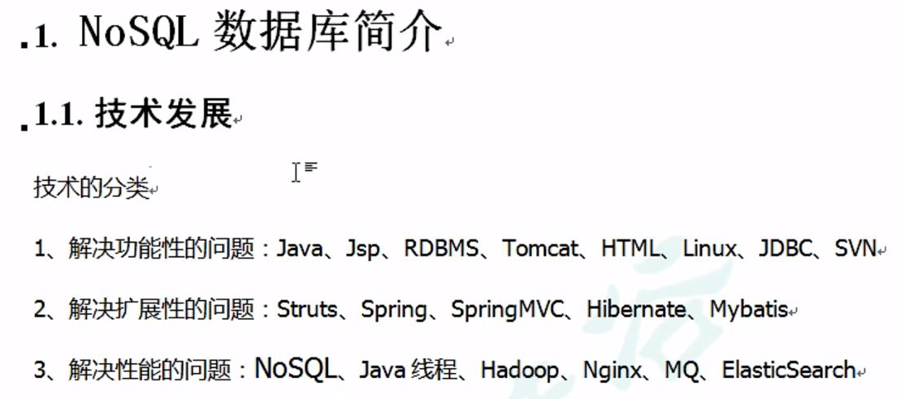


解决CPU及内存压力


解决IO压力


NoSQL以简单的**key-value**模式存储，不支持ACID（原子性、一致性、隔离性、持久性）

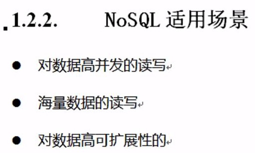


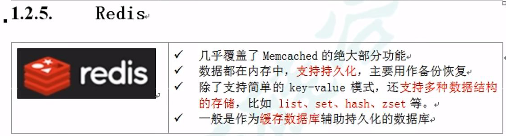


### Redis

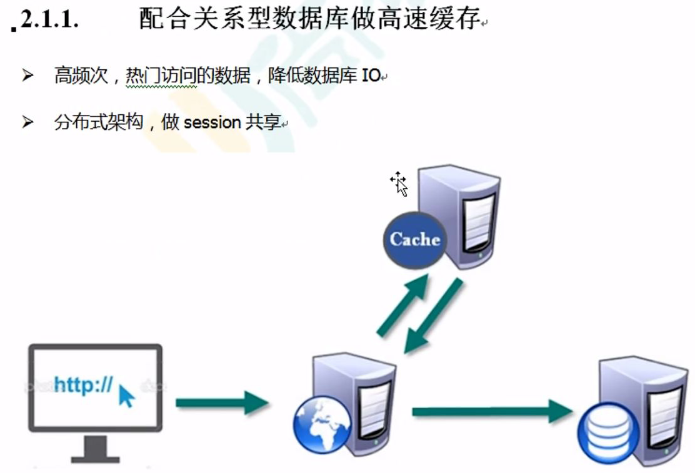


#### 单线程 + 多路IO复用


## 安装

要有C语言的编译环境
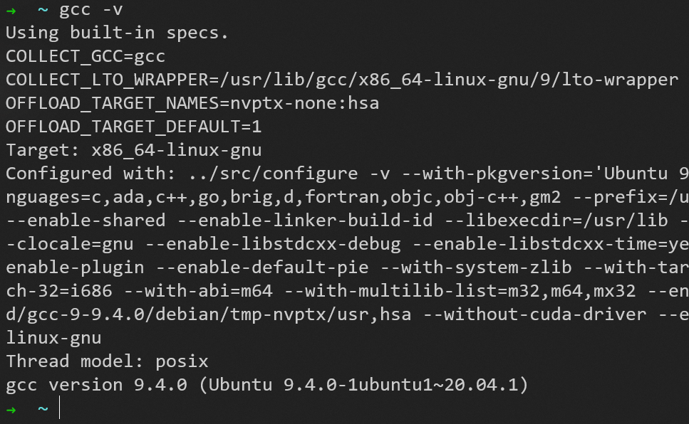

使用命令```sudo apt-get update```更新软件源

可以使用命令```sudo apt-cache search redis-server```搜索可用于安装的软件包名称

可以使用命令```sudo apt-cache madison redis-server```
列出所有来源的版本

使用命令```sudo apt-get install redis-server```安装

安装成功
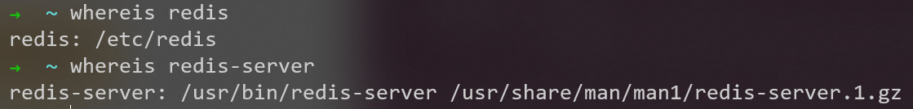

使用命令```service --status-all```可查看当前的所有服务

使用命令```sudo service redis-server start```启动服务（推荐）
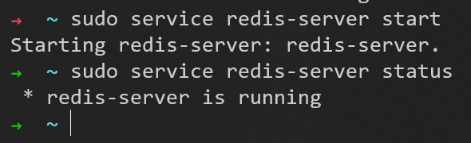

这时使用命令```redis-server```会报6379端口被占用的错误，可以使用命令```netstat -tln | grep 6379```查看端口的状态
那就把redis-server服务关闭，再使用命令```redis-server```成功启动（不推荐）
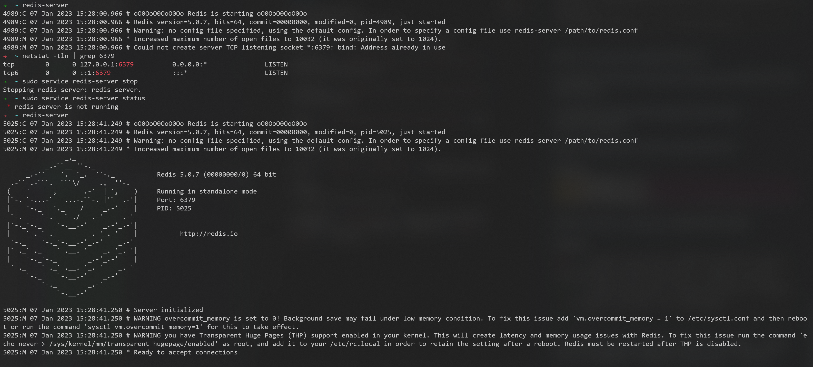

- 注意：这时使用```Ctrl+Z```快捷键，退出了当前进程的执行界面，程序没有结束，只是被挂起了

通过```ps```命令可以查看进程信息，这里不做详细介绍，可通过```jobs```命令查看被挂起的进程号
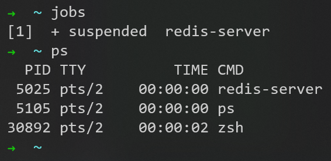

通过```fg```命令可以恢复进程到前台执行、```bg```命令恢复进程到后台执行
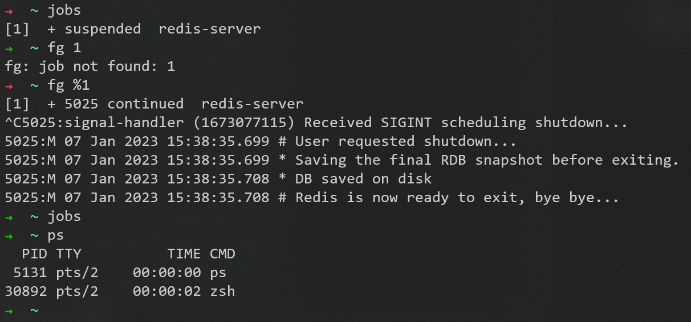
- 注意：这时使用```Ctrl+C```快捷键，强制终端程序的执行

## 使用

启动好redis-server后，使用命令```ps -ef | grep redis```能看到redis的进程
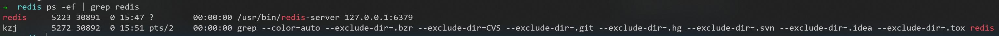

使用命令```redis-cli```通过客户端连接redis，输入```ping```，如果出现```pong```，就说明完全没问题
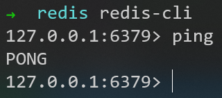

使用命令```redis-benchmark -h 127.0.0.1 -p 6379 -n 10000 -c 100```做个简单的性能测试，其中-h 本机地址，-p 端口号，-n 请求数， -c 并行数

### 配置文件redis.conf位置

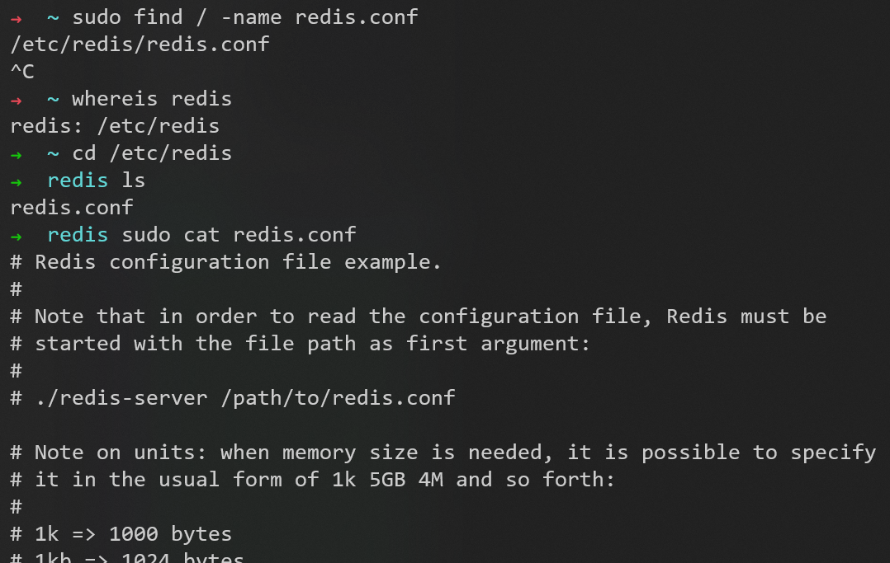


