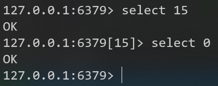
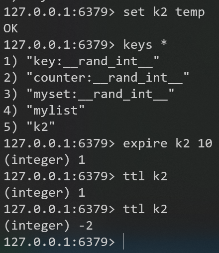

# 常用五大数据类型


## Redis键（key）

在```redis-cli```中操作


切换数据库



查看、添加key


判断存在、删除key


设置key的过期时间，查看key是否过期


## Redis字符串（String）


set、get命令


append、strlen、setnx命令


incr、decr命令


incrby、decrby命令


mset、mget、msetnx命令


getrange、setrange、setex、getset命令


### 原子性

#### Redis是单线程


#### Java是多线程

Java中的i++操作（能被打断）分为三步：
1. 取值
2. 加1
3. 赋值


i的值的范围是2到200，取到2的极端情况的线程执行次序是：
1. b在第1次**取值**后**加1**前被a打断，此时b取到的i为0
2. a在执行完第99次i++后被b打断
3. b执行第1次**加1**和**赋值**后被a打断，此时i为1
4. a在执行第100次**取值**后**加1**前被b打断，此时a取到的i为1
5. b执行直到第100次i++完成，此时切换回a
6. a执行第100次**加1**和**赋值**，然后i为2，结束

### String底层结构


## Redis列表（List）


lpush、rpush、lpop、rpop、rpoplpush、lrange命令


lindex、llen命令


linsert、lrem、lset命令


### List底层结构


## Redis集合（Set）


到P10  尚硅谷


