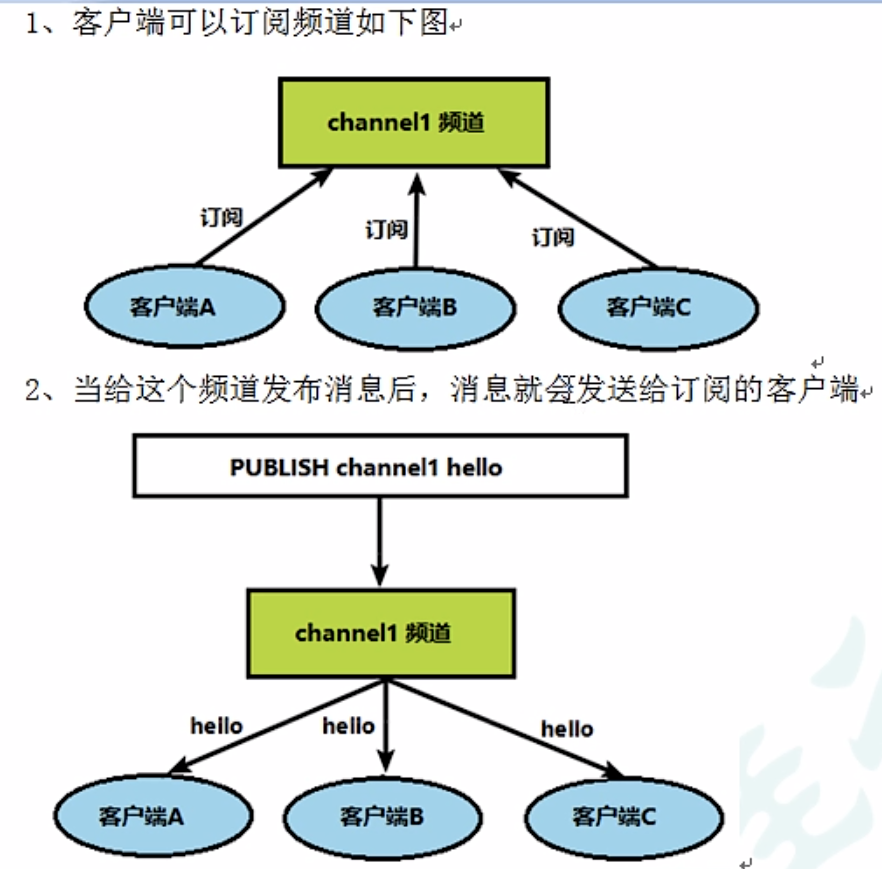
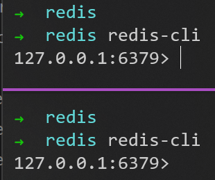
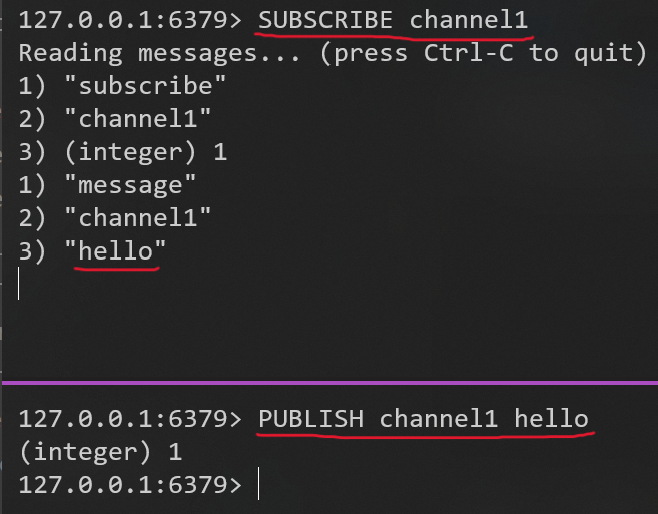

# 配置文件redis.conf详解

```conf
#redis.conf
# Redis configuration file example.
# ./redis-server /path/to/redis.conf
 
################################## INCLUDES ###################################
#这在你有标准配置模板但是每个redis服务器又需要个性设置的时候很有用。
# include /path/to/local.conf
# include /path/to/other.conf
 
################################ GENERAL #####################################
 
#是否在后台执行，yes：后台运行；no：不是后台运行（老版本默认）
daemonize yes
 
  #3.2里的参数，是否开启保护模式，默认开启。要是配置里没有指定bind和密码。开启该参数后，redis只会本地进行访问，拒绝外部访问。要是开启了密码和bind，可以开启。否则最好关闭，设置为no。
  protected-mode yes
#redis的进程文件
pidfile /var/run/redis/redis-server.pid
 
#redis监听的端口号。
port 6379
 
#此参数确定了TCP连接中已完成队列(完成三次握手之后)的长度， 当然此值必须不大于Linux系统定义的/proc/sys/net/core/somaxconn值，默认是511，而Linux的默认参数值是128。当系统并发量大并且客户端速度缓慢的时候，可以将这二个参数一起参考设定。该内核参数默认值一般是128，对于负载很大的服务程序来说大大的不够。一般会将它修改为2048或者更大。在/etc/sysctl.conf中添加:net.core.somaxconn = 2048，然后在终端中执行sysctl -p。
tcp-backlog 511
 
#绑定本机的IP地址，（准确的是：本机的网卡对应的IP地址，每一个网卡都有一个IP地址），而不是redis允许来自其他计算机的IP地址。
 
如果指定了bind，则说明只允许来自指定网卡的Redis请求。如果没有指定，就说明可以接受来自任意一个网卡的Redis请求。
bind 127.0.0.1
 
#配置unix socket来让redis支持监听本地连接。
# unixsocket /var/run/redis/redis.sock
#配置unix socket使用文件的权限
# unixsocketperm 700
 
# 此参数为设置客户端空闲超过timeout，服务端会断开连接，为0则服务端不会主动断开连接，不能小于0。
timeout 0
 
#tcp keepalive参数。如果设置不为0，就使用配置tcp的SO_KEEPALIVE值，使用keepalive有两个好处:检测挂掉的对端。降低中间设备出问题而导致网络看似连接却已经与对端端口的问题。在Linux内核中，设置了keepalive，redis会定时给对端发送ack。检测到对端关闭需要两倍的设置值。
tcp-keepalive 0
 
#指定了服务端日志的级别。级别包括：debug（很多信息，方便开发、测试），verbose（许多有用的信息，但是没有debug级别信息多），notice（适当的日志级别，适合生产环境），warn（只有非常重要的信息）
loglevel notice
 
#指定了记录日志的文件。空字符串的话，日志会打印到标准输出设备。后台运行的redis标准输出是/dev/null。
logfile /var/log/redis/redis-server.log
 
#是否打开记录syslog功能
# syslog-enabled no
 
#syslog的标识符。
# syslog-ident redis
 
#日志的来源、设备
# syslog-facility local0
 
#数据库的数量，默认使用的数据库是DB 0。可以通过”SELECT “命令选择一个db
databases 16
 
################################ SNAPSHOTTING ################################
# 快照配置
# 注释掉“save”这一行配置项就可以让保存数据库功能失效
# 设置sedis进行数据库镜像的频率。
# 900秒（15分钟）内至少1个key值改变（则进行数据库保存--持久化） 
# 300秒（5分钟）内至少10个key值改变（则进行数据库保存--持久化） 
# 60秒（1分钟）内至少10000个key值改变（则进行数据库保存--持久化）
save 900 1
save 300 10
save 60 10000
 
#当RDB持久化出现错误后，是否依然进行继续进行工作，yes：不能进行工作，no：可以继续进行工作，可以通过info中的rdb_last_bgsave_status了解RDB持久化是否有错误
stop-writes-on-bgsave-error yes
 
#使用压缩rdb文件，rdb文件压缩使用LZF压缩算法，yes：压缩，但是需要一些cpu的消耗。no：不压缩，需要更多的磁盘空间
rdbcompression yes
 
#是否校验rdb文件。从rdb格式的第五个版本开始，在rdb文件的末尾会带上CRC64的校验和。这跟有利于文件的容错性，但是在保存rdb文件的时候，会有大概10%的性能损耗，所以如果你追求高性能，可以关闭该配置。
rdbchecksum yes
 
#rdb文件的名称
dbfilename dump.rdb
 
#数据目录，数据库的写入会在这个目录。rdb、aof文件也会写在这个目录
dir /var/lib/redis
 
################################# REPLICATION #################################
#复制选项，slave复制对应的master。
# slaveof <masterip> <masterport>
 
#如果master设置了requirepass，那么slave要连上master，需要有master的密码才行。masterauth就是用来配置master的密码，这样可以在连上master后进行认证。
# masterauth <master-password>
 
#当从库同主机失去连接或者复制正在进行，从机库有两种运行方式：1) 如果slave-serve-stale-data设置为yes(默认设置)，从库会继续响应客户端的请求。2) 如果slave-serve-stale-data设置为no，除去INFO和SLAVOF命令之外的任何请求都会返回一个错误”SYNC with master in progress”。
slave-serve-stale-data yes
 
#作为从服务器，默认情况下是只读的（yes），可以修改成NO，用于写（不建议）。
slave-read-only yes
 
#是否使用socket方式复制数据。目前redis复制提供两种方式，disk和socket。如果新的slave连上来或者重连的slave无法部分同步，就会执行全量同步，master会生成rdb文件。有2种方式：disk方式是master创建一个新的进程把rdb文件保存到磁盘，再把磁盘上的rdb文件传递给slave。socket是master创建一个新的进程，直接把rdb文件以socket的方式发给slave。disk方式的时候，当一个rdb保存的过程中，多个slave都能共享这个rdb文件。socket的方式就的一个个slave顺序复制。在磁盘速度缓慢，网速快的情况下推荐用socket方式。
repl-diskless-sync no
 
#diskless复制的延迟时间，防止设置为0。一旦复制开始，节点不会再接收新slave的复制请求直到下一个rdb传输。所以最好等待一段时间，等更多的slave连上来。
repl-diskless-sync-delay 5
 
#slave根据指定的时间间隔向服务器发送ping请求。时间间隔可以通过 repl_ping_slave_period 来设置，默认10秒。
# repl-ping-slave-period 10
 
#复制连接超时时间。master和slave都有超时时间的设置。master检测到slave上次发送的时间超过repl-timeout，即认为slave离线，清除该slave信息。slave检测到上次和master交互的时间超过repl-timeout，则认为master离线。需要注意的是repl-timeout需要设置一个比repl-ping-slave-period更大的值，不然会经常检测到超时。
# repl-timeout 60
 
#是否禁止复制tcp链接的tcp nodelay参数，可传递yes或者no。默认是no，即使用tcp nodelay。如果master设置了yes来禁止tcp nodelay设置，在把数据复制给slave的时候，会减少包的数量和更小的网络带宽。但是这也可能带来数据的延迟。默认我们推荐更小的延迟，但是在数据量传输很大的场景下，建议选择yes。
repl-disable-tcp-nodelay no
 
#复制缓冲区大小，这是一个环形复制缓冲区，用来保存最新复制的命令。这样在slave离线的时候，不需要完全复制master的数据，如果可以执行部分同步，只需要把缓冲区的部分数据复制给slave，就能恢复正常复制状态。缓冲区的大小越大，slave离线的时间可以更长，复制缓冲区只有在有slave连接的时候才分配内存。没有slave的一段时间，内存会被释放出来，默认1m。
# repl-backlog-size 5mb
 
#master没有slave一段时间会释放复制缓冲区的内存，repl-backlog-ttl用来设置该时间长度。单位为秒。
# repl-backlog-ttl 3600
 
#当master不可用，Sentinel会根据slave的优先级选举一个master。最低的优先级的slave，当选master。而配置成0，永远不会被选举。
slave-priority 100
 
#redis提供了可以让master停止写入的方式，如果配置了min-slaves-to-write，健康的slave的个数小于N，mater就禁止写入。master最少得有多少个健康的slave存活才能执行写命令。这个配置虽然不能保证N个slave都一定能接收到master的写操作，但是能避免没有足够健康的slave的时候，master不能写入来避免数据丢失。设置为0是关闭该功能。
# min-slaves-to-write 3
 
#延迟小于min-slaves-max-lag秒的slave才认为是健康的slave。
# min-slaves-max-lag 10
 
# 设置1或另一个设置为0禁用这个特性。
# Setting one or the other to 0 disables the feature.
# By default min-slaves-to-write is set to 0 (feature disabled) and
# min-slaves-max-lag is set to 10.
 
################################## SECURITY ###################################
#requirepass配置可以让用户使用AUTH命令来认证密码，才能使用其他命令。这让redis可以使用在不受信任的网络中。为了保持向后的兼容性，可以注释该命令，因为大部分用户也不需要认证。使用requirepass的时候需要注意，因为redis太快了，每秒可以认证15w次密码，简单的密码很容易被攻破，所以最好使用一个更复杂的密码。
# requirepass foobared
 
#把危险的命令给修改成其他名称。比如CONFIG命令可以重命名为一个很难被猜到的命令，这样用户不能使用，而内部工具还能接着使用。
# rename-command CONFIG b840fc02d524045429941cc15f59e41cb7be6c52
 
#设置成一个空的值，可以禁止一个命令
# rename-command CONFIG ""
################################### LIMITS ####################################
 
# 设置能连上redis的最大客户端连接数量。默认是10000个客户端连接。由于redis不区分连接是客户端连接还是内部打开文件或者和slave连接等，所以maxclients最小建议设置到32。如果超过了maxclients，redis会给新的连接发送’max number of clients reached’，并关闭连接。
# maxclients 10000
 
#redis配置的最大内存容量。当内存满了，需要配合maxmemory-policy策略进行处理。注意slave的输出缓冲区是不计算在maxmemory内的。所以为了防止主机内存使用完，建议设置的maxmemory需要更小一些。
# maxmemory <bytes>
 
#内存容量超过maxmemory后的处理策略。
#volatile-lru：利用LRU算法移除设置过过期时间的key。
#volatile-random：随机移除设置过过期时间的key。
#volatile-ttl：移除即将过期的key，根据最近过期时间来删除（辅以TTL）
#allkeys-lru：利用LRU算法移除任何key。
#allkeys-random：随机移除任何key。
#noeviction：不移除任何key，只是返回一个写错误。
#上面的这些驱逐策略，如果redis没有合适的key驱逐，对于写命令，还是会返回错误。redis将不再接收写请求，只接收get请求。写命令包括：set setnx setex append incr decr rpush lpush rpushx lpushx linsert lset rpoplpush sadd sinter sinterstore sunion sunionstore sdiff sdiffstore zadd zincrby zunionstore zinterstore hset hsetnx hmset hincrby incrby decrby getset mset msetnx exec sort。
# maxmemory-policy noeviction
 
#lru检测的样本数。使用lru或者ttl淘汰算法，从需要淘汰的列表中随机选择sample个key，选出闲置时间最长的key移除。
# maxmemory-samples 5
 
############################## APPEND ONLY MODE ###############################
#默认redis使用的是rdb方式持久化，这种方式在许多应用中已经足够用了。但是redis如果中途宕机，会导致可能有几分钟的数据丢失，根据save来策略进行持久化，Append Only File是另一种持久化方式，可以提供更好的持久化特性。Redis会把每次写入的数据在接收后都写入 appendonly.aof 文件，每次启动时Redis都会先把这个文件的数据读入内存里，先忽略RDB文件。
appendonly no
 
#aof文件名
appendfilename "appendonly.aof"
 
#aof持久化策略的配置
#no表示不执行fsync，由操作系统保证数据同步到磁盘，速度最快。
#always表示每次写入都执行fsync，以保证数据同步到磁盘。
#everysec表示每秒执行一次fsync，可能会导致丢失这1s数据。
appendfsync everysec
 
# 在aof重写或者写入rdb文件的时候，会执行大量IO，此时对于everysec和always的aof模式来说，执行fsync会造成阻塞过长时间，no-appendfsync-on-rewrite字段设置为默认设置为no。如果对延迟要求很高的应用，这个字段可以设置为yes，否则还是设置为no，这样对持久化特性来说这是更安全的选择。设置为yes表示rewrite期间对新写操作不fsync,暂时存在内存中,等rewrite完成后再写入，默认为no，建议yes。Linux的默认fsync策略是30秒。可能丢失30秒数据。
no-appendfsync-on-rewrite no
 
#aof自动重写配置。当目前aof文件大小超过上一次重写的aof文件大小的百分之多少进行重写，即当aof文件增长到一定大小的时候Redis能够调用bgrewriteaof对日志文件进行重写。当前AOF文件大小是上次日志重写得到AOF文件大小的二倍（设置为100）时，自动启动新的日志重写过程。
auto-aof-rewrite-percentage 100
#设置允许重写的最小aof文件大小，避免了达到约定百分比但尺寸仍然很小的情况还要重写
auto-aof-rewrite-min-size 64mb
 
#aof文件可能在尾部是不完整的，当redis启动的时候，aof文件的数据被载入内存。重启可能发生在redis所在的主机操作系统宕机后，尤其在ext4文件系统没有加上data=ordered选项（redis宕机或者异常终止不会造成尾部不完整现象。）出现这种现象，可以选择让redis退出，或者导入尽可能多的数据。如果选择的是yes，当截断的aof文件被导入的时候，会自动发布一个log给客户端然后load。如果是no，用户必须手动redis-check-aof修复AOF文件才可以。
aof-load-truncated yes
 
################################ LUA SCRIPTING ###############################
# 如果达到最大时间限制（毫秒），redis会记个log，然后返回error。当一个脚本超过了最大时限。只有SCRIPT KILL和SHUTDOWN NOSAVE可以用。第一个可以杀没有调write命令的东西。要是已经调用了write，只能用第二个命令杀。
lua-time-limit 5000
 
################################ REDIS CLUSTER ###############################
#集群开关，默认是不开启集群模式。
# cluster-enabled yes
 
#集群配置文件的名称，每个节点都有一个集群相关的配置文件，持久化保存集群的信息。这个文件并不需要手动配置，这个配置文件有Redis生成并更新，每个Redis集群节点需要一个单独的配置文件，请确保与实例运行的系统中配置文件名称不冲突
# cluster-config-file nodes-6379.conf
 
#节点互连超时的阀值。集群节点超时毫秒数
# cluster-node-timeout 15000
 
#在进行故障转移的时候，全部slave都会请求申请为master，但是有些slave可能与master断开连接一段时间了，导致数据过于陈旧，这样的slave不应该被提升为master。该参数就是用来判断slave节点与master断线的时间是否过长。判断方法是：
#比较slave断开连接的时间和(node-timeout * slave-validity-factor) + repl-ping-slave-period
#如果节点超时时间为三十秒, 并且slave-validity-factor为10,假设默认的repl-ping-slave-period是10秒，即如果超过310秒slave将不会尝试进行故障转移 
# cluster-slave-validity-factor 10
 
#master的slave数量大于该值，slave才能迁移到其他孤立master上，如这个参数若被设为2，那么只有当一个主节点拥有2 个可工作的从节点时，它的一个从节点会尝试迁移。
# cluster-migration-barrier 1
 
#默认情况下，集群全部的slot有节点负责，集群状态才为ok，才能提供服务。设置为no，可以在slot没有全部分配的时候提供服务。不建议打开该配置，这样会造成分区的时候，小分区的master一直在接受写请求，而造成很长时间数据不一致。
# cluster-require-full-coverage yes
 
################################## SLOW LOG ###################################
###slog log是用来记录redis运行中执行比较慢的命令耗时。当命令的执行超过了指定时间，就记录在slow log中，slog log保存在内存中，所以没有IO操作。
#执行时间比slowlog-log-slower-than大的请求记录到slowlog里面，单位是微秒，所以1000000就是1秒。注意，负数时间会禁用慢查询日志，而0则会强制记录所有命令。
slowlog-log-slower-than 10000
 
#慢查询日志长度。当一个新的命令被写进日志的时候，最老的那个记录会被删掉。这个长度没有限制。只要有足够的内存就行。你可以通过 SLOWLOG RESET 来释放内存。
slowlog-max-len 128
 
################################ LATENCY MONITOR ##############################
#延迟监控功能是用来监控redis中执行比较缓慢的一些操作，用LATENCY打印redis实例在跑命令时的耗时图表。只记录大于等于下边设置的值的操作。0的话，就是关闭监视。默认延迟监控功能是关闭的，如果你需要打开，也可以通过CONFIG SET命令动态设置。
latency-monitor-threshold 0
 
############################# EVENT NOTIFICATION ##############################
#键空间通知使得客户端可以通过订阅频道或模式，来接收那些以某种方式改动了 Redis 数据集的事件。因为开启键空间通知功能需要消耗一些 CPU ，所以在默认配置下，该功能处于关闭状态。
#notify-keyspace-events 的参数可以是以下字符的任意组合，它指定了服务器该发送哪些类型的通知：
##K 键空间通知，所有通知以 __keyspace@__ 为前缀
##E 键事件通知，所有通知以 __keyevent@__ 为前缀
##g DEL 、 EXPIRE 、 RENAME 等类型无关的通用命令的通知
##$ 字符串命令的通知
##l 列表命令的通知
##s 集合命令的通知
##h 哈希命令的通知
##z 有序集合命令的通知
##x 过期事件：每当有过期键被删除时发送
##e 驱逐(evict)事件：每当有键因为 maxmemory 政策而被删除时发送
##A 参数 g$lshzxe 的别名
#输入的参数中至少要有一个 K 或者 E，否则的话，不管其余的参数是什么，都不会有任何 通知被分发。详细使用可以参考http://redis.io/topics/notifications
 
notify-keyspace-events ""
 
############################### ADVANCED CONFIG ###############################
#数据量小于等于hash-max-ziplist-entries的用ziplist，大于hash-max-ziplist-entries用hash
hash-max-ziplist-entries 512
#value大小小于等于hash-max-ziplist-value的用ziplist，大于hash-max-ziplist-value用hash。
hash-max-ziplist-value 64
 
#数据量小于等于list-max-ziplist-entries用ziplist，大于list-max-ziplist-entries用list。
list-max-ziplist-entries 512
#value大小小于等于list-max-ziplist-value的用ziplist，大于list-max-ziplist-value用list。
list-max-ziplist-value 64
 
#数据量小于等于set-max-intset-entries用iniset，大于set-max-intset-entries用set。
set-max-intset-entries 512
 
#数据量小于等于zset-max-ziplist-entries用ziplist，大于zset-max-ziplist-entries用zset。
zset-max-ziplist-entries 128
#value大小小于等于zset-max-ziplist-value用ziplist，大于zset-max-ziplist-value用zset。
zset-max-ziplist-value 64
 
#value大小小于等于hll-sparse-max-bytes使用稀疏数据结构（sparse），大于hll-sparse-max-bytes使用稠密的数据结构（dense）。一个比16000大的value是几乎没用的，建议的value大概为3000。如果对CPU要求不高，对空间要求较高的，建议设置到10000左右。
hll-sparse-max-bytes 3000
 
#Redis将在每100毫秒时使用1毫秒的CPU时间来对redis的hash表进行重新hash，可以降低内存的使用。当你的使用场景中，有非常严格的实时性需要，不能够接受Redis时不时的对请求有2毫秒的延迟的话，把这项配置为no。如果没有这么严格的实时性要求，可以设置为yes，以便能够尽可能快的释放内存。
activerehashing yes
 
##对客户端输出缓冲进行限制可以强迫那些不从服务器读取数据的客户端断开连接，用来强制关闭传输缓慢的客户端。
#对于normal client，第一个0表示取消hard limit，第二个0和第三个0表示取消soft limit，normal client默认取消限制，因为如果没有寻问，他们是不会接收数据的。
client-output-buffer-limit normal 0 0 0
#对于slave client和MONITER client，如果client-output-buffer一旦超过256mb，又或者超过64mb持续60秒，那么服务器就会立即断开客户端连接。
client-output-buffer-limit slave 256mb 64mb 60
#对于pubsub client，如果client-output-buffer一旦超过32mb，又或者超过8mb持续60秒，那么服务器就会立即断开客户端连接。
client-output-buffer-limit pubsub 32mb 8mb 60
 
#redis执行任务的频率为1s除以hz。
hz 10
 
#在aof重写的时候，如果打开了aof-rewrite-incremental-fsync开关，系统会每32MB执行一次fsync。这对于把文件写入磁盘是有帮助的，可以避免过大的延迟峰值。
aof-rewrite-incremental-fsync yes
```

# Redis的发布和订阅




## 使用

首先打开两个**redis-cli**客户端


subscribe、publish命令


