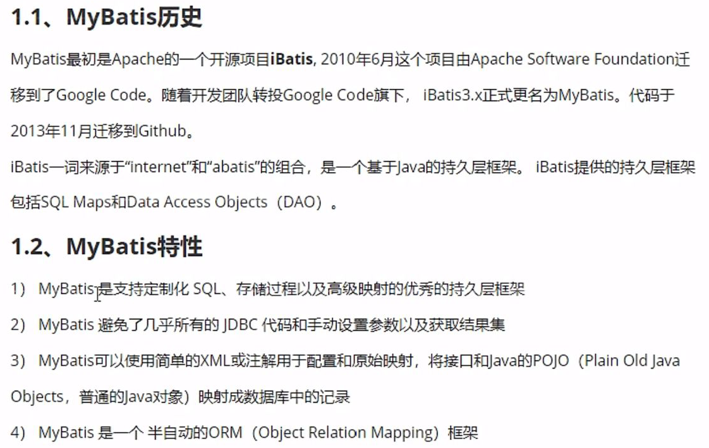
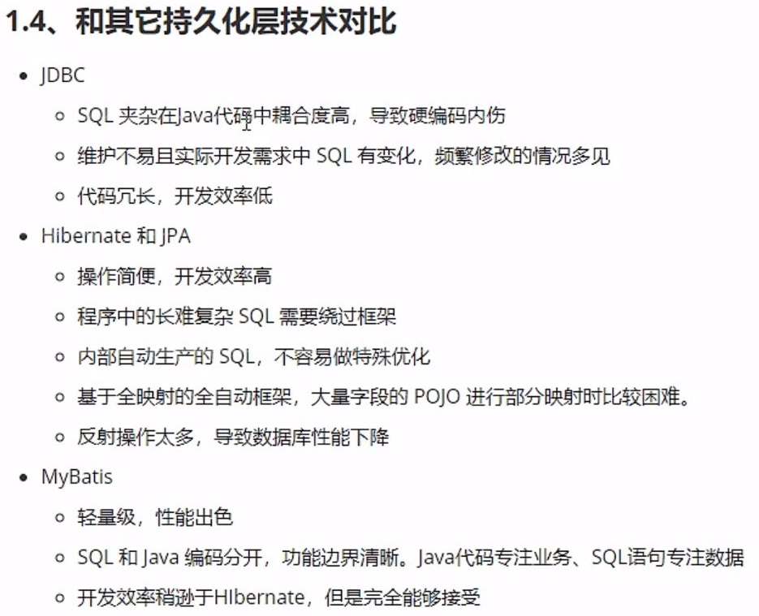
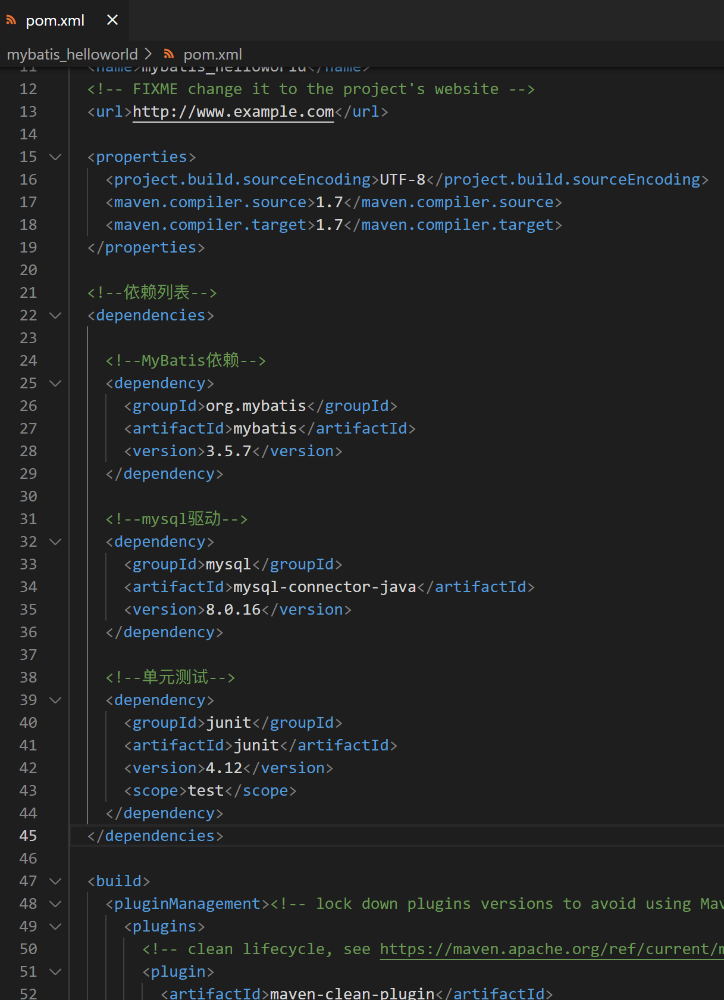

# MyBatis

## 简介

持久层框架
DAO：数据库访问对象
ORM：对象关系映射（对象指**Java中的对象**，关系指**关系型数据库**，创建Java对象和数据库记录的映射）


1. 纯手动：JDBC
2. 半自动：MyBatis
3. 全自动：Hibernate



## 安装

首先用Maven构建一个工程，并引入依赖
```java
 <!--依赖列表-->
  <dependencies>
 
    <!--MyBatis依赖-->
    <dependency>
      <groupId>org.mybatis</groupId>
      <artifactId>mybatis</artifactId>
      <version>3.5.7</version>
    </dependency>
 
    <!--mysql驱动-->
    <dependency>
      <groupId>mysql</groupId>
      <artifactId>mysql-connector-java</artifactId>
      <version>8.0.16</version>
    </dependency>
 
    <!--单元测试-->
    <dependency>
      <groupId>junit</groupId>
      <artifactId>junit</artifactId>
      <version>4.12</version>
      <scope>test</scope>
    </dependency>
  </dependencies>
```



到尚硅谷SSM P6  6min


