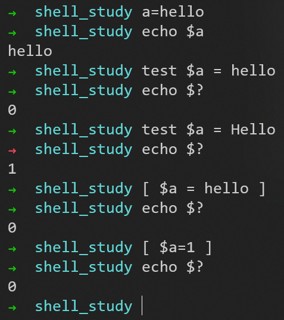
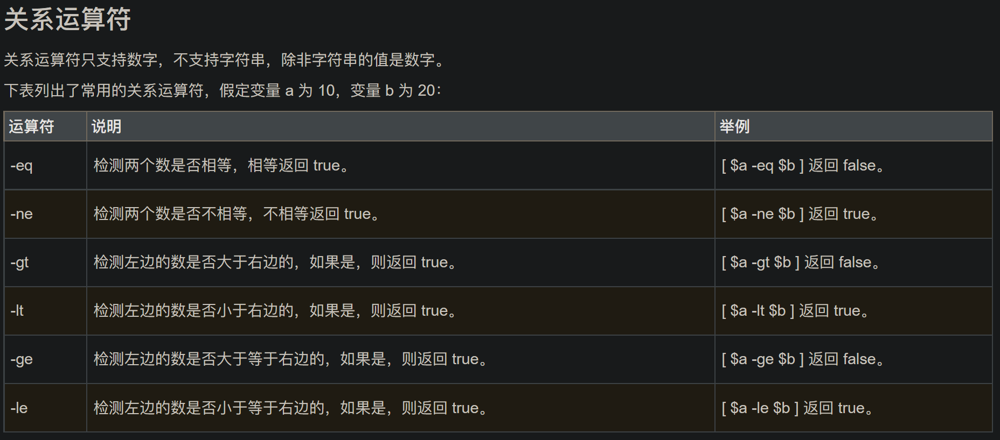
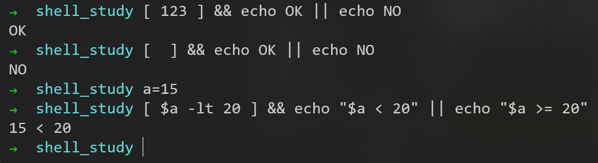

# Shell编程

shell 是一个应用程序，它连接了用户和 Linux 内核，让用户能够更加高效、安全、低成本地使用 Linux 内核，这就是 Shell 的本质。

shell 本身并不是内核的一部分，它只是站在内核的基础上编写的一个应用程序。

那么什么是shell脚本呢？

shell脚本就是由Shell命令组成的执行文件，将一些命令整合到一个文件中，进行处理业务逻辑，脚本不用编译即可运行。它通过解释器解释运行，所以速度相对来说比较慢。

shell脚本中最重要的就是对shell命令的使用与组合，再使用shell脚本支持的一些语言特性，完成想要的功能。

查看支持的shell


## 入门

### 扩展名

```sh```
```php```

### 开头

```#!/bin/bash```（指定解析器）

### 执行第一个shell脚本

#### 启动子shell进程执行


注意：
1. 用```sh 或 bash [脚本文件名]```运行脚本（**另启动一个bash进程**，来运行脚本，文件名当作参数传入）
2. 也可以直接用```[脚本文件名]```运行脚本，必须要有执行权限（让**当前的shell环境**去执行脚本）

#### 在当前shell中直接执行

还有这两种执行方式


```source```和```.```都是shell内嵌命令


#### 测试父子shell

父子shell的套娃


## 变量

### 分类

Shell变量的作用域可以分为三种：
1. 只能在函数内部使用，这叫做局部变量（local variable）
2. 可以在当前Shell进程中使用，这叫做全局变量（global variable）
3. 可以在子进程中使用，这叫做环境变量（environment variable）

[Shell脚本-全局变量、局部变量、环境变量网页链接](https://blog.csdn.net/zjc156m/article/details/118582021)

#### 局部变量

在 Shell 函数中定义的变量默认也是全局变量，它和在函数外部定义变量拥有一样的效果

a 是在函数内部定义的，但是在函数外部也可以得到它的值，证明它的作用域是全局的，而不是仅限于函数内部

要想变量的作用域仅限于函数内部，可以在定义时加上local命令，此时该变量就成了局部变量


#### 全局变量

所谓全局变量，就是指变量在当前的整个 Shell 进程中都有效。每个 Shell 进程都有自己的作用域，彼此之间互不影响。在 Shell 中定义的变量，默认就是全局变量
需要强调的是，全局变量的作用范围是当前的 Shell 进程，而不是当前的 Shell 脚本文件，它们是不同的概念。打开一个 Shell 窗口就创建了一个 Shell 进程，打开多个 Shell 窗口就创建了多个 Shell 进程，每个 Shell 进程都是独立的，拥有不同的进程 ID。在一个 Shell 进程中可以使用 source 命令执行多个 Shell 脚本文件，此时全局变量在这些脚本文件中都有效

当前有两个shell脚本文件
a.sh的内容为
```shell
#!/bin/bash
echo $a
b=400
```
b.sh的内容为
```shell
#!/bin/bash
echo $b
```

这三条命令都是在一个进程中执行的，从输出结果可以发现，在 Shell 窗口中以命令行的形式定义的变量a，在a.sh中有效；在a.sh中定义的变量b，在b.sh中也有效，变量b的作用范围已经超越了所在的脚本文件


#### 环境变量

全局变量只在当前 Shell 进程中有效，对其它 Shell 进程和子进程都无效。如果使用```export```命令将全局变量导出，那么它就在所有的子进程中也有效了，这称为环境变量

环境变量被创建时所处的 Shell 进程称为父进程，如果在父进程中再创建一个新的进程来执行 Shell 命令，那么这个新的进程被称作 Shell 子进程。当 Shell 子进程产生时，它会继承父进程的环境变量为自己所用，所以说环境变量可从父进程传给子进程。不难理解，环境变量还可以传递给孙进程

注意，两个没有父子关系的 Shell 进程是不能传递环境变量的，并且环境变量只能向下传递而不能向上传递，即“传子不传父”


[set、env、export——Linux中的环境变量命令网页链接](https://blog.csdn.net/u014756827/article/details/78072074)

##### export

使用```export```命令可以导出一个新的环境变量

##### env

使用```env```命令可以显示所有的环境变量

##### set

使用```set```命令可以显示所有本地定义的Shell变量

### 变量操作

#### 定义变量

```my_name="kzj"```
等号前后不能有空格

默认的定义不是数值，而是字符串


变量的值如果有空格，需要使用双引号或单引号括起来


##### 单引号、双引号、没有引号的区别

1. 单引号：
可以说是所见即所得：即将单引号内的内容原样输出，或者描述为单引号里面看见的是什么就会输出什么。

2. 双引号：
把双引号内的内容输出出来；如果内容中有命令，变量等，会先把变量，命令解析出结果，然后在输出最终内容来。
双引号内命令或变量的写法为命令或变量或$（命令或变量）。

3. 无引号：
把内容输出出来，可能不会讲含有空格的字符串视为一个整体输出；
如果内容中有命令、变量等，会先把变量、命令解析结果，然后在输出最终内容来；
如果字符串中带有空格等特殊字符，则不能完整的输出，需要改加双引号，一般连续的字符串，数字，路径等可以用，不过最好用双引号替代之。

#### 使用变量

使用一个定义过的变量，只要在变量名前面加美元符号即可

变量名外面的花括号是可选的，加不加都行，加花括号是为了帮助解释器识别变量的边界
推荐给所有变量加上花括号，这是个好的编程习惯

已定义的变量，可以被重新定义


#### 只读变量

使用 readonly 命令可以将变量定义为只读变量，只读变量的值不能被改变

#### 删除变量

使用 unset 命令可以删除变量，变量被删除后不能再次使用，unset 命令不能删除只读变量

### 特殊变量

为了脚本能获取外界传入的参数
shell编程中有一些特殊的变量可以使用，这些变量在脚本中可以作为全局变量来使用

- ```$0```	执行脚本的名称
- ```$n```	接收shell脚本文件执行时传入的第n个参数，第10个以及以上必须要用{n}
- ```$?```	脚本的返回值，代表上一个命令是否执行成功，如果成功，则为0，否则不成功
- ```$!```	代表最后执行的后台命令的PID
- ```$#```	脚本执行时，输入的参数的个数（常用于循环）
- ```$@```	输入的参数的具体内容（将输入的参数作为一个多个对象，即是所有参数的一个列表）
- ```$*```	输入的参数的具体内容（将输入的参数作为一个单词）

```$n```的使用例子为
```shell
#!/bin/bash
echo "hello, world"
echo "hello, $1"
```


```$?```的使用例子为


## 运算符

```expr```命令较为麻烦


简单的方法：```$((运算式))``` 或 ```$[运算式]```


分别怎么赋值


### 实例：计算两个参数的和


### 算数运算符


## 条件判断

### 基本语法

```test condition```
```[ condition ]```（注意condition前后要有空格）

为真，返回0；为假，返回1

注意等号的两边要有空格，不然会把左右两边和空格识别成一个值
注意这里能使用```=```运算符，是因为两边被当成字符串，而不是数字

里面有值，则为真；里面为空，则为假


### 关系运算符


注意：
```>```表示输出重定向
```<```表示输入重定向


### 文件测试运算符


### 逻辑运算符


用于多条件判断：
1. ```&&```（前一条命令执行**成功**时，才执行后一条命令）
2. ```||```（前一条命令执行**失败**时，才执行后一条命令）

类似三元表达式



