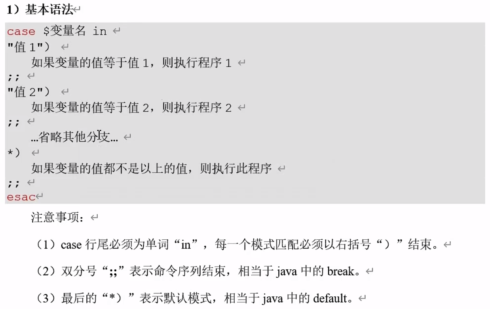

# 流程控制

之前进行条件判断，就是为了流程控制

## if判断


```;```的作用：分隔两个命令


### 实例：判断登录的用户

shell脚本文件内容为
 ```shell
#!/bin/bash
if [ $1 = kzj ]
then
        echo "welcome, $1"
fi
 ```
如果传入参数为空，会报错


所以，shell脚本文件内容改进为
 ```shell
#!/bin/bash
if [ "$1"x = "kzj"x ]
then
        echo "welcome, $1"
fi
 ```
这样，传入空值就不会报错了


### 实例：多条件判断

shell脚本文件内容为
 ```shell
#!/bin/bash
if [ $1 -gt 18 ] && [ $1 -lt 35 ]
then
        echo OK
fi
 ```


if后面能不能只用一对中括号，即把```&&```放到```[  ]```里面
```&&```不能直接放进去，换成```-a```可以放进去
```shell
#!/bin/bash
if [ $1 -gt 18 -a $1 -lt 35 ]
then
	echo OK
fi
 ```


#### 布尔运算符


### if多分支

之前都是if单分支，现在开始if多分支

shell脚本文件内容为
 ```shell
#!/bin/bash
if [ $1 -lt 18 ]
then
	echo "kid or teenager"  
elif [ $1 -lt 60 ]
then
	echo "adult"
else
	echo "older"
fi
 ```


## case语句



shell脚本文件内容为
 ```shell
#!/bin/bash
case $1 in
1)
	echo "one"
;;
2)
	echo "two"
;;
*)
	echo "number else"
;;
esac
```


## for循环


---

到P77
