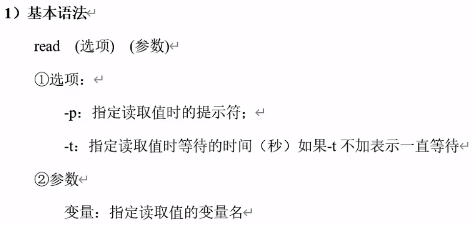
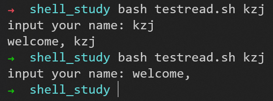
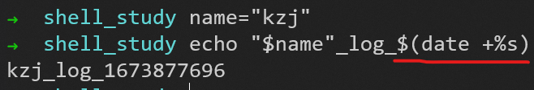
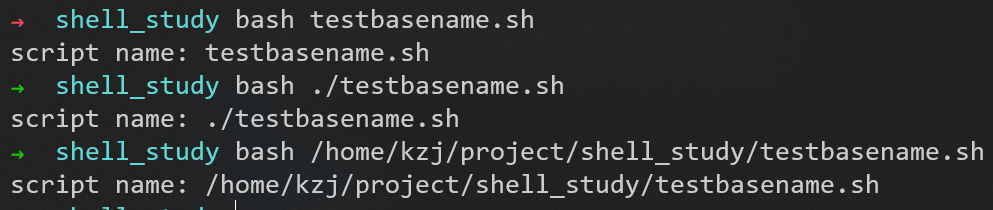
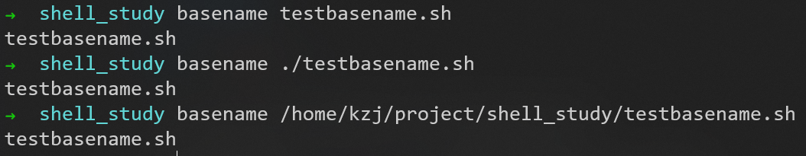
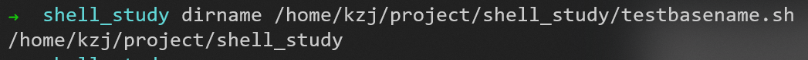
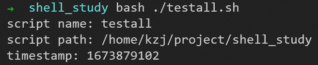
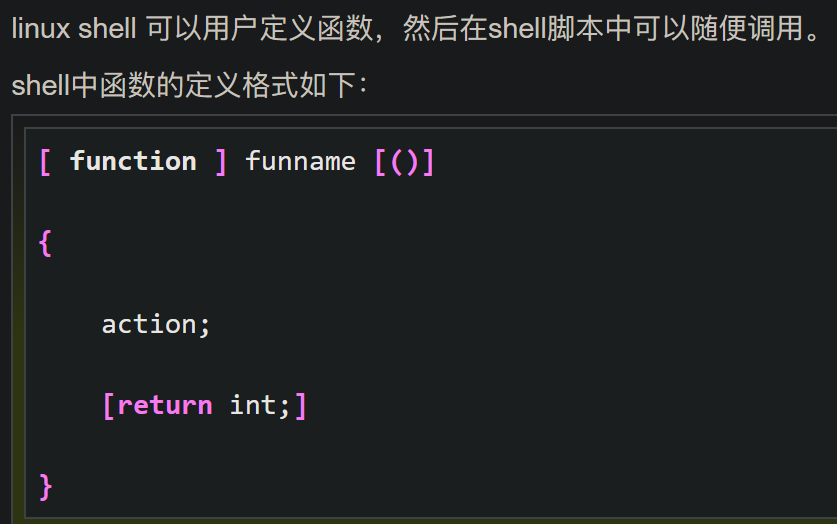
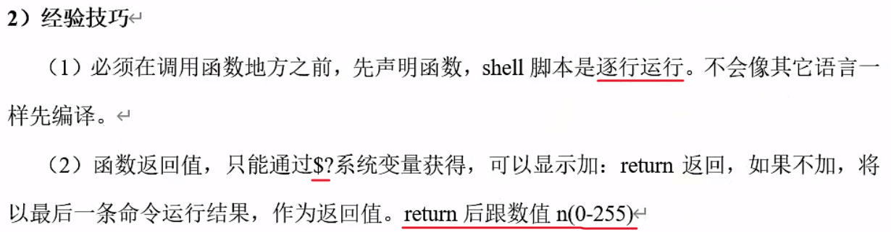
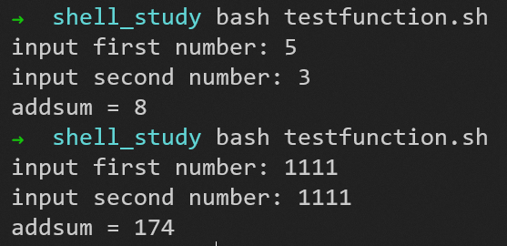

# 读取控制台输入

## read



shell脚本文件内容为
```shell
#!/bin/bash
read -t 10 -p "input your name: " name
echo "welcome, $name"
```


# 函数（类似脚本文件）

## 系统函数

### ```date```


系统函数的使用：```$()```（命令替换）（得到括号内命令的执行结果）


### ```basename```

```$0```表示当前的脚本名称，shell脚本文件内容为
 ```shell
#!/bin/bash
echo script name: $0
```


怎样可以不加前面的完整路径

本质就是字符串的截取


### ```dirname```




### 实例：输出当前脚本的文件名、绝对路径、执行时间戳

shell脚本文件内容为
```shell
#!/bin/bash
echo script name: $(basename $0 .sh)
echo script path: $(cd $(dirname $0); pwd)
echo timestamp:   $(date +%s)
```


## 自定义函数


注意：```[...]```表示这一部分是可有可无的
1. ```function```可以不写
2. 参数列表可以省略（函数的形参不需要定义，默认是```$n```，这一点和脚本是一样的）
3. 返回语句可以省略



shell脚本文件内容为
```shell
#!/bin/bash
function add(){
	s=$[$1 + $2]
	return $s
}
read -p "input first number: " num1
read -p "input second number: " num2
add $num1 $num2
echo "addsum = "$?
```

加法的结果超过255，得到的结果就会出错

解决方法：不用函数的直接return返回，不要用```$?```获取函数返回值，用前面系统函数的调用方式，用命令替换```$()```，把函数返回的值赋给另外一个变量
```shell
#!/bin/bash
function add(){
	s=$[$1 + $2]
	echo $s
}
read -p "input first number: " num1
read -p "input second number: " num2
addsum=$(add $num1 $num2)
echo "addsum = "$addsum
```


## 综合应用

### 归档文件


shell脚本文件内容为
```shell
#!/bin/bash

# 首先判断输入参数个数是否为1
if [ $# -ne 1 ]
then
    echo "参数个数错误，应该输入一个参数，作为归档的目录名，程序退出"
    exit
fi

# 从参数中获取目录名称
if [ -d $1 ]
then
    echo "目录存在"
else
    echo "目录不存在，程序退出"
    exit
fi
DIR_ALL=$(cd $1; pwd)
DIR_PATH=$(dirname ${DIR_ALL})
DIR_NAME=$(basename ${DIR_ALL})
echo "获取目录成功"

# 获取当前日期
DATE=$(date +%y%m%d)

# 定义生成的归档文件名称
FILE=archive_${DIR_NAME}_${DATE}.tar.gz
BAK=/root/archive
DEST=${BAK}/${FILE}
if [ -d ${BAK} ]
then 
    echo "存在归档目录"
else
    echo "新建归档目录"
    mkdir ${BAK}
fi

# 开始归档目录文件
echo "开始归档"
tar -czf ${DEST} ${DIR_ALL}
if [ $? -eq 0 ]
then
    echo "归档成功"
    echo "归档文件为：${DEST}"
else
    echo "归档出现问题"
fi
exit
```

这样每手动执行一次，可以生成一个归档文件

#### 使用crontab命令定期执行程序

把上面的shell脚本文件加入到定时任务中

[Linux crontab 命令 菜鸟教程](https://www.runoob.com/linux/linux-comm-crontab.html)


注意上面这样使用```sudo```有问题，因为**sudo需要交互式输入密码，当然不执行了**

改进：可以以root身份执行crontab，**把定时任务写在root用户的crontab工作表里**

注意每个用户都有一个crontab工作表，root用户有权限查看别的用户的crontab工作表


用```su```命令可以切换用户


测试一下root用户能否成功执行这个shell脚本


把执行这个shell脚本的命令写入root用户的crontab工作表里

成功

#### 使用```set -x```命令，将脚本内的变量的值暴露出来

set -x 显示脚本执行过程，并显示脚本对变量的处理结果。如果，某一个脚本使用了大量的变量，而我们希望能看到这些变量的传递，使用是否正确，那么，set -x 将是你很好的选择。（快速定位问题，尤其是变量所产生的问题）

将```set -x```添加在shell脚本文件中```#!/bin/bash```的后面


运行shell脚本文件的输出如下图所示


