# 读取控制台输入

## read

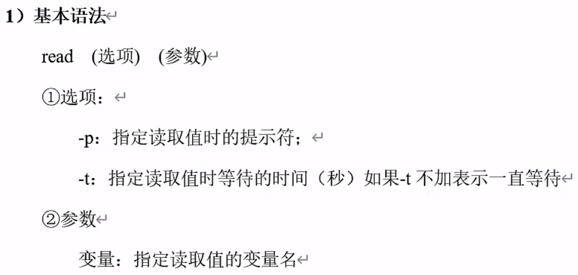

shell脚本文件内容为
```shell
#!/bin/bash
read -t 10 -p "input your name: " name
echo "welcome, $name"
```
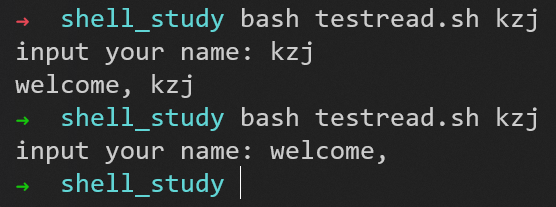

# 函数（类似脚本文件）

## 系统函数

### ```date```

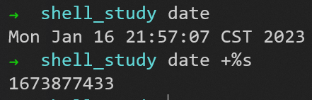

系统函数的使用：```$()```（命令替换）（得到括号内命令的执行结果）
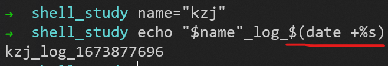

### ```basename```

```$0```表示当前的脚本名称，shell脚本文件内容为
 ```shell
#!/bin/bash
echo script name: $0
```
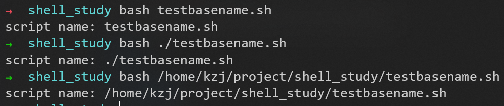

怎样可以不加前面的完整路径
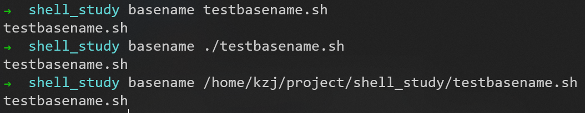
本质就是字符串的截取

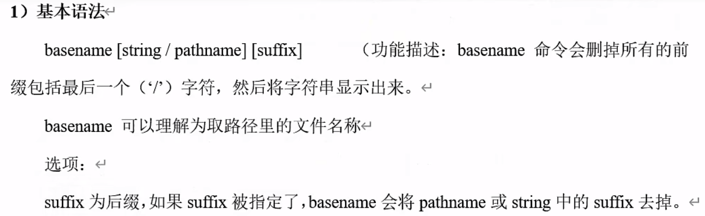
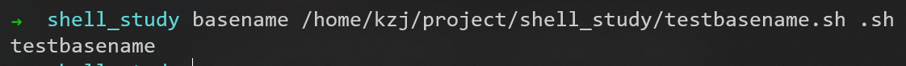

### ```dirname```

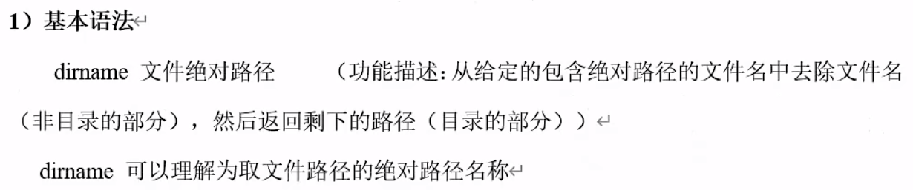
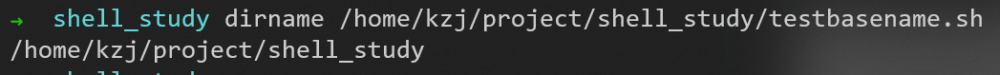

### 实例：输出当前脚本的文件名、绝对路径、执行时间戳

shell脚本文件内容为
```shell
#!/bin/bash
echo script name: $(basename $0 .sh)
echo script path: $(cd $(dirname $0); pwd)
echo timestamp:   $(date +%s)
```
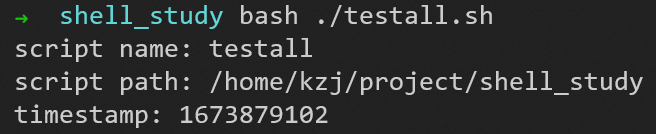

## 自定义函数

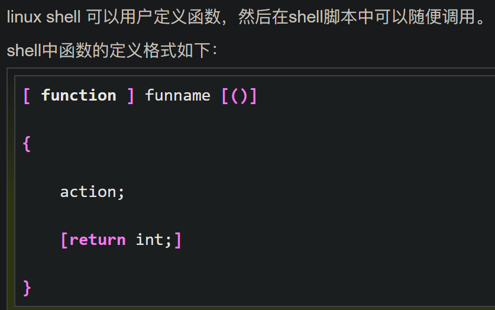
注意：```[...]```表示这一部分是可有可无的
1. ```function```可以不写
2. 参数列表可以省略（函数的形参不需要定义，默认是```$n```，这一点和脚本是一样的）
3. 返回语句可以省略


shell脚本文件内容为
```shell
#!/bin/bash
function add(){
	s=$[$1 + $2]
	return $s
}
read -p "input first number: " num1
read -p "input second number: " num2
add $num1 $num2
echo "addsum = "$?
```
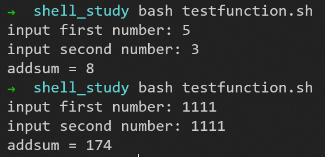
加法的结果超过255，得到的结果就会出错

解决方法：不用函数的直接return返回，不要用```$?```获取函数返回值，用前面系统函数的调用方式，用命令替换```$()```，把函数返回的值赋给另外一个变量
```shell
#!/bin/bash
function add(){
	s=$[$1 + $2]
	echo $s
}
read -p "input first number: " num1
read -p "input second number: " num2
addsum=$(add $num1 $num2)
echo "addsum = "$addsum
```
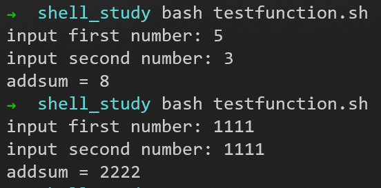

## 综合应用

### 归档文件

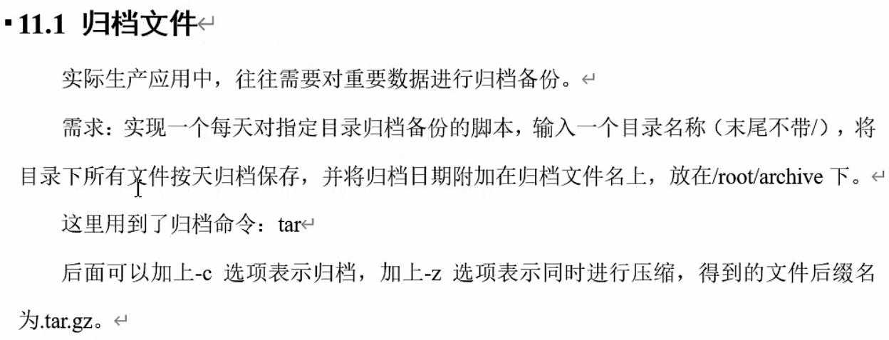

shell脚本文件内容为
```shell

```


到P82  3min


