# 正则表达式

[正则表达式在线测试网站](https://c.runoob.com/front-end/854/)

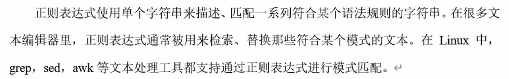

awk、sed、grep更适合的方向：
- ```grep``` 更适合单纯的查找或匹配文本
- ```sed``` 更适合编辑匹配到的文本
- ```awk``` 更适合格式化文本，对文本进行较复杂格式处理

[Linux grep 命令 菜鸟教程](https://www.runoob.com/linux/linux-comm-grep.html)

[Linux sed 命令 菜鸟教程](https://www.runoob.com/linux/linux-comm-sed.html)

[Linux awk 命令 菜鸟教程](https://www.runoob.com/linux/linux-comm-awk.html)

## 常用特殊字符

### ```^```

匹配一行的开头

### ```$```

匹配一行的结尾
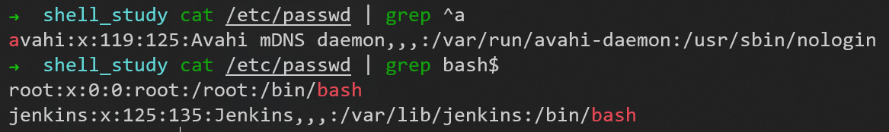

放一起用```^$```就是匹配空行
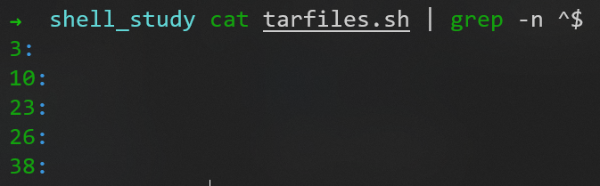

### ```.```

匹配一个任意的字符

### ```*```

表示上一个字符出现任意次（0次、1次、多次），不会单独使用
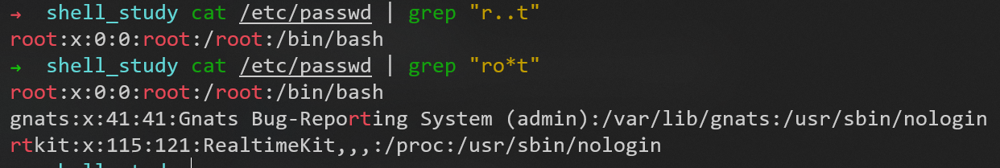

```.*```可以匹配任意
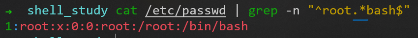

### ```[]```

匹配某个范围内的一个字符
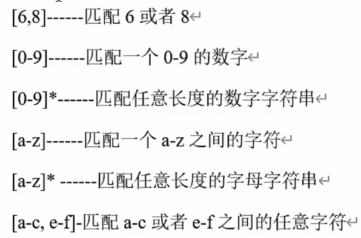

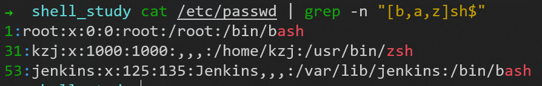

### ```\```

表示转义，不会单独使用
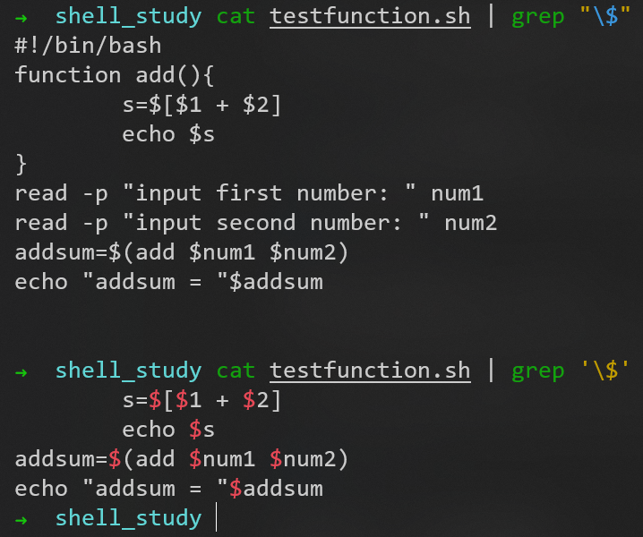
注意：必须用**单引号**才能表示转义，不能用双引号

## 扩展的正则表达式

### ```{}```

指定上一个字符出现的次数，不会单独使用

### ```+```

类似```*```，但表示一次或多次

### ```?```

类似```*```，但表示0次或一次

## 实践：匹配手机号

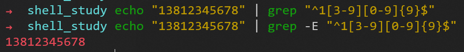
默认不支持扩展的特殊字符```{}```，要用```-E```参数，表示支持扩展的正则表达式

# 文本处理工具

## cut

[Linux cut 命令 菜鸟教程](https://www.runoob.com/linux/linux-comm-cut.html)

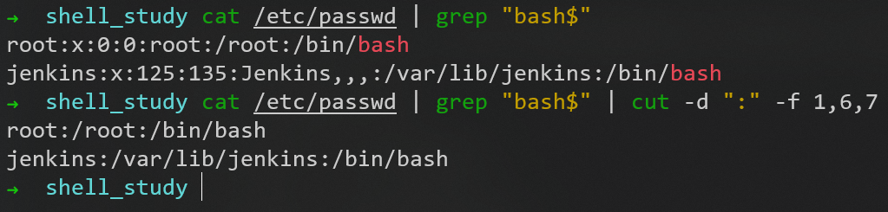

### 实践：得到IP地址

用```ifconfig eth0 | grep "inet " | cut -d " " -f 10```命令得到当前的IP地址
```grep```相当于提取选定的**行**，```cut```相当于提取选定的**列**
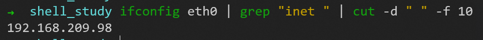
注意这里```-f 10```的原因是，那一行的前面有很多空格，要数清楚

如果要切出所有的IP地址，就用命令```ifconfig | grep "inet " | cut -d " " -f 10```

## awk

[Linux awk 命令 菜鸟教程](https://www.runoob.com/linux/linux-comm-awk.html)

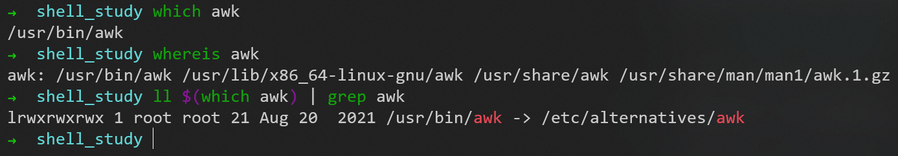
注意```which```与```whereis```的区别：
1. ```which```查找的可执行文件，必须是要**在PATH下的可执行文件**
2. ```whereis```可以用来查找二进制（命令）、源文件、man文件。与which不同的是这条命令可以是**通过文件索引数据库而非PATH来查找的**，所以查找的面比which要广

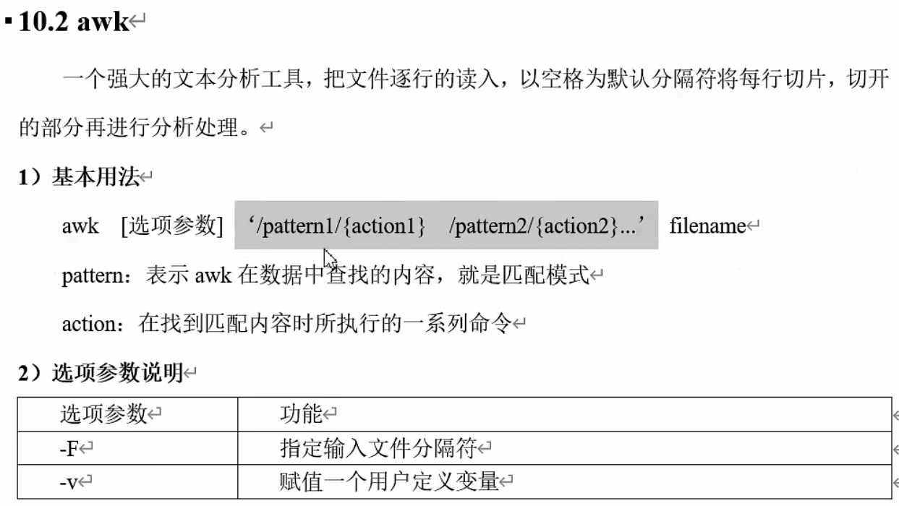
一个```pattern```（正则表达式，用于匹配文本）对应一个```action```（对于找到的文本，执行的命令）

### 实践：代替```grep```和```cut```

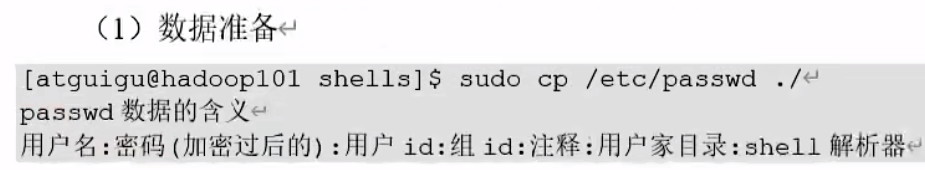

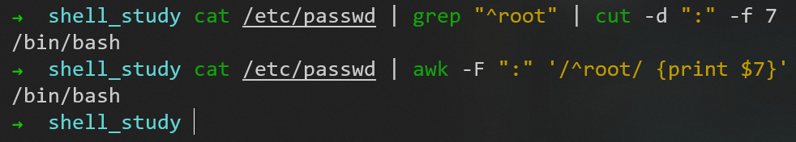
```cat /etc/passwd | grep "^root" | cut -d ":" -f 7```
之前使用了```grep```（行的提取）和```cut```（列的提取）两个工具
```cat /etc/passwd | awk -F ":" '/^root/ {print $7}'```
现在用```awk```就不用那么麻烦了，一个工具直接把行和列的操作全部搞定

可以使用字符串拼接
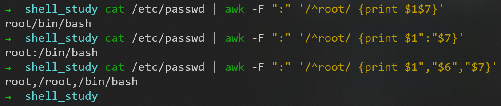

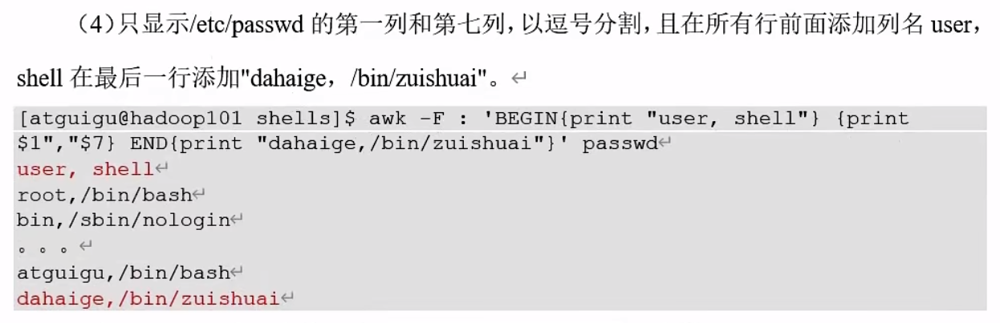
```cat /etc/passwd | awk -F ":" 'BEGIN{print "user, shell"} {print $1", "$7} END{print "dahaige, /bin/zuishuai"}'```

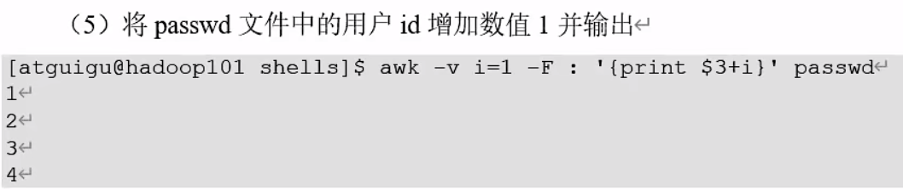
查看每一行的第三列：
```cat /etc/passwd | awk -F ":" '{print $3}'```
输出每一行的第三列+1：
```cat /etc/passwd | awk -F ":" '{print $3+1}'```
这里的+1在```action```代码块中写死了，下次想+2怎么办，如果```action```代码块复杂，修改比较麻烦
解决方法：
使用```-v```参数，把```+n```中的```n```定义成**变量**，传递进```action```代码块，不管```action```代码块有多复杂，```n```只要修改一次
更有甚者，可以把```action```代码块包装成一个脚本文件，可以使用```-f```参数指定执行的脚本文件
```cat /etc/passwd | awk -v i=1 -F ":" '{print $3+i}'```

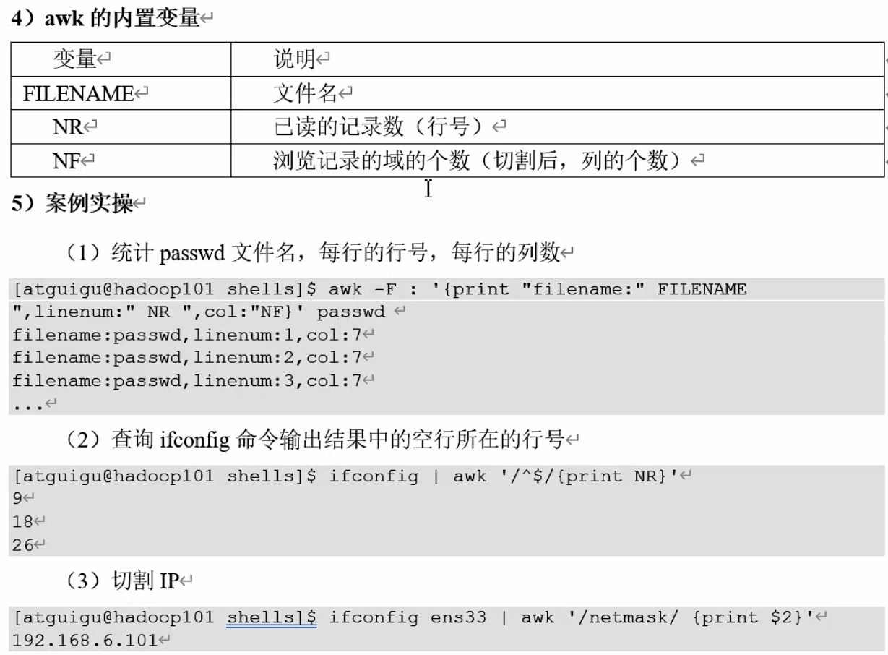

# 综合应用案例：发送消息

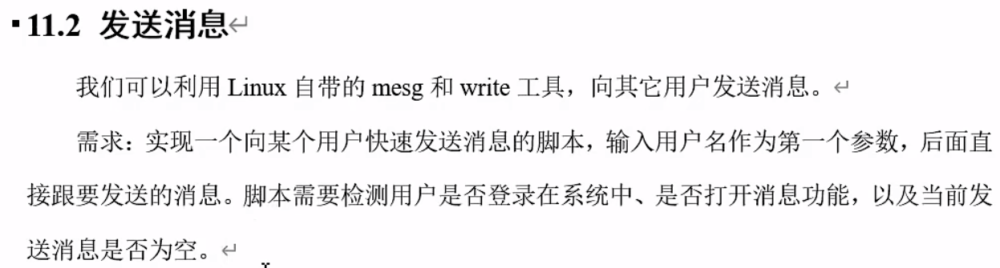


---

到P88  2：40min


