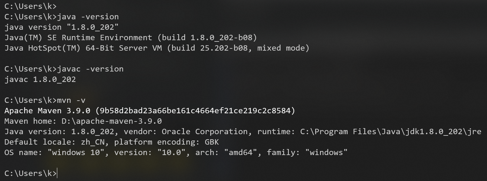
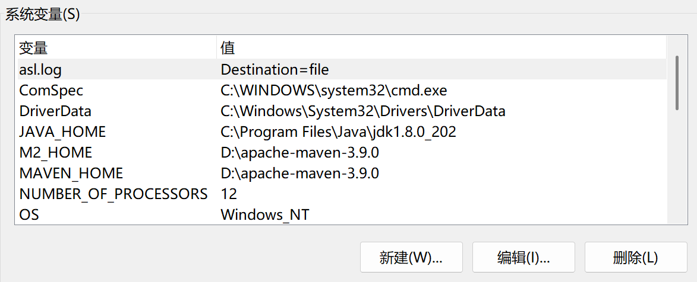
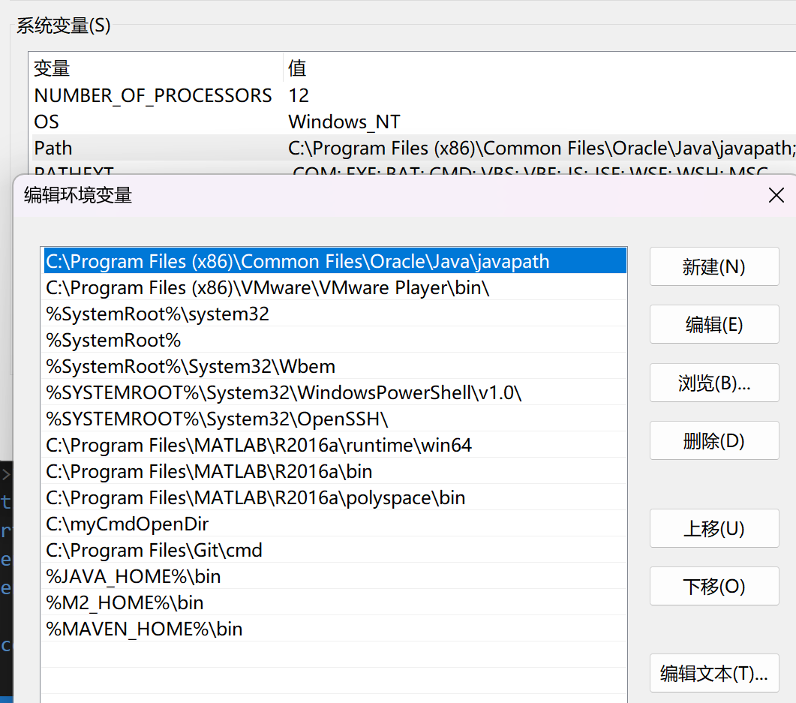
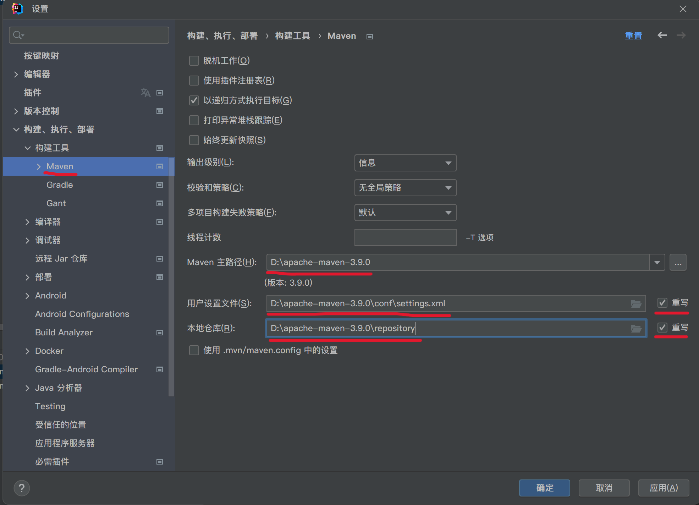
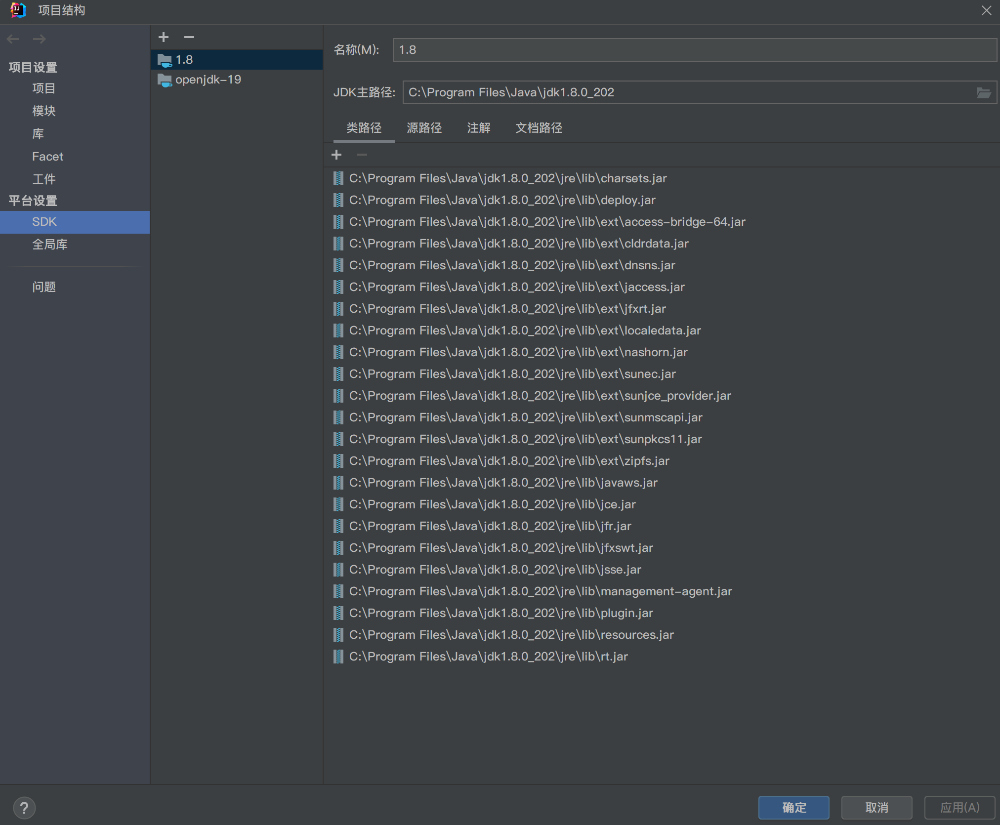

# SpringBoot

## 学习路径


## 简介


## 微服务


[微服务介绍](https://martinfowler.com/microservices/)

一个应用应该是一组小型服务，可以通过HTTP的方式进行互通

## 环境准备

在windows下开发





### maven设置

给maven的```settings.xml```配置文件的```profiles```标签添加
```xml
    <profile> <!--配置springboot创建maven时 设置默认的编译环境  -->
      <id>jdk-1.8</id>
        <activation>
            <activeByDefault>true</activeByDefault>
            <jdk>1.8</jdk>
        </activation>
          <properties>
            <maven.compiler.source>1.8</maven.compiler.source>
            <maven.compiler.target>1.8</maven.compiler.target>
            <maven.compiler.compilerVersion>1.8</maven.compiler.compilerVersion> 
         </properties>
    </profile>
```

给maven的```settings.xml```配置文件的```mirrors```标签添加
```xml
    <mirror>
        <id>alimaven</id>
        <mirrorOf>central</mirrorOf>
        <name>aliyun maven</name>
        <url>http://maven.aliyun.com/nexus/content/repositories/central/</url>
    </mirror>
```

### IDEA设置

配置成自己的maven


配置成自己的JDK



