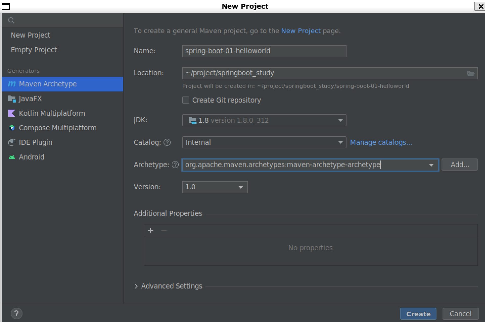

# HelloWorld

## 创建一个maven工程（jar）



## 导入springboot依赖

在```pom.xml```文件中添加
```xml
    <parent>
        <groupId>org.springframework.boot</groupId>
        <artifactId>spring-boot-starter-parent</artifactId>
        <version>1.5.9.RELEASE</version>
    </parent>

    <dependencies>
        <dependency>
            <groupId>org.springframework.boot</groupId>
            <artifactId>spring-boot-starter-web</artifactId>
        </dependency>
    </dependencies>
```

## 编写一个主程序，用于启动springboot应用

创建文件```src/main/java/com/kzj/HelloWorldMainApplication.java```内容如下
```java
package com.kzj;
import org.springframework.boot.SpringApplication;
import org.springframework.boot.autoconfigure.SpringBootApplication;

@SpringBootApplication
public class HelloWorldMainApplication {
    public static void main(String[] args) {
        SpringApplication.run(HelloWorldMainApplication.class, args);
    }
}
```

## 编写相关的Controller、Service


