# HelloWorld

## 创建一个maven工程（jar）

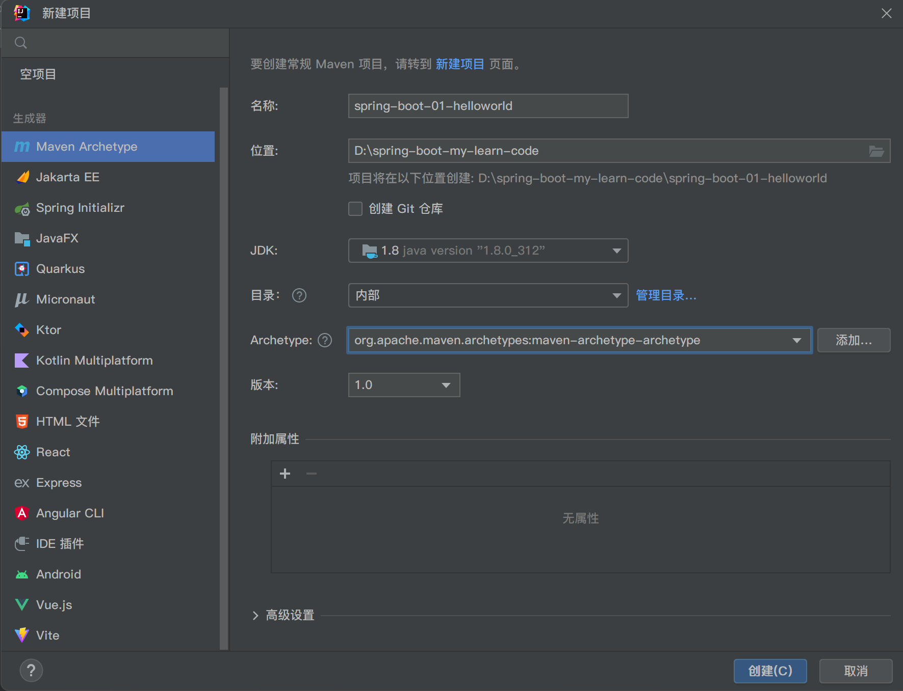

## 导入springboot依赖

在```pom.xml```文件中添加
```xml
    <parent>
        <groupId>org.springframework.boot</groupId>
        <artifactId>spring-boot-starter-parent</artifactId>
        <version>1.5.9.RELEASE</version>
    </parent>

    <dependencies>
        <dependency>
            <groupId>org.springframework.boot</groupId>
            <artifactId>spring-boot-starter-web</artifactId>
        </dependency>
    </dependencies>
```

## 编写一个主程序，用于启动springboot应用

创建文件```src/main/java/com/kzj/HelloWorldMainApplication.java```内容如下
```java
package com.kzj;
import org.springframework.boot.SpringApplication;
import org.springframework.boot.autoconfigure.SpringBootApplication;

@SpringBootApplication
public class HelloWorldMainApplication {
    public static void main(String[] args) {
        SpringApplication.run(HelloWorldMainApplication.class, args);
    }
}
```

## 编写相关的Controller、Service

创建文件```src/main/java/com/kzj/ccontroller/HelloController.java```内容如下
```java
package com.kzj.controller;
import org.springframework.stereotype.Controller;
import org.springframework.web.bind.annotation.RequestMapping;
import org.springframework.web.bind.annotation.ResponseBody;

@Controller
public class HelloController {
    @ResponseBody
    @RequestMapping("/hello")
    public String hello(){
        return "HelloWorld";
    }
}
```

## 运行主程序的main方法

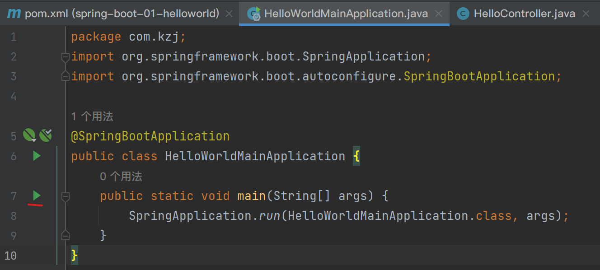

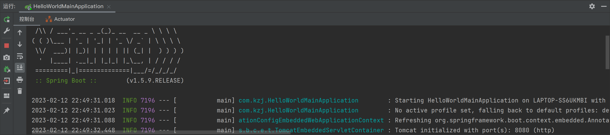

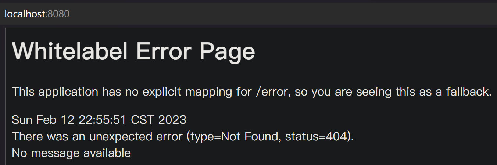


## 简化部署

不需要打war包，创建可执行的jar包，无需在目标服务器安装tomcat

### 导入springboot的maven插件

在```pom.xml```文件中添加
```xml
    <build>
        <plugins>
            <plugin>
                <groupId>org.springframework.boot</groupId>
                <artifactId>spring-boot-maven-plugin</artifactId>
            </plugin>
        </plugins>
    </build>
```

### 使用插件打包

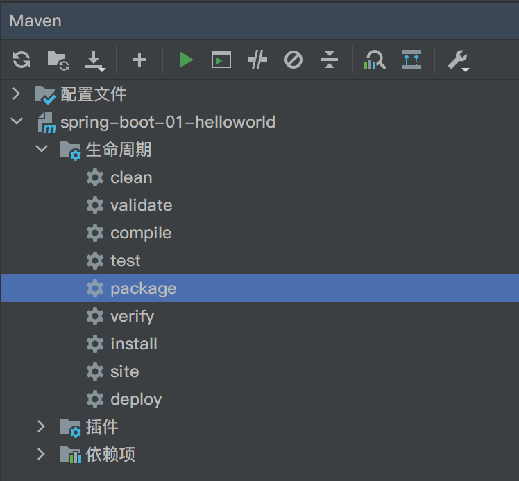

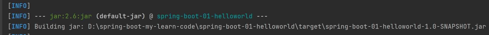

### 运行jar包

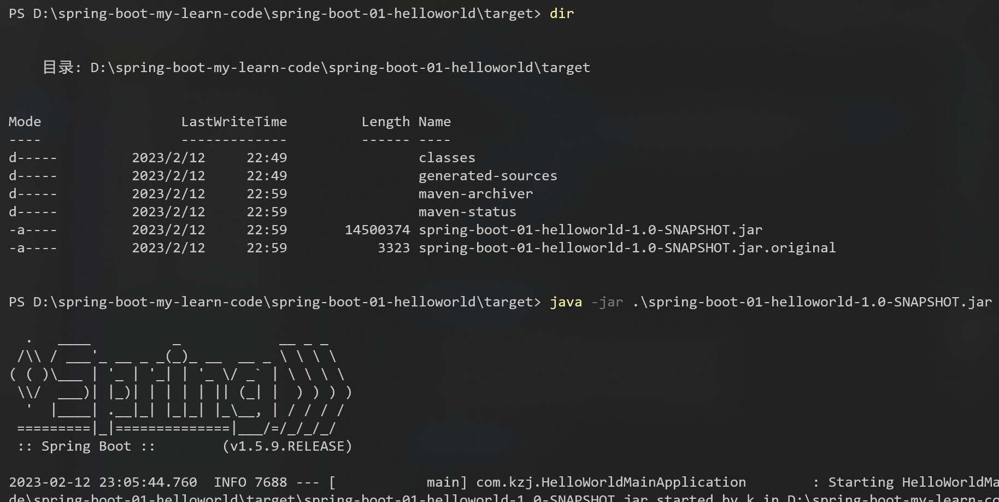

经测试，成功


## pom.xml文件探究

### 父项目

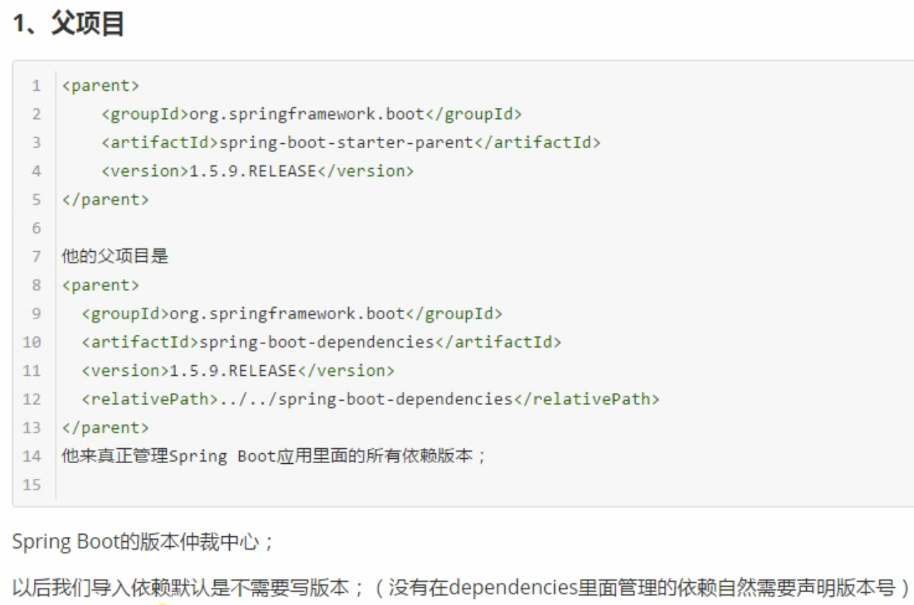

### springboot场景启动器

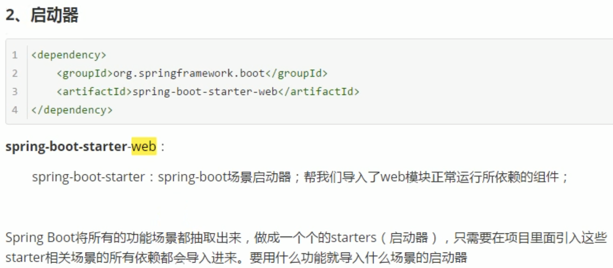

## 自动配置

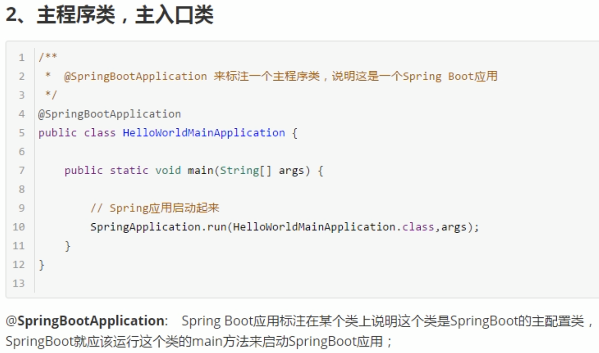

学完整个课程再看P7

# 使用Spring Initializer快速创建Spring Boot项目

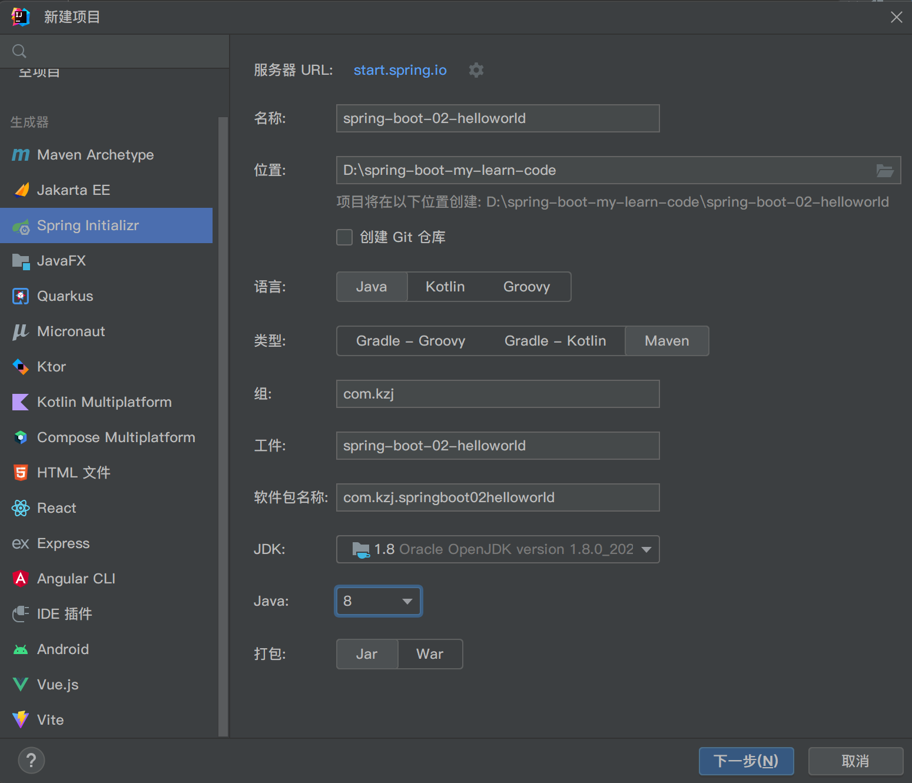

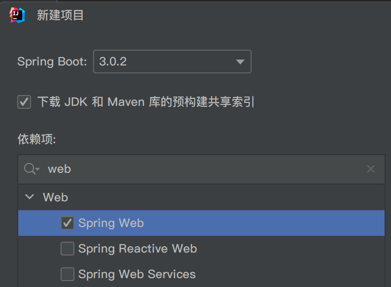

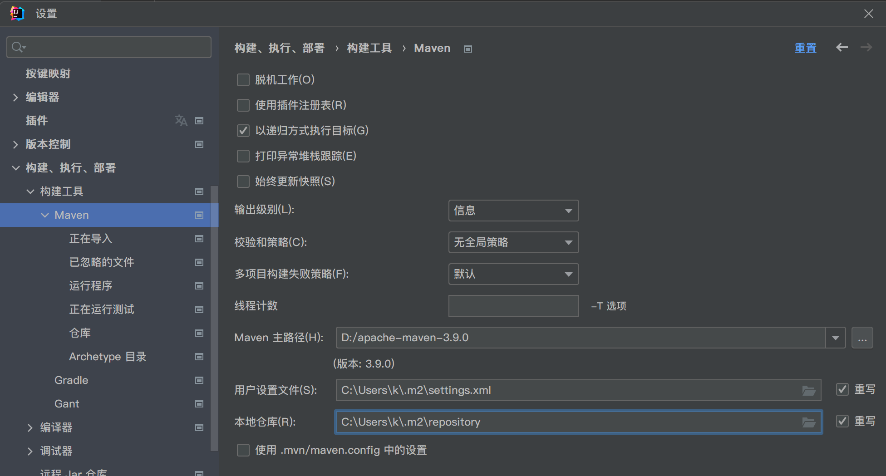
使用默认的用户设置文件和本地仓库位置，把settings.xml文件复制到对应的文件夹中
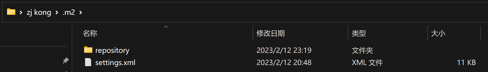

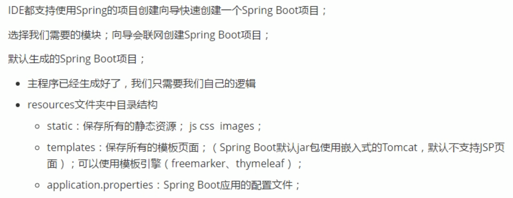

创建文件```src/main/java/com/kzj/springboot02helloworld/controller/HelloController.java```内容如下

```java
package com.kzj.springboot02helloworld.controller;

import org.springframework.stereotype.Controller;
import org.springframework.web.bind.annotation.RequestMapping;
import org.springframework.web.bind.annotation.ResponseBody;
import org.springframework.web.bind.annotation.RestController;

@RestController
//@ResponseBody
//@Controller
public class HelloController {
    @RequestMapping("/hello")
    public String hello(){
        return "hello world!";
    }
}
```

在文件```src/main/resources/application.properties```中添加内容如下
```xml
server.port=8081
```

运行后，成功访问


