# yaml

## 配置文件

SpringBoot使用一个全局配置文件
配置文件的文件名是固定的
```application.properties```
```application.yaml```

在resources文件夹下
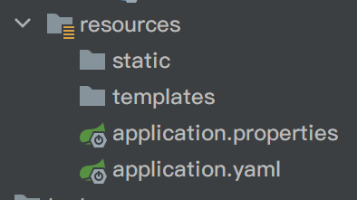

作用：修改SpringBoot自动配置的默认值

yaml以数据为中心，比json、xml更适合做配置文件


## yaml语法


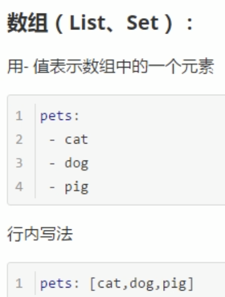

## yaml配置文件值获取

新建```src/main/java/com/kzj/springboot02helloworld/bean/Person.java```
```java
package com.kzj.springboot02helloworld.bean;
import java.util.Date;
import java.util.List;
import java.util.Map;

public class Person {
    private String lastName;
    private Integer age;
    private Boolean boss;
    private Date birth;
    private Map<String, Object> maps;
    private List<Object> lists;
    private Dog dog;
}
```
使用IDEA的```Alt```+```Insert```快捷键，添加setter、getter、toString方法

新建```src/main/java/com/kzj/springboot02helloworld/bean/Dog.java```
```java
package com.kzj.springboot02helloworld.bean;

public class Dog {
    private String name;
    private Integer age;
}
```
同理添加setter、getter、toString方法

在```pom.xml```文件中导入配置文件处理器，就有提示了
```xml
        <dependency>
            <groupId>org.springframework.boot</groupId>
            <artifactId>spring-boot-configuration-processor</artifactId>
            <optional>true</optional>
        </dependency>
```

```application.yaml```的内容为
```yaml
person:
  lastName: kzj
  age: 25
  boss: false
  birth: 1998/1/1
  maps: {k1: v1, k2: v2}
  lists: [lisi, wangwu]
  dog: {name: baby, age: 2}
 ```

### 使用```@ConfigurationProperties```注解，进行属性绑定

```src/main/java/com/kzj/springboot02helloworld/bean/Person.java```修改成
```java
package com.kzj.springboot02helloworld.bean;
import org.springframework.boot.context.properties.ConfigurationProperties;
import org.springframework.stereotype.Component;
import java.util.Date;
import java.util.List;
import java.util.Map;

/**
 * 将配置文件中配置的每一个属性的值，映射到Person组件中
 * @ConfigurationProperties(prefix = "person")告诉SpringBoot将本类中的所有属性和配置文件中person的配置进行绑定
 * 只有这个组件是容器中的组件，才能使用容器提供的@ConfigurationProperties功能
 * 所以要用@Component
 */
@Component
@ConfigurationProperties(prefix = "person")
public class Person {
    private String lastName;
    private Integer age;
    private Boolean boss;
    private Date birth;
    private Map<String, Object> maps;
    private List<Object> lists;
    private Dog dog;
    // 省略的setter、getter、toString方法
}
 ```

### 使用```@Autowired```注解，进行自动装配

新建```src/test/java/com/kzj/springboot02helloworld/SpringBoot02HelloworldApplicationTests.java```
```java
package com.kzj.springboot02helloworld;
import com.kzj.springboot02helloworld.bean.Person;
import org.junit.jupiter.api.Test;
import org.junit.runner.RunWith;
import org.springframework.beans.factory.annotation.Autowired;
import org.springframework.boot.test.context.SpringBootTest;
import org.springframework.test.context.junit4.SpringRunner;

/**
 * SpringBoot单元测试
 * 可以在测试期间进行自动注入容器的功能
 */
@RunWith(SpringRunner.class)
@SpringBootTest
class SpringBoot02HelloworldApplicationTests {
    @Autowired
    Person person;
    @Test
    void contextLoads() {
        System.out.println(person);
    }
}
 ```

运行这个测试类，成功获取配置文件中的值


# properties

## properties配置文件值获取

属性值配置同上
```application.properties```的内容为
```properties
person.last-name=kzj
person.age=25
person.boss=false
person.birth=1998/1/1
person.maps.k1=v1
person.maps.k2=v2
person.lists=lisi,wangwu
person.dog.name=baby
person.dog.age=2
 ```

运行结果为


### 使用```@Value```注解，将配置文件中的属性注入到容器内组件中

```java
package com.kzj.springboot02helloworld.bean;
import org.springframework.beans.factory.annotation.Value;
import org.springframework.boot.context.properties.ConfigurationProperties;
import org.springframework.stereotype.Component;
import java.util.Date;
import java.util.List;
import java.util.Map;

@Component
//@ConfigurationProperties(prefix = "person")
public class Person {
    /**
     * <bean class="Person">
     *      @value("")注解就相当于property标签中的value属性
     *      <property name="lastName" value="字面量/${key}从环境变量、配置文件中获取值/#{SpEL}"></property>
     * </bean>
     */
    @Value("${person.last-name}")
    private String lastName;
    @Value("#{12*2+1}")
    private Integer age;
    @Value("true")
    private Boolean boss;
    private Date birth;
    private Map<String, Object> maps;
    private List<Object> lists;
    private Dog dog;
    // 省略的setter、getter、toString方法
}
```

运行结果为


#### ```@Value```获取值和```@ConfigurationProperties```获取值的比较

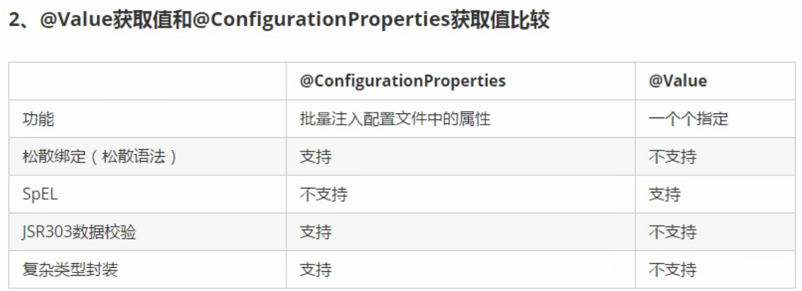


##### 使用```@Validated```注解，进行配置文件注入值的数据校验

在```pom.xml```文件中添加
```xml
        <dependency>
            <groupId>org.springframework.boot</groupId>
            <artifactId>spring-boot-starter-validation</artifactId>
        </dependency>
```

```src/main/java/com/kzj/springboot02helloworld/bean/Person.java```修改成
```java
package com.kzj.springboot02helloworld.bean;
import org.springframework.boot.context.properties.ConfigurationProperties;
import org.springframework.stereotype.Component;
import org.springframework.validation.annotation.Validated;
import javax.validation.constraints.Email;
import java.util.Date;
import java.util.List;
import java.util.Map;

@Component
@ConfigurationProperties(prefix = "person")
@Validated
public class Person {
    @Email
    private String lastName;
    private Integer age;
    private Boolean boss;
    private Date birth;
    private Map<String, Object> maps;
    private List<Object> lists;
    private Dog dog;
    // 省略的setter、getter、toString方法
}
 ```

因注入的值没有通过校验而报错
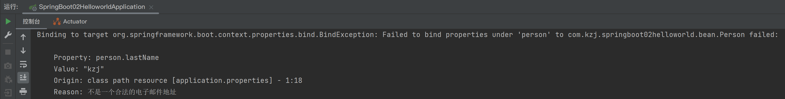

总结：


### 使用```@PropertySource```注解，加载指定的配置文件

```@ConfigurationProperties```注解默认从全局配置文件中获取值

新建```src/main/resources/person.properties```
```java
person.last-name=kzj
person.age=25
person.boss=false
person.birth=1998/1/1
person.maps.k1=v1
person.maps.k2=v2
person.lists=lisi,wangwu
person.dog.name=baby
person.dog.age=2
 ```

```src/main/java/com/kzj/springboot02helloworld/bean/Person.java```修改成
```java
package com.kzj.springboot02helloworld.bean;
import org.springframework.boot.context.properties.ConfigurationProperties;
import org.springframework.context.annotation.PropertySource;
import org.springframework.stereotype.Component;
import java.util.Date;
import java.util.List;
import java.util.Map;

@PropertySource(value={"classpath:person.properties"})
@Component
@ConfigurationProperties(prefix = "person")
public class Person {
    private String lastName;
    private Integer age;
    private Boolean boss;
    private Date birth;
    private Map<String, Object> maps;
    private List<Object> lists;
    private Dog dog;
    // 省略的setter、getter、toString方法
}
 ```

运行测试方法，成功获取配置文件```person.properties```中的值
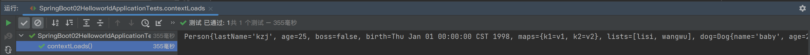

### 使用```@ImportResource```注解，导入Spring的配置文件，让其中的内容生效

 新建```src/main/java/com/kzj/springboot02helloworld/service/HelloService.java```
```java
package com.kzj.springboot02helloworld.service;

public class HelloService {
}
 ```

新建```src/main/resources/beans.xml```
```xml
<?xml version="1.0" encoding="UTF-8"?>
<beans xmlns="http://www.springframework.org/schema/beans"
       xmlns:xsi="http://www.w3.org/2001/XMLSchema-instance"
       xsi:schemaLocation="http://www.springframework.org/schema/beans http://www.springframework.org/schema/beans/spring-beans.xsd">
    <bean id="helloService" class="com.kzj.springboot02helloworld.service.HelloService"></bean>
</beans>
 ```

```src/test/java/com/kzj/springboot02helloworld/SpringBoot02HelloworldApplicationTests.java```修改成
```java
package com.kzj.springboot02helloworld;
import com.kzj.springboot02helloworld.bean.Person;
import org.junit.jupiter.api.Test;
import org.junit.runner.RunWith;
import org.springframework.beans.factory.annotation.Autowired;
import org.springframework.boot.test.context.SpringBootTest;
import org.springframework.context.ApplicationContext;
import org.springframework.test.context.junit4.SpringRunner;

@RunWith(SpringRunner.class)
@SpringBootTest
class SpringBoot02HelloworldApplicationTests {
    @Autowired
    Person person;

    @Autowired
    ApplicationContext ioc;

    @Test
    public void testHelloService() {
        boolean b = ioc.containsBean("helloService");
        System.out.println(b);
    }

    @Test
    void contextLoads() {
        System.out.println(person);
    }
}
```

运行结果为
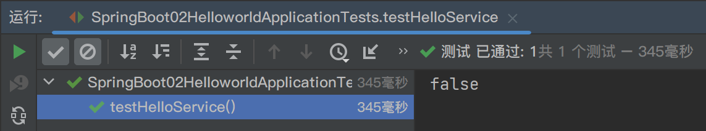


```src/main/java/com/kzj/springboot02helloworld/SpringBoot02HelloworldApplication.java```修改成
```java
package com.kzj.springboot02helloworld;
import org.springframework.boot.SpringApplication;
import org.springframework.boot.autoconfigure.SpringBootApplication;
import org.springframework.context.annotation.ImportResource;

@ImportResource(locations = {"classpath:beans.xml"})
@SpringBootApplication
public class SpringBoot02HelloworldApplication {
    public static void main(String[] args) {
        SpringApplication.run(SpringBoot02HelloworldApplication.class, args);
    }
}
 ```

运行上面的测试方法，结果为
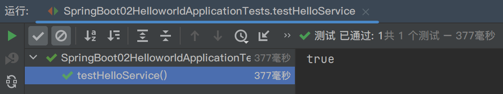

#### 使用```@Configuration```注解，以全注解的方式给容器添加组件

> 注意：SpringBoot不推荐上面的使用xml的方式给容器添加组件

使用```@Configuration```注解，指明当前类是一个配置类，就是来替代之前的Spring的xml配置文件

##### 使用```@Bean```注解，给容器中添加组件

> 在Spring的xml配置文件中，用```<bean></bean>```标签添加组件

```src/main/java/com/kzj/springboot02helloworld/SpringBoot02HelloworldApplication.java```是默认的主配置类

我们可以新建一个配置类```src/main/java/com/kzj/springboot02helloworld/config/MyAppConfig.java```
```java
package com.kzj.springboot02helloworld.config;
import com.kzj.springboot02helloworld.service.HelloService;
import org.springframework.context.annotation.Bean;
import org.springframework.context.annotation.Configuration;

@Configuration
public class MyAppConfig {
    @Bean
    // 将方法的返回值添加到容器中，容器中这个组件默认的id就是方法名
    public HelloService helloService(){
        System.out.println("配置类@Bean给容器中添加组件");
        return new HelloService();
    }
}
 ```

在```src/main/java/com/kzj/springboot02helloworld/SpringBoot02HelloworldApplication.java```中注释掉
```java
//@ImportResource(locations = {"classpath:beans.xml"})
```

运行结果为
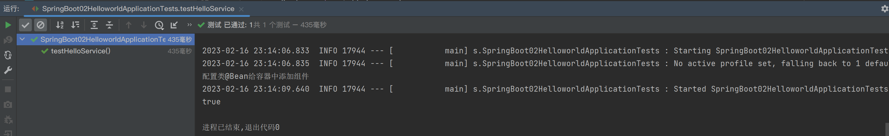

# 配置文件占位符

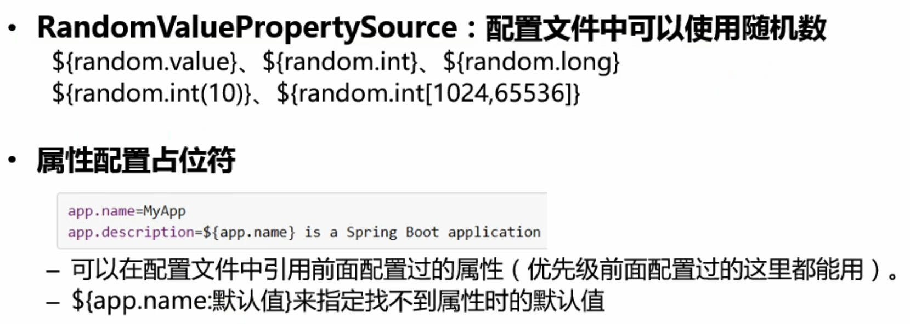

```application.properties```的内容修改为
```properties
person.last-name=kzj${random.uuid}
person.age=${random.int}
person.boss=false
person.birth=1998/1/1
person.maps.k1=v1
person.maps.k2=v2
person.lists=lisi,wangwu
person.dog.name=${person.last-name}'s dog
person.dog.age=2
 ```

运行结果为
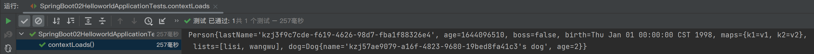

# Profile

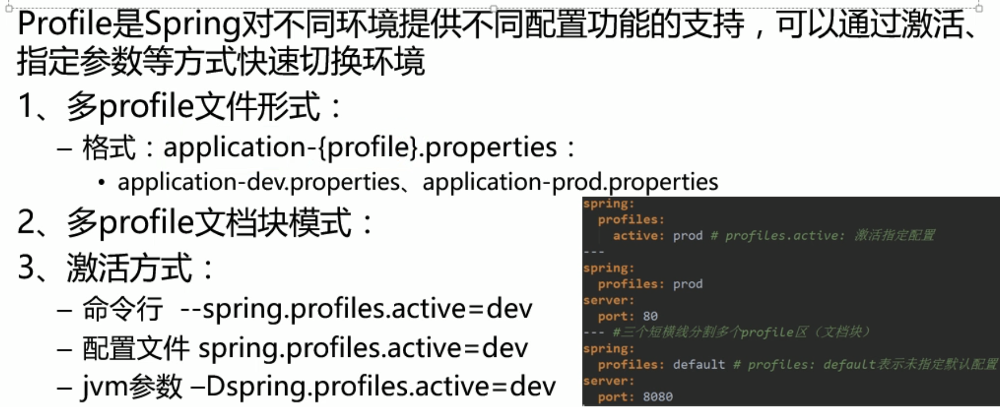

## properties文件（多profile文件形式）

新建文件```src/main/resources/application-dev.properties```
```properties
server.port=8082
```

新建文件```src/main/resources/application-prod.properties```
```properties
server.port=80
```

原先的配置文件```src/main/resources/application.properties```中为
```properties
server.port=8081
```

默认使用```application.properties```文件中的配置

在配置文件```src/main/resources/application.properties```中添加
```properties
spring.profiles.active=dev
```

则会激活使用```application-dev.properties```文件中的配置

## yaml文件（多profile文档块模式）

在配置文件```src/main/resources/application.yaml```中添加

```yaml
server:
  port: 8081
spring:
  profiles:
    active: dev
---
server:
  port: 80
spring:
  config:
    activate:
      on-profile: prod
---
server:
  port: 8082
spring:
  config:
    activate:
      on-profile: dev
```

则会激活使用8082端口

## 激活指定的profile

### 1. 在配置文件中指定

如上```spring.profiles.active=dev```

### 2. 传入命令行参数

先把项目打成jar包
使用命令```sudo java -jar spring-boot-02-helloworld-0.0.1-SNAPSHOT.jar --spring.profiles.active=prod```
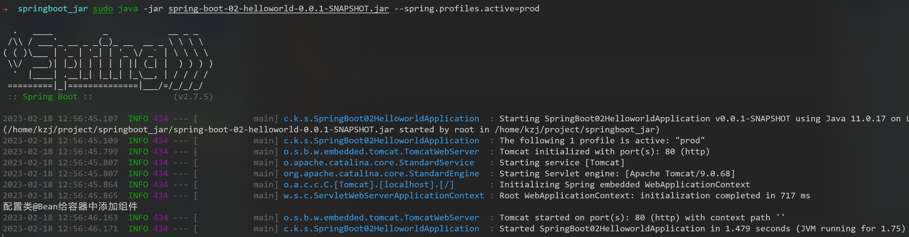
如果使用多个参数，可以用空格分开```--配置项=值```

### 3. 传入JVM参数

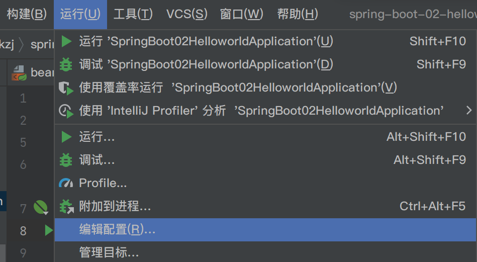
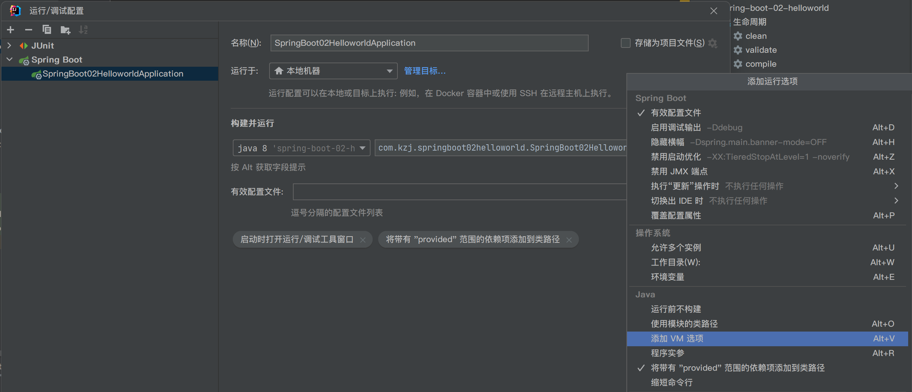
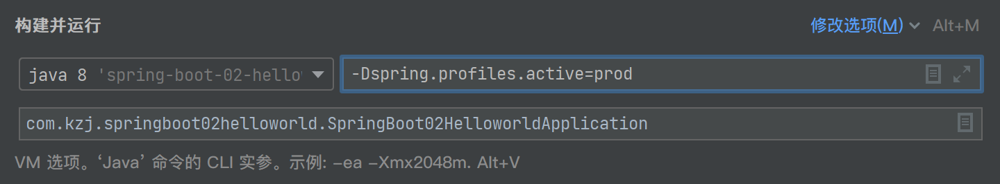
使用虚拟机参数```-Dspring.profiles.active=prod```
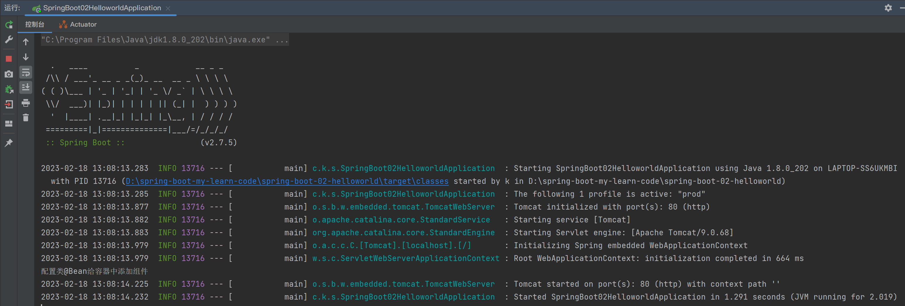

# 配置文件加载位置

## 内部配置文件

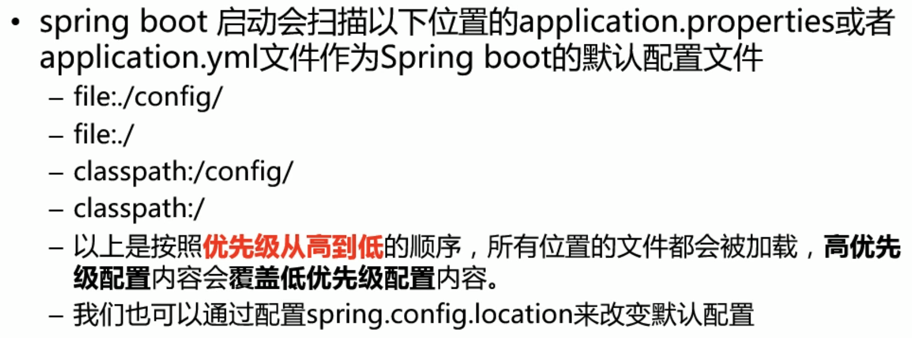

- classpath 指的是```src.main.java```和```src.main.resources```路径以及第三方jar包的根路径
- file 指的是```项目根目录```

这些配置文件或命令行参数会形成**互补配置**：
1. 低优先级配置文件，配置全部内容
2. 高优先级配置文件，覆盖部分内容
3. 命令行参数，覆盖配置文件的内容

## 外部配置文件

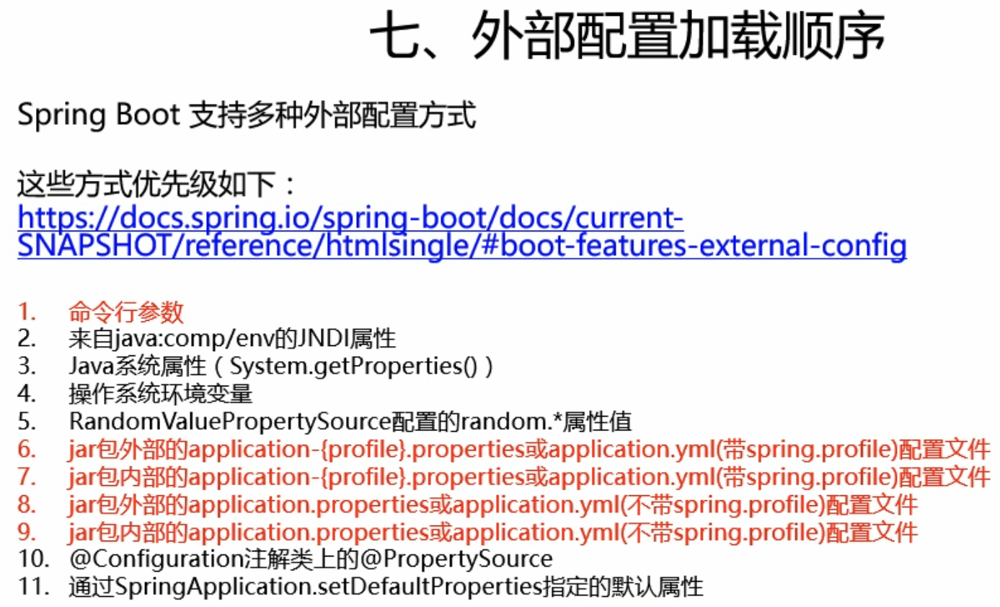

官方文档
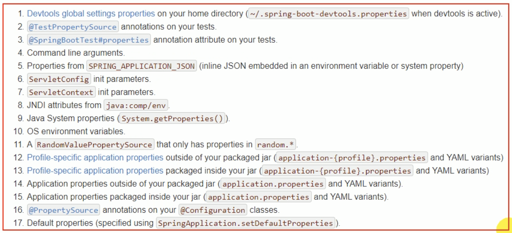

### 引入jar包外的配置文件

如果已经打好了jar包，但是要改的配置特别多，用传入命令行参数```--配置项=值```的方式比较繁琐，这时可引入**jar包外的配置文件**，放在jar包的同目录下

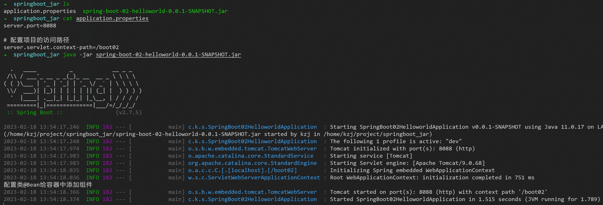

访问成功


# 自动配置原理

学完整个课程再看P19 P20


