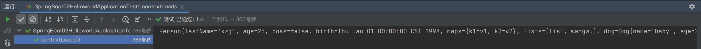

# yaml

## 配置文件

SpringBoot使用一个全局配置文件
配置文件的文件名是固定的
```application.properties```
```application.yaml```

在resources文件夹下


作用：修改SpringBoot自动配置的默认值

yaml以数据为中心，比json、xml更适合做配置文件


## yaml语法


## yaml配置文件值获取

新建```src/main/java/com/kzj/springboot02helloworld/bean/Person.java```
```java
package com.kzj.springboot02helloworld.bean;
import java.util.Date;
import java.util.List;
import java.util.Map;

public class Person {
    private String lastName;
    private Integer age;
    private Boolean boss;
    private Date birth;
    private Map<String, Object> maps;
    private List<Object> lists;
    private Dog dog;
}
```
使用IDEA的```Alt```+```Insert```快捷键，添加setter、getter、toString方法

新建```src/main/java/com/kzj/springboot02helloworld/bean/Dog.java```
```java
package com.kzj.springboot02helloworld.bean;

public class Dog {
    private String name;
    private Integer age;
}
```
同理添加setter、getter、toString方法

在```pom.xml```文件中导入配置文件处理器，就有提示了
```xml
        <dependency>
            <groupId>org.springframework.boot</groupId>
            <artifactId>spring-boot-configuration-processor</artifactId>
            <optional>true</optional>
        </dependency>
```

```application.yaml```的内容为
```yaml
person:
  lastName: kzj
  age: 25
  boss: false
  birth: 1998/1/1
  maps: {k1: v1, k2: v2}
  lists: [lisi, wangwu]
  dog: {name: baby, age: 2}
 ```

### 使用```@ConfigurationProperties```注解，进行属性绑定

```src/main/java/com/kzj/springboot02helloworld/bean/Person.java```修改成
```java
package com.kzj.springboot02helloworld.bean;
import org.springframework.boot.context.properties.ConfigurationProperties;
import org.springframework.stereotype.Component;
import java.util.Date;
import java.util.List;
import java.util.Map;

/**
 * 将配置文件中配置的每一个属性的值，映射到Person组件中
 * @ConfigurationProperties(prefix = "person")告诉SpringBoot将本类中的所有属性和配置文件中person的配置进行绑定
 * 只有这个组件是容器中的组件，才能使用容器提供的@ConfigurationProperties功能
 * 所以要用@Component
 */
@Component
@ConfigurationProperties(prefix = "person")
public class Person {
    private String lastName;
    private Integer age;
    private Boolean boss;
    private Date birth;
    private Map<String, Object> maps;
    private List<Object> lists;
    private Dog dog;
    // 省略的setter、getter、toString方法
}
 ```

### 使用```@Autowired```注解，进行自动装配

```src/test/java/com/kzj/springboot02helloworld/SpringBoot02HelloworldApplicationTests.java```修改成
```java
package com.kzj.springboot02helloworld;
import com.kzj.springboot02helloworld.bean.Person;
import org.junit.jupiter.api.Test;
import org.junit.runner.RunWith;
import org.springframework.beans.factory.annotation.Autowired;
import org.springframework.boot.test.context.SpringBootTest;
import org.springframework.test.context.junit4.SpringRunner;

/**
 * SpringBoot单元测试
 * 可以在测试期间进行自动注入容器的功能
 */
@RunWith(SpringRunner.class)
@SpringBootTest
class SpringBoot02HelloworldApplicationTests {
    @Autowired
    Person person;
    @Test
    void contextLoads() {
        System.out.println(person);
    }
}
 ```

运行这个测试类，成功获取配置文件中的值


# properties

## properties配置文件值获取

属性值配置同上
```application.properties```的内容为
```properties
person.last-name=kzj
person.age=25
person.boss=false
person.birth=1998/1/1
person.maps.k1=v1
person.maps.k2=v2
person.lists=lisi,wangwu
person.dog.name=baby
person.dog.age=2
 ```

运行结果为


### 使用```@Value```注解，将配置文件中的属性注入到容器内组件中

```java
package com.kzj.springboot02helloworld.bean;
import org.springframework.beans.factory.annotation.Value;
import org.springframework.boot.context.properties.ConfigurationProperties;
import org.springframework.stereotype.Component;
import java.util.Date;
import java.util.List;
import java.util.Map;

@Component
//@ConfigurationProperties(prefix = "person")
public class Person {
    /**
     * <bean class="Person">
     *      @value("")注解就相当于property标签中的value属性
     *      <property name="lastName" value="字面量/${key}从环境变量、配置文件中获取值/#{SpEL}"></property>
     * </bean>
     */
    @Value("${person.last-name}")
    private String lastName;
    @Value("#{12*2+1}")
    private Integer age;
    @Value("true")
    private Boolean boss;
    private Date birth;
    private Map<String, Object> maps;
    private List<Object> lists;
    private Dog dog;
    // 省略的setter、getter、toString方法
}
```

运行结果为


#### ```@Value```获取值和```@ConfigurationProperties```获取值的比较


##### 配置文件注入值的数据校验


---
到P13 10min

最后再看复习P7
之后看 ： Spring注解版 （谷粒学院）

