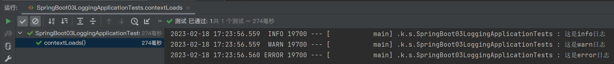

# 日志

## 日志框架

故事背景：


## 使用 SLF4j


设计模式：适配器模式


遗留问题：


**中间包**用来**偷梁换柱**


### 实操

创建新项目


在pom.xml文件中右键菜单，点击**显示依赖项**


总结：


#### 日志使用

SpringBoot默认已经帮我们配置好日志

将测试类```src/test/java/com/kzj/springboot03logging/SpringBoot03LoggingApplicationTests.java```修改为
```java
package com.kzj.springboot03logging;
import org.junit.jupiter.api.Test;
import org.junit.runner.RunWith;
import org.slf4j.Logger;
import org.slf4j.LoggerFactory;
import org.springframework.boot.test.context.SpringBootTest;
import org.springframework.test.context.junit4.SpringRunner;

@RunWith(SpringRunner.class)
@SpringBootTest
class SpringBoot03LoggingApplicationTests {
    // 日志记录器
    Logger logger = LoggerFactory.getLogger(getClass());
    @Test
    void contextLoads() {
        // 别用 System.out.println();

        // 日志的级别，由低到高：trace < debug < info < warn < error
        // 可以调整输出的日志级别，日志就只会输出这个级别及更高级别
        logger.trace("这是trace日志");
        logger.debug("这是debug日志");
        // SpringBoot默认使用info级别的日志
        logger.info("这是info日志");
        logger.warn("这是warn日志");
        logger.error("这是error日志");
    }
}
```

运行结果为


可以在配置文件```src/main/resources/application.properties```中调整输出的日志级别
```properties
logging.level.com.kzj=trace
```

再次运行，结果为


#### 修改默认配置


##### 指定日志文件和日志Profile功能

学完整个课程再看P26

## 切换日志框架

学完整个课程再看P27


