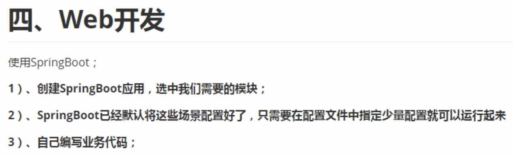
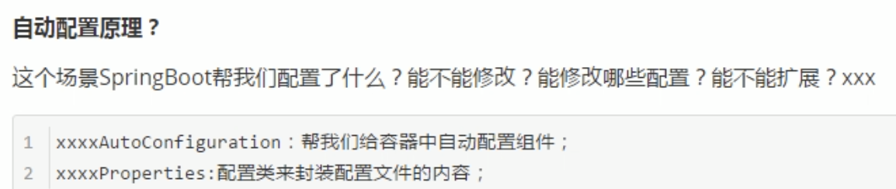
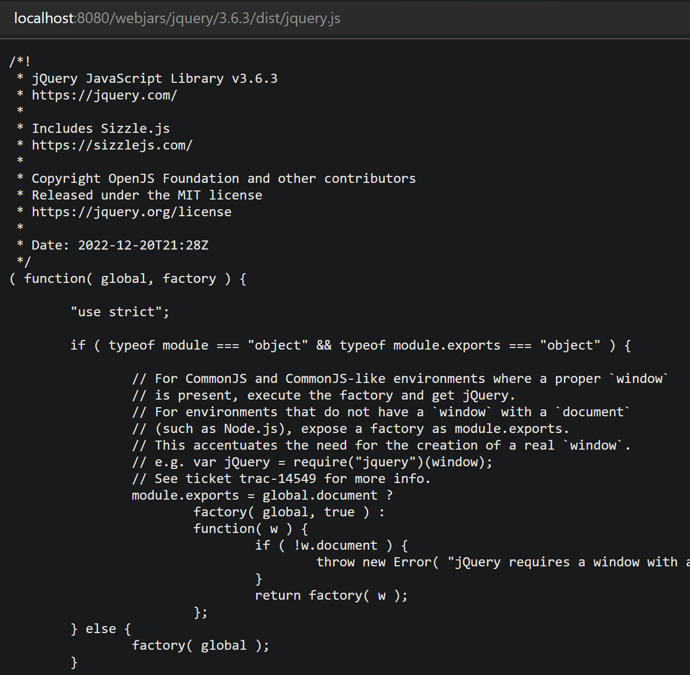
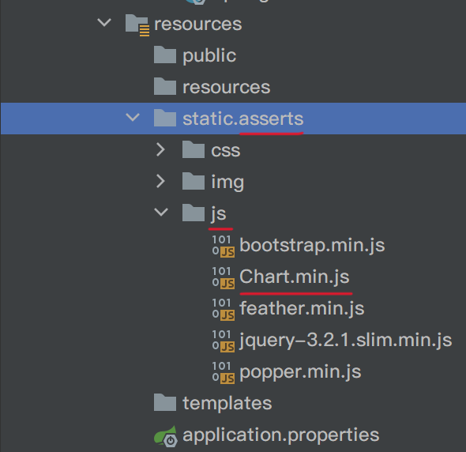
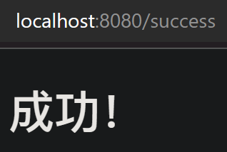

# Web开发



## 自动配置



学完整个课程再看P28

## HelloWorld

新建工程


新建```src/main/java/com/kzj/springboot04webrestfulcrud/controller/HelloController.java```
```java
package com.kzj.springboot04webrestfulcrud.controller;
import org.springframework.stereotype.Controller;
import org.springframework.web.bind.annotation.RequestMapping;
import org.springframework.web.bind.annotation.ResponseBody;

@Controller
public class HelloController {
    @ResponseBody
    @RequestMapping("/hello")
    public String hello(){
        return "Hello World";
    }
}
```

### SpringBoot对静态资源的映射规则

#### 映射规则```/webjars/**```

```WebMvcAutoConfiguration.class```下面的```addResourceHandlers()```方法中，能看出：

所有的```/webjars/**```请求，都去```classpath:/META-INF/resources/webjars/```路径下找资源

webjars：以jar包的方式引入静态资源

[webjars官方网站](https://www.webjars.org/)

举例：
可以通过maven引入jquery
```xml
<dependency>
    <groupId>org.webjars.npm</groupId>
    <artifactId>jquery</artifactId>
    <version>3.6.3</version>
</dependency>
 ```

引入的webjars的结构如下图


在访问的时候，只需要写webjars文件夹下的资源的相对目录和名称，即可

启动项目后，浏览器输入```localhost:8080/webjars/jquery/3.6.3/dist/jquery.js```即可访问


#### 映射规则```/**```

继续```WebMvcAutoConfiguration.class```下面的```addResourceHandlers()```方法中，继续到```WebMvcProperties.class```下面的```staticPathPattern```属性和```CLASSPATH_RESOURCE_LOCATIONS```属性，能看出：

所有的```/**```请求，都去
```
"classpath:/META-INF/resources/", 
"classpath:/resources/",
"classpath:/static/", 
"classpath:/public/", 
"/"
```
路径下找资源

上述的五个文件夹称为**静态资源文件夹**

classpath：```src.main.java```和```src.main.resources```路径以及第三方jar包的根路径

将静态资源文件拷贝到```classpath:/static/```路径下


重启项目后，浏览器输入```localhost:8080/asserts/js/Chart.min.js```即可访问


#### 首页映射

**静态资源文件夹**下的所有index.html页面，被```/**```映射

新增```src/main/resources/public/index.html```文件

重启项目后，浏览器输入```localhost:8080/```即可访问自己定义的首页


## 模板引擎

模板引擎有：JSP、Velocity、Freemarker、Thymeleaf
SpringBoot推荐使用**Thymeleaf**


### 引入thymeleaf

[Maven中央仓库](https://mvnrepository.com/)

可以通过maven引入thymeleaf
```xml
        <dependency>
            <groupId>org.springframework.boot</groupId>
            <artifactId>spring-boot-starter-thymeleaf</artifactId>
        </dependency>
```

### thymeleaf使用

```ThymeleafProperties.class```下面的
```java
@ConfigurationProperties(
    prefix = "spring.thymeleaf"
)
public class ThymeleafProperties {
    private static final Charset DEFAULT_ENCODING;
    public static final String DEFAULT_PREFIX = "classpath:/templates/";
    public static final String DEFAULT_SUFFIX = ".html";
    private boolean checkTemplate = true;
    private boolean checkTemplateLocation = true;
    private String prefix = "classpath:/templates/";
    private String suffix = ".html";
    private String mode = "HTML";
 ```
能看出thymeleaf的用法：

只要把HTML页面放在```classpath:/templates/```目录下面，就能自动渲染了

实例：

```src/main/java/com/kzj/springboot04webrestfulcrud/controller/HelloController.java```修改为
```java
package com.kzj.springboot04webrestfulcrud.controller;
import org.springframework.stereotype.Controller;
import org.springframework.web.bind.annotation.RequestMapping;
import org.springframework.web.bind.annotation.ResponseBody;

@Controller
public class HelloController {
    @ResponseBody
    @RequestMapping("/hello")
    public String hello(){
        return "Hello World";
    }
    
    @RequestMapping("/success")
    public String success(){
        // classpath:/templates/success.html
        return "success";
    }
}
 ```
注意：```return "xxxxx";```对应寻找模板```classpath:/templates/xxxxx.html```

新建```src/main/resources/templates/success.html```
```html
<!DOCTYPE html>
<html lang="en">
<head>
    <meta charset="UTF-8">
    <title>Title</title>
</head>
<body>
    <h1>成功！</h1>
</body>
</html>
```

运行成功


### thymeleaf语法

[thymeleaf官方文档](https://www.thymeleaf.org/doc/tutorials/3.0/usingthymeleaf.html)

[thymeleaf中文文档](https://fanlychie.github.io/post/thymeleaf.html)

通过```<html xmlns:th="http://www.thymeleaf.org">```引入 Thymeleaf 命名空间，启动语法提示

实例：
查出一些数据，在页面展示

```src/main/java/com/kzj/springboot04webrestfulcrud/controller/HelloController.java```修改为
```java
package com.kzj.springboot04webrestfulcrud.controller;
import org.springframework.stereotype.Controller;
import org.springframework.web.bind.annotation.RequestMapping;
import java.util.Map;

@Controller
public class HelloController {
    @RequestMapping("/success")
    public String success(Map<String, Object> map){
        map.put("message", "controller传入模板的信息");
        // classpath:/templates/success.html
        return "success";
    }
}
 ```

```src/main/resources/templates/success.html```修改为
```html
<!DOCTYPE html>
<html lang="en" xmlns:th="http://www.thymeleaf.org">
<head>
    <meta charset="UTF-8">
    <title>Title</title>
</head>
<body>
    <h1>成功！</h1>
    <!--th:text 设置div里面的文本内容-->
    <div th:text="${message}">如果没有经过模板引擎解析，你将看到我</div>
</body>
</html>
 ```

运行成功


如果直接用浏览器打开```success.html```，会看到


#### th:任意html属性（左值）

```th:任意html属性```来替换原生属性的值

例子：

模板html文件中
```html
    <div id="div01" class="myDiv"
         th:id="${message}" th:class="${message}" th:text="${message}">
        如果没有经过模板引擎解析，你将看到我
    </div>
 ```

网页源代码为
```html
    <div id="controller传入模板的信息" class="controller传入模板的信息">controller传入模板的信息</div>
```

#### 表达式语法（右值）


实际使用参照[thymeleaf中文文档](https://fanlychie.github.io/post/thymeleaf.html)


实例：
在页面展示更多数据

```src/main/java/com/kzj/springboot04webrestfulcrud/controller/HelloController.java```修改为
```java
package com.kzj.springboot04webrestfulcrud.controller;
import org.springframework.stereotype.Controller;
import org.springframework.web.bind.annotation.RequestMapping;
import java.util.Arrays;
import java.util.Map;

@Controller
public class HelloController {
    @RequestMapping("/success")
    public String success(Map<String, Object> map){
        map.put("message", "<h1>controller传入模板的信息</h1>");
        map.put("users", Arrays.asList("zhangsan", "lisi", "wangwu"));
        // classpath:/templates/success.html
        return "success";
    }
}
 ```

```src/main/resources/templates/success.html```修改为
```html
<!DOCTYPE html>
<html lang="en" xmlns:th="http://www.thymeleaf.org">
<head>
    <meta charset="UTF-8">
    <title>Title</title>
</head>
<body>
    <h1>成功！</h1>
    <hr/>
    <div th:text="${message}"></div>
    <div th:utext="${message}"></div>
    <hr/>
    <!--th:each 每次遍历都会生成当前这个标签-->
    <h4 th:text="${user}" th:each="user:${users}"></h4>
    <hr/>
    <h4>
        <span th:each="user:${users}"> [[${user}]] </span>
    </h4>
</body>
</html>
 ```

运行的效果为


## SpringMVC 自动配置

学完整个课程再看P32 

### 扩展与全面接管 SpringMVC

学完整个课程再看P33 P34

# Web开发综合实验

## 导入资源

将实体类和DAO文件拷贝到```src/main/java/com/kzj/springboot04webrestfulcrud/```路径下


将静态资源文件（css、img、js）拷贝到```classpath:/static/```路径下
将静态资源文件（html）拷贝到```classpath:/templates/```路径下


```src/main/java/com/kzj/springboot04webrestfulcrud/controller/HelloController.java```修改为
```java
package com.kzj.springboot04webrestfulcrud.controller;
import org.springframework.stereotype.Controller;
import org.springframework.web.bind.annotation.RequestMapping;

@Controller
public class HelloController {
    @RequestMapping("/")
    public String login(){
        return "login";
    }
}
 ```

运行项目，浏览器输入```localhost:8080/```即可访问首页


## 国际化

### 编写国际化配置文件，抽取页面需要显示的国际化消息


### SpringBoot 自动配置好了管理国际化资源文件的组件

```MessageSourceAutoConfiguration.class```下面的```messageSource()```方法中，继续到```MessageSourceProperties.class```下面的```basename```属性，能看出：

我们的配置文件可以直接放在类路径下叫```messages.properties```

我们的配置文件放在了```i18n/```下，可以用```spring.messages.basename```来设置
只需在```application.properties```中添加
```properties
spring.messages.basename=i18n.login
 ```

### 在页面获取国际化的值

使用```#{}```获取国际化的值

```src/main/resources/templates/login.html```修改为
```html
<!DOCTYPE html>
<html lang="en" xmlns:th="http://www.thymeleaf.org">
	<head>
		<meta http-equiv="Content-Type" content="text/html; charset=UTF-8">
		<meta name="viewport" content="width=device-width, initial-scale=1, shrink-to-fit=no">
		<meta name="description" content="">
		<meta name="author" content="">
		<title>Signin Template for Bootstrap</title>
		<!-- Bootstrap core CSS -->
		<link href="/asserts/css/bootstrap.min.css" rel="stylesheet">
		<!-- Custom styles for this template -->
		<link href="/asserts/css/signin.css" rel="stylesheet">
	</head>

	<body class="text-center">
		<form class="form-signin" action="dashboard.html">
			
			<h1 class="h3 mb-3 font-weight-normal" th:text="#{login.tip}" >Please sign in</h1>
			<label class="sr-only" th:text="#{login.username}" >Username</label>
			<input type="text" class="form-control" placeholder="Username" th:placeholder="#{login.username}" required="" autofocus="">
			<label class="sr-only" th:text="#{login.password}" >Password</label>
			<input type="password" class="form-control" placeholder="Password" th:placeholder="#{login.password}" required="">
			<div class="checkbox mb-3">
				<label>
          			<input type="checkbox" value="remember-me"/> [[#{login.remember}]]
        		</label>
			</div>
			<button class="btn btn-lg btn-primary btn-block" type="submit" th:text="#{login.btn}" >Sign in</button>
			<p class="mt-5 mb-3 text-muted">© 2017-2018</p>
			<a class="btn btn-sm">中文</a>
			<a class="btn btn-sm">English</a>
		</form>
	</body>
</html>
 ```

中文的显示效果有问题


是IDEA中文编码的问题，修改设置


在下图这里设置，可以对之后的每个项目生效


然后修改项目文件中的```?```为正确的中文

重启项目，中文显示没问题


### 点击链接切换国际化

#### 获取区域信息

```WebMvcAutoConfiguration.class```下面的```localeResolver()```方法中，继续到```AcceptHeaderLocaleResolver.class```下面的```resolveLocale()```方法，能看出：

从请求头中拿到区域信息


如果想点击链接切换国际化，就需要把默认的```localeResolver()```区域信息解析器换掉

可以在**链接上携带区域信息**
```src/main/resources/templates/login.html```的对应位置修改为
```html
			<a class="btn btn-sm" th:href="@{/(l='zh_CN')}" >中文</a>
			<a class="btn btn-sm" th:href="@{/(l='en_US')}" >English</a>
 ```

自己写一个**区域信息解析器**
如果链接的参数上带有区域信息，就使用这个区域信息；
如果链接的参数上没带区域信息，就使用系统默认的。
新增```src/main/java/com/kzj/springboot04webrestfulcrud/component/MyLocalResolver.java```
```java
package com.kzj.springboot04webrestfulcrud.component;
import org.springframework.util.StringUtils;
import org.springframework.web.servlet.LocaleResolver;
import javax.servlet.http.HttpServletRequest;
import javax.servlet.http.HttpServletResponse;
import java.util.Locale;

/**
 * 在链接上携带区域信息
 */
public class MyLocalResolver implements LocaleResolver {
    @Override
    public Locale resolveLocale(HttpServletRequest request) {
        String l = request.getParameter("l");
        Locale locale = Locale.getDefault();
        if(!StringUtils.isEmpty(l)){
            String[] split = l.split("_");
            locale = new Locale(split[0], split[1]);
        }
        return locale;
    }

    @Override
    public void setLocale(HttpServletRequest request, HttpServletResponse response, Locale locale) {
    }
}
 ```

还需要在配置类中配置，**添加这个组件到容器中**
新增```src/main/java/com/kzj/springboot04webrestfulcrud/config/MyMvcConfig.java```
```java
package com.kzj.springboot04webrestfulcrud.config;
import com.kzj.springboot04webrestfulcrud.component.MyLocalResolver;
import org.springframework.context.annotation.Bean;
import org.springframework.context.annotation.Configuration;
import org.springframework.web.servlet.LocaleResolver;

@Configuration
public class MyMvcConfig {
    @Bean
    public LocaleResolver localeResolver(){
        return new MyLocalResolver();
    }
}
```

访问
```http://localhost:8080/?l=en_US```
```http://localhost:8080/?l=zh_CN```
分别显示不同的国际化信息

## 登录 和 拦截器

```src/main/resources/templates/login.html```的对应位置修改为
```html
		<form class="form-signin" action="dashboard.html" th:action="@{/user/login}" method="post">
			
			<h1 class="h3 mb-3 font-weight-normal" th:text="#{login.tip}" >Please sign in</h1>
			<p style="color: red" th:text="${msg}" th:if="${not #strings.isEmpty(msg)}"></p>
			<label class="sr-only" th:text="#{login.username}" >Username</label>
			<input type="text" name="username" class="form-control" placeholder="Username" th:placeholder="#{login.username}" required="" autofocus="">
			<label class="sr-only" th:text="#{login.password}" >Password</label>
			<input type="password" name="password" class="form-control" placeholder="Password" th:placeholder="#{login.password}" required="">	
 ```

新增```src/main/java/com/kzj/springboot04webrestfulcrud/controller/LoginController.java```
```java
package com.kzj.springboot04webrestfulcrud.controller;
import org.springframework.stereotype.Controller;
import org.springframework.util.StringUtils;
import org.springframework.web.bind.annotation.PostMapping;
import org.springframework.web.bind.annotation.RequestParam;
import java.util.Map;

@Controller
public class LoginController {
    @PostMapping(value = "/user/login")
    // @RequestMapping(value = "/user/login", method = RequestMethod.POST)
    public String login(@RequestParam("username") String username,
                        @RequestParam("password") String password,
                        Map<String, Object> map){
        if(!StringUtils.isEmpty(username) && "123456".equals(password)){
            // 登录成功
            return "dashboard";
        }else{
            // 登录失败
            map.put("msg", "用户名密码错误");
            return "login";
        }
    }
}
```

让页面的修改实时生效的技巧：
```properties
# 禁用模板引擎的缓存
spring.thymeleaf.cache=false
```
修改页面后，使用```Ctrl```+```F9```：重新编译
这样就不需要重启项目了

运行项目
登录成功：跳转到```dashboard.html```页面，现在样式有点问题

登录失败：跳转到```login.html```页面，并附带提示信息


---
到P36 14min

最后再看复习P7
最后再看复习P19 P20
最后再看复习P26 P27
最后再看复习P28
最后再看复习P32 P33 P34的4min之后
之后看 ： Spring注解版 （谷粒学院）

