# Web开发

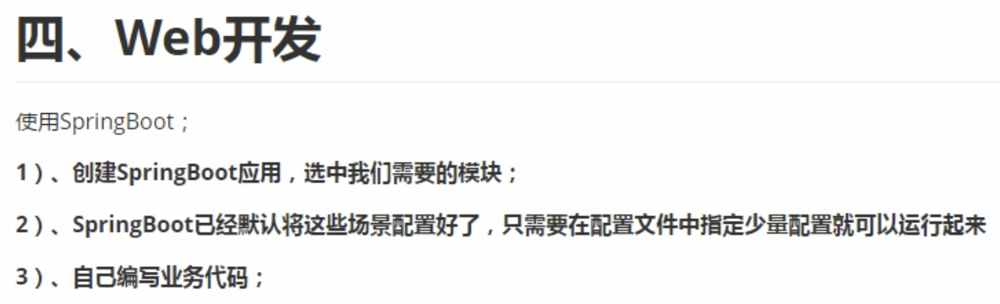

## 自动配置

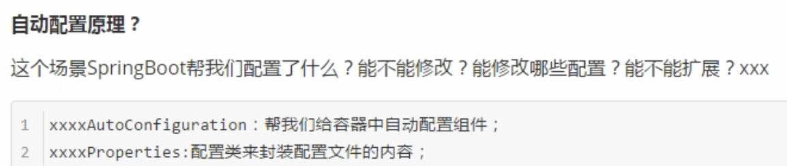

学完整个课程再看P28

## HelloWorld

新建工程
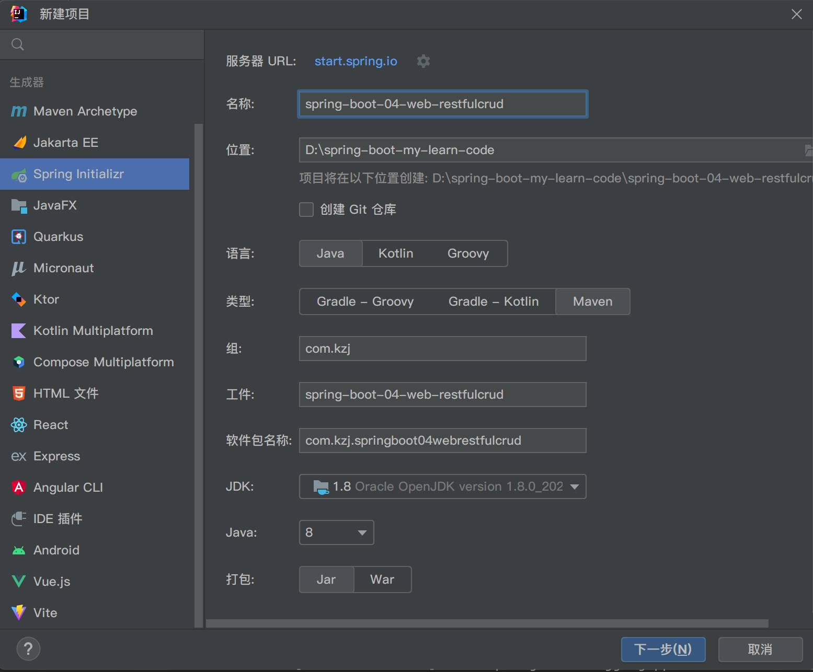

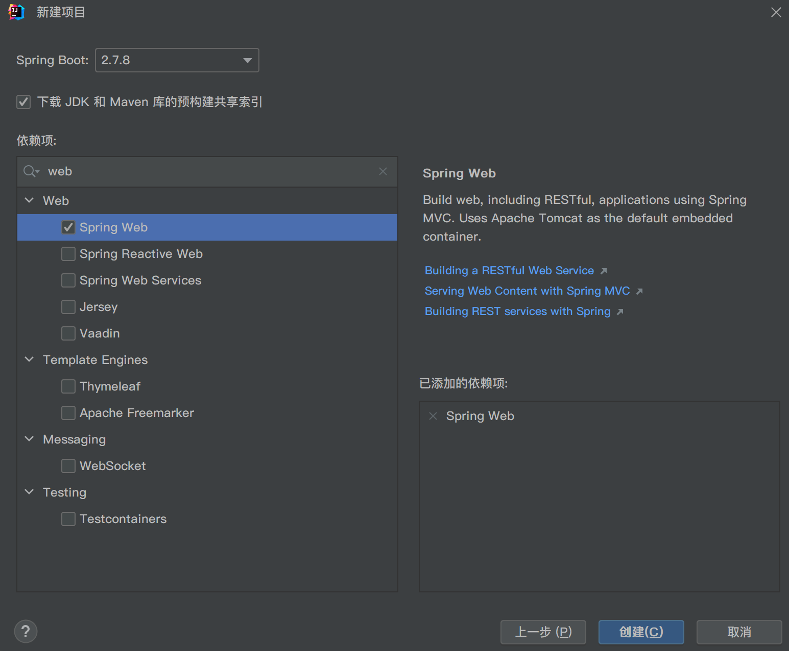

新建```src/main/java/com/kzj/springboot04webrestfulcrud/controller/HelloController.java```
```java
package com.kzj.springboot04webrestfulcrud.controller;
import org.springframework.stereotype.Controller;
import org.springframework.web.bind.annotation.RequestMapping;
import org.springframework.web.bind.annotation.ResponseBody;

@Controller
public class HelloController {
    @ResponseBody
    @RequestMapping("/hello")
    public String hello(){
        return "Hello World";
    }
}
```

### SpringBoot对静态资源的映射规则

#### 映射规则```/webjars/**```

```WebMvcAutoConfiguration.class```下面的```addResourceHandlers()```方法中，能看出：

所有的```/webjars/**```请求，都去```classpath:/META-INF/resources/webjars/```路径下找资源

webjars：以jar包的方式引入静态资源

[webjars官方网站](https://www.webjars.org/)

举例：
可以通过maven引入jquery
```xml
<dependency>
    <groupId>org.webjars.npm</groupId>
    <artifactId>jquery</artifactId>
    <version>3.6.3</version>
</dependency>
 ```

引入的webjars的结构如下图
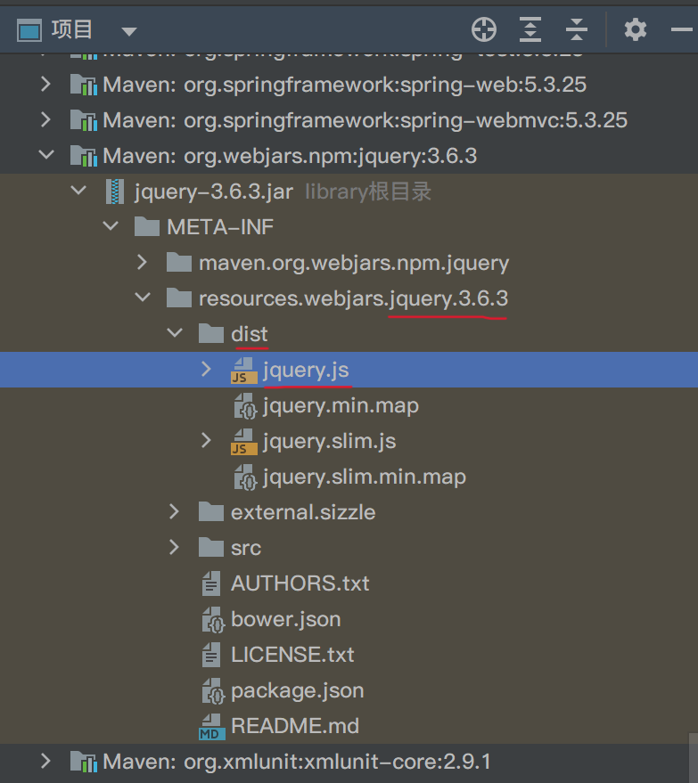

在访问的时候，只需要写webjars文件夹下的资源的相对目录和名称，即可

启动项目后，浏览器输入```localhost:8080/webjars/jquery/3.6.3/dist/jquery.js```即可访问
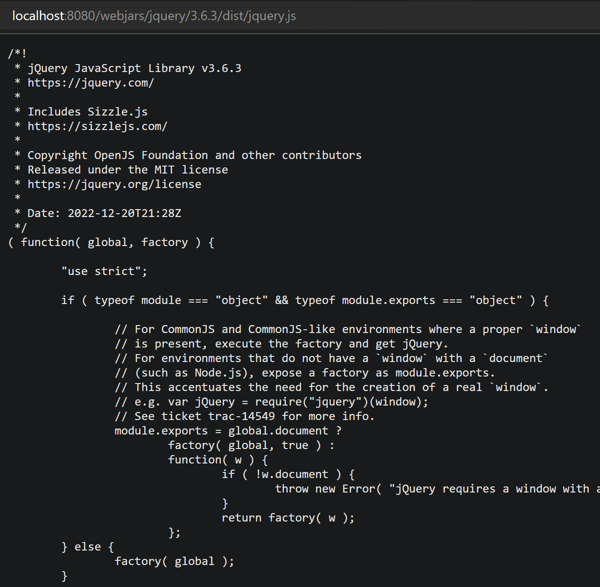

#### 映射规则```/**```

继续```WebMvcAutoConfiguration.class```下面的```addResourceHandlers()```方法中，继续到```WebMvcProperties.class```下面的```staticPathPattern```属性和```CLASSPATH_RESOURCE_LOCATIONS```属性，能看出：

所有的```/**```请求，都去
```
"classpath:/META-INF/resources/", 
"classpath:/resources/",
"classpath:/static/", 
"classpath:/public/", 
"/"
```
路径下找资源

上述的五个文件夹称为**静态资源文件夹**

classpath：```src.main.java```和```src.main.resources```路径以及第三方jar包的根路径

将静态资源文件拷贝到```classpath:/static/```路径下
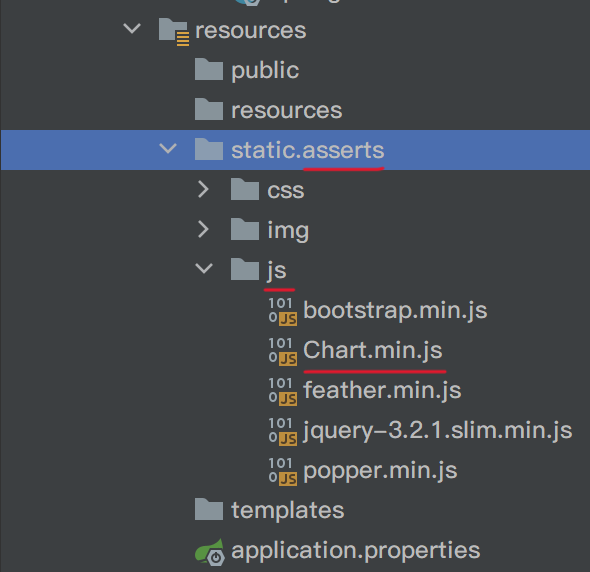

重启项目后，浏览器输入```localhost:8080/asserts/js/Chart.min.js```即可访问
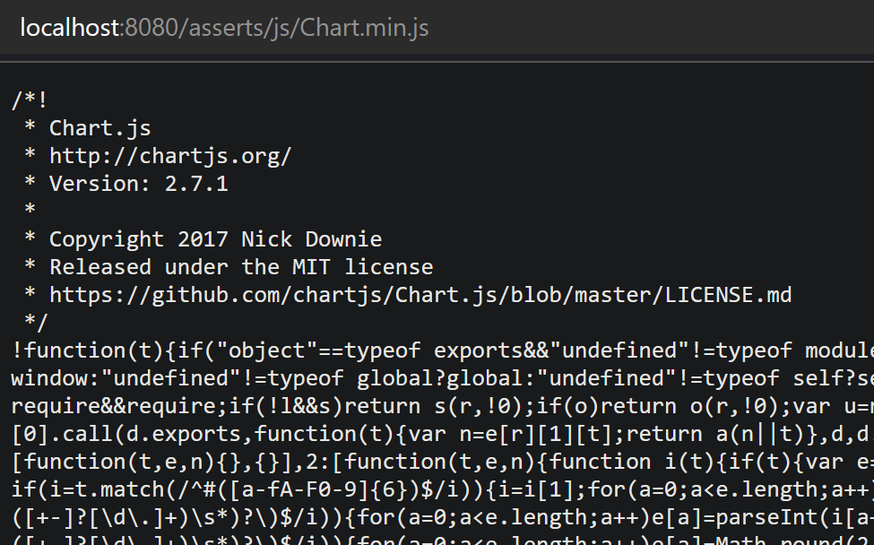

#### 首页映射

**静态资源文件夹**下的所有index.html页面，被```/**```映射

新增```src/main/resources/public/index.html```文件

重启项目后，浏览器输入```localhost:8080/```即可访问自己定义的首页
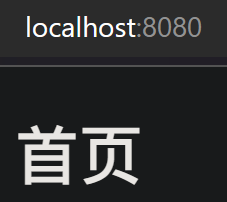

## 模板引擎

模板引擎有：JSP、Velocity、Freemarker、Thymeleaf
SpringBoot推荐使用**Thymeleaf**

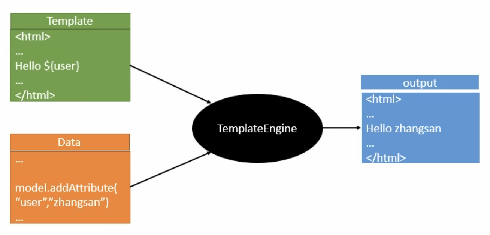

### 引入thymeleaf

[Maven中央仓库](https://mvnrepository.com/)

可以通过maven引入thymeleaf
```xml
        <dependency>
            <groupId>org.springframework.boot</groupId>
            <artifactId>spring-boot-starter-thymeleaf</artifactId>
        </dependency>
```

### thymeleaf使用

```ThymeleafProperties.class```下面的
```java
@ConfigurationProperties(
    prefix = "spring.thymeleaf"
)
public class ThymeleafProperties {
    private static final Charset DEFAULT_ENCODING;
    public static final String DEFAULT_PREFIX = "classpath:/templates/";
    public static final String DEFAULT_SUFFIX = ".html";
    private boolean checkTemplate = true;
    private boolean checkTemplateLocation = true;
    private String prefix = "classpath:/templates/";
    private String suffix = ".html";
    private String mode = "HTML";
 ```
能看出thymeleaf的用法：

只要把HTML页面放在```classpath:/templates/```目录下面，就能自动渲染了

实例：

```src/main/java/com/kzj/springboot04webrestfulcrud/controller/HelloController.java```修改为
```java
package com.kzj.springboot04webrestfulcrud.controller;
import org.springframework.stereotype.Controller;
import org.springframework.web.bind.annotation.RequestMapping;
import org.springframework.web.bind.annotation.ResponseBody;

@Controller
public class HelloController {
    @ResponseBody
    @RequestMapping("/hello")
    public String hello(){
        return "Hello World";
    }
    
    @RequestMapping("/success")
    public String success(){
        // classpath:/templates/success.html
        return "success";
    }
}
 ```
注意：```return "xxxxx";```对应寻找模板```classpath:/templates/xxxxx.html```

新建```src/main/resources/templates/success.html```
```html
<!DOCTYPE html>
<html lang="en">
<head>
    <meta charset="UTF-8">
    <title>Title</title>
</head>
<body>
  <h1>成功！</h1>
</body>
</html>
```

运行成功
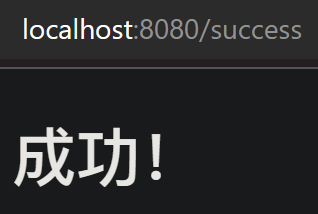

### thymeleaf语法

[thymeleaf官方文档](https://www.thymeleaf.org/doc/tutorials/3.0/usingthymeleaf.html)

[thymeleaf中文文档](https://fanlychie.github.io/post/thymeleaf.html)


---
到P31

最后再看复习P7
最后再看复习P19 P20
最后再看复习P26 P27
最后再看复习P28
之后看 ： Spring注解版 （谷粒学院）

