# 数据访问

JDBC、MyBatis、Spring Data JPA

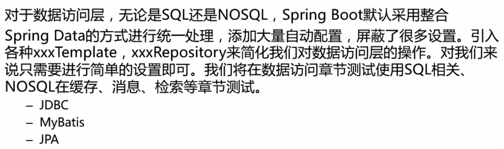

## JDBC

新建项目
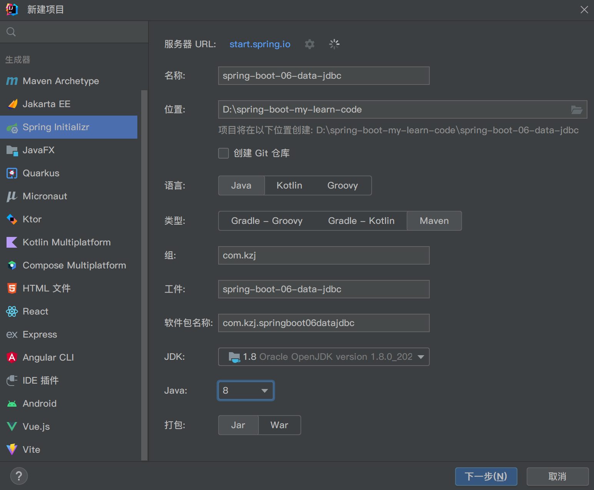
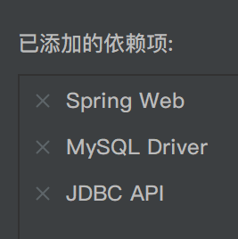

启动数据库，确保其中有名为```atguigudb```的数据库

在配置文件```src/main/resources/application.yaml```中添加
```yaml
spring:
  datasource:
    username: root
    password: 1
    url: jdbc:mysql://localhost:3306/atguigudb
    # Mysql8.0以上版本的driver
    driver-class-name: com.mysql.cj.jdbc.Driver
```

```src/test/java/com/kzj/springboot06datajdbc/SpringBoot06DataJdbcApplicationTests.java```修改为
```java
package com.kzj.springboot06datajdbc;
import org.junit.jupiter.api.Test;
import org.junit.runner.RunWith;
import org.springframework.beans.factory.annotation.Autowired;
import org.springframework.boot.test.context.SpringBootTest;
import org.springframework.test.context.junit4.SpringRunner;
import javax.sql.DataSource;
import java.sql.Connection;
import java.sql.SQLException;

@RunWith(SpringRunner.class)
@SpringBootTest
class SpringBoot06DataJdbcApplicationTests {
    @Autowired
    DataSource dataSource;

    @Test
    void contextLoads() throws SQLException {
        System.out.println(dataSource.getClass());
        Connection connection = dataSource.getConnection();
        System.out.println(connection);
        connection.close();
    }
}
 ```

测试方法的运行结果为


### 自动配置原理

数据源的相关配置都在```DataSourceProperties.class```里面

到P61 7min


## MyBatis


待学习


## Spring Data JPA

### 简介

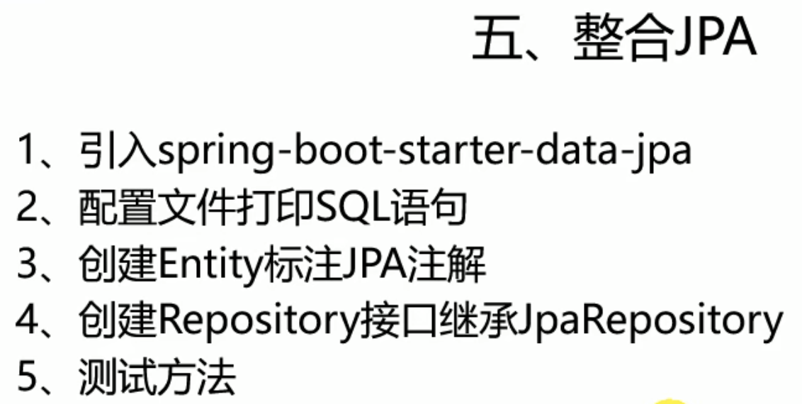
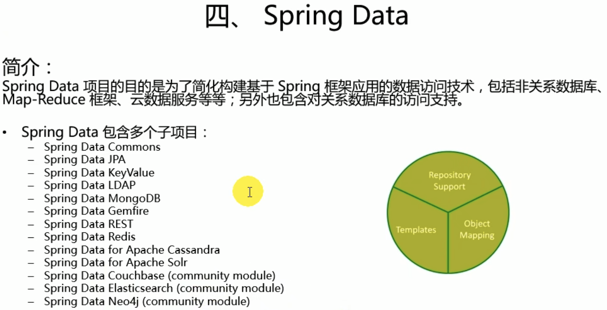
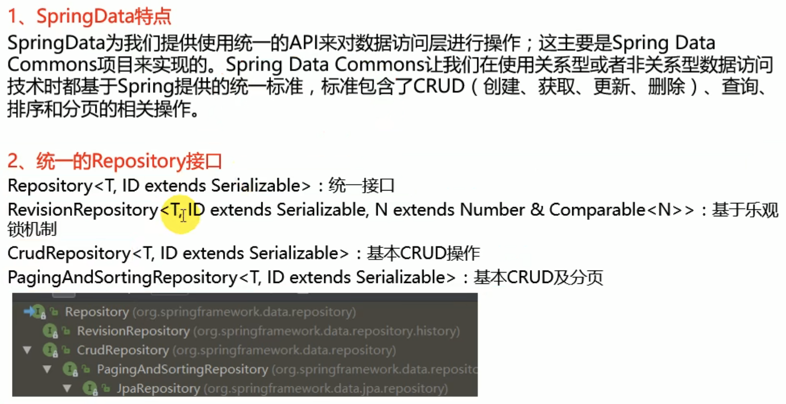
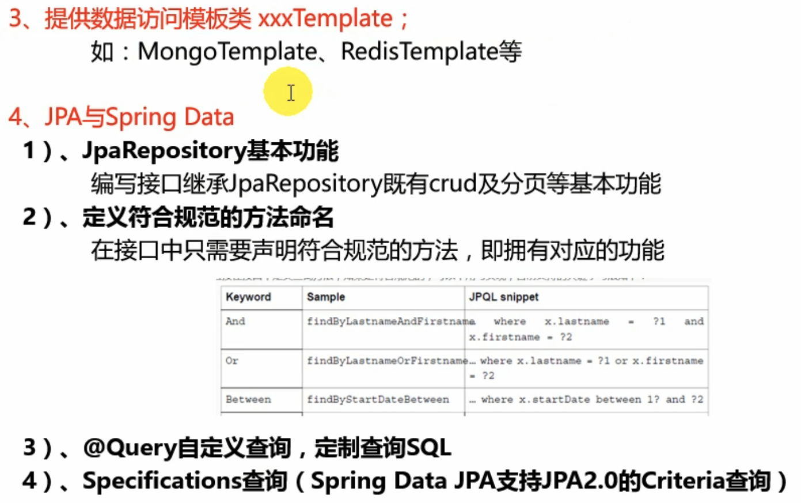
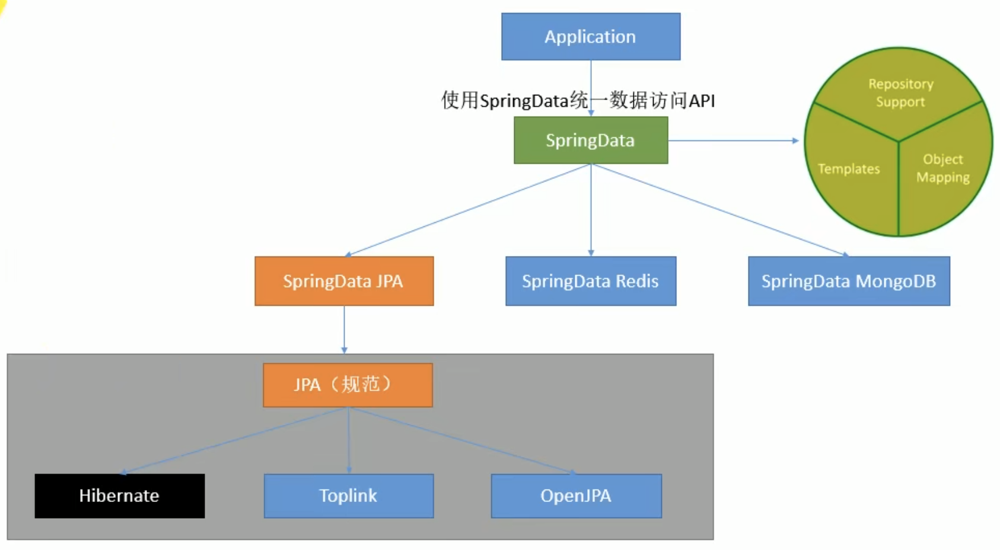

### 整合JPA

JPA:ORM（Object Relation Mapping、对象关系映射），是通过使用描述对象和数据库之间映射的元数据，将面向对象语言程序中的对象自动持久化到关系数据库中。简单来说就是将数据库表与java实体对象做一个映射

新建项目

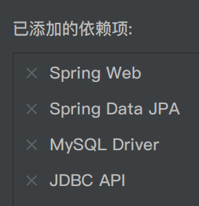

同前面的项目，在配置文件```src/main/resources/application.yaml```中配置数据源
```yaml
spring:
  datasource:
    username: root
    password: 1
    url: jdbc:mysql://localhost:3306/atguigudb
    # Mysql8.0以上版本的driver
    driver-class-name: com.mysql.cj.jdbc.Driver
```

#### 编写一个实体类（bean）和数据表进行映射，并且配置好映射关系

新增```src/main/java/com/kzj/springboot06datajpa/entity/User.java```
```java
package com.kzj.springboot06datajpa.entity;
import javax.persistence.*;

// 使用JPA注解配置映射关系
@Entity     // 告诉JPA这是一个实体类（和数据表映射的类）
@Table(name = "tbl_user")   // 指定和哪个数据表对应，如果省略，默认表名是类名小写（user）
public class User {
    @Id     // 这是一个主键
    @GeneratedValue(strategy = GenerationType.IDENTITY)     // 自增策略
    private Integer id;
    @Column(name = "last_name", length = 50)     // 指定和数据表对应的一个列，如果省略，默认列名是属性名
    private String lastName;
    @Column
    private String email;
    // 省略的setter、getter方法
}
```
其中配置的数据表```tbl_user```不需要自己创建

#### 编写一个Dao接口（Repository）来操作实体类对应的数据表

新增```src/main/java/com/kzj/springboot06datajpa/repository/UserRepository.java```
继承```JpaRepository```
```java
package com.kzj.springboot06datajpa.repository;
import com.kzj.springboot06datajpa.entity.User;
import org.springframework.data.jpa.repository.JpaRepository;

// 继承JpaRepository来完成对数据库的操作
public interface UserRepository extends JpaRepository<User, Integer> {
}
```

#### 基本配置

现在还没有数据表```tbl_user```，也不需要自己创建
还需要对JPA做一些配置

```src/main/resources/application.yaml```修改为
```yaml
spring:
  datasource:
    username: root
    password: 1
    url: jdbc:mysql://localhost:3306/atguigudb
    # Mysql8.0以上版本的driver
    driver-class-name: com.mysql.cj.jdbc.Driver
  jpa:
    hibernate:
      # 定义数据表的生成策略，如果没有数据表，则会创建数据表；如果有数据表，则会更新数据表结构
      ddl-auto: update
    # 控制台显示sql
    show-sql: true
 ```

运行项目
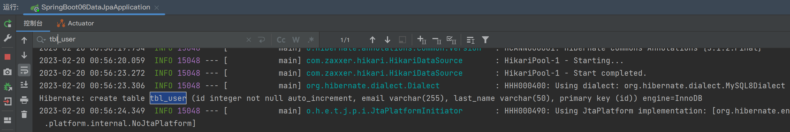
成功在数据库中建```tbl_user```表
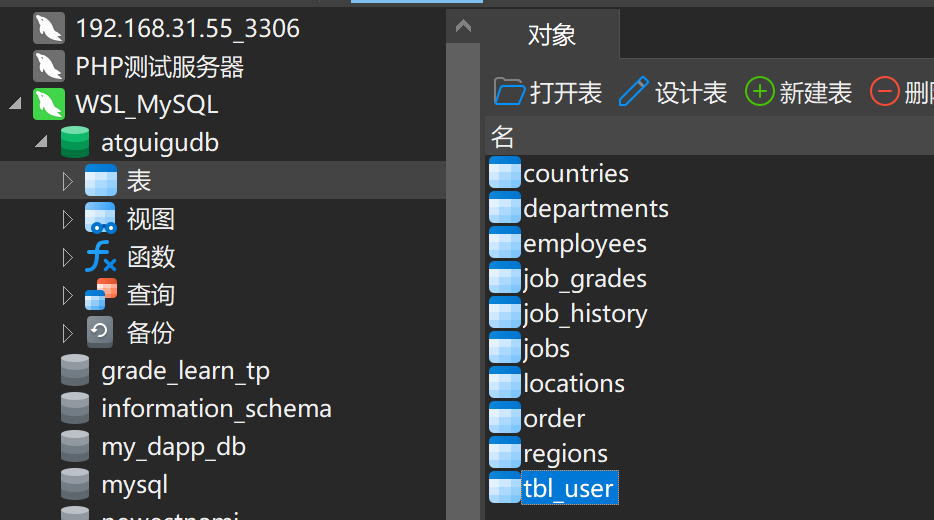

#### 增删改查


---

到P67  12：30min


