# PHP

[PHP教程](https://www.runoob.com/php/php-tutorial.html)

## 切换php版本

先安装php5.6
[安装教程](https://blog.csdn.net/acnwcl/article/details/123958930)

```shell
sudo update-alternatives --config php
 ```
用于切换版本
已经切换，在php -v看到是切换后的
注意：上面切换的是命令行中的php版本，但是apache中php版本没有切换

尝试切换apache中的php版本
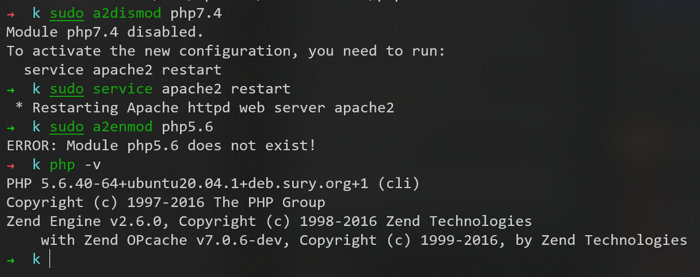

发现是少安装了东西
安装libapache2-mod-php5.6
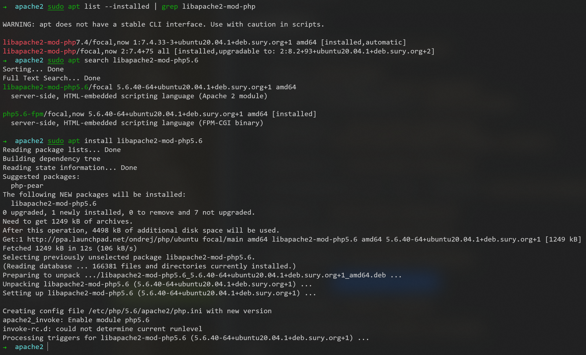

使用```a2enmod```和```a2dismod```命令
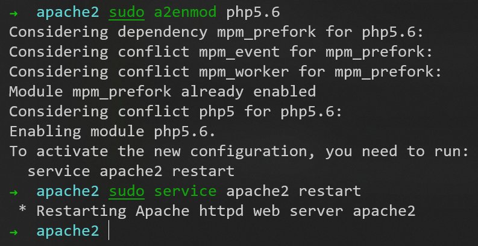

apache2中版本切换成功
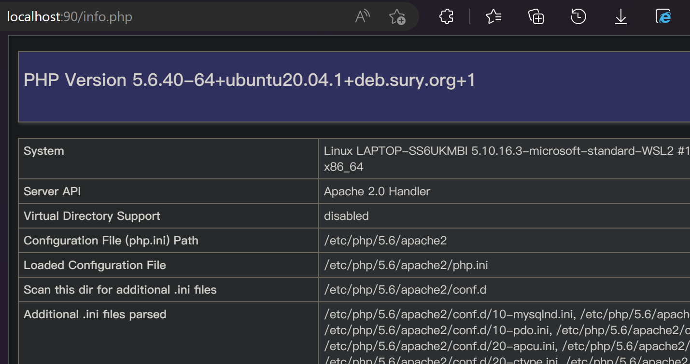

# ThinkPHP 5.1

[官方文档](https://www.kancloud.cn/manual/thinkphp5_1/353946)

## 安装

确保已经安装apache2、php7.4、mysql

接着安装composer
```shell
curl -sS https://getcomposer.org/installer | php
mv composer.phar /usr/local/bin/composer
 ```
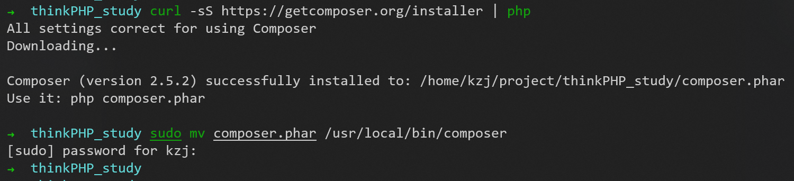

由于在安装过程中，国内访问composer的速度比较慢，可以使用国内镜像
```shell
composer config -g repo.packagist composer https://packagist.phpcomposer.com
 ```

然后安装ThinkPHP 5.1
```shell
cd /var/www/html
sudo composer create-project topthink/think=5.1.x helloworld
 ```
注意：apache和nginx中部署的网页文件都放在同一个目录/var/www/html
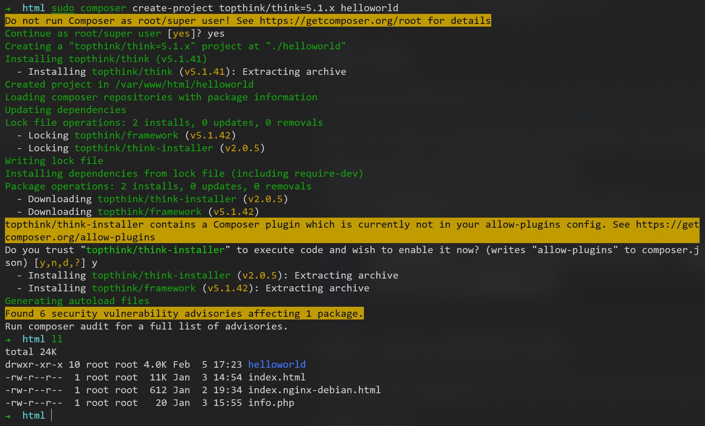

开启apache服务
```shell
sudo service apache2 start
```
注意：之前，我为了apache的端口和nginx的端口不冲突，把apache的端口号配置为90

访问```http://localhost:90/helloworld/public/```，成功
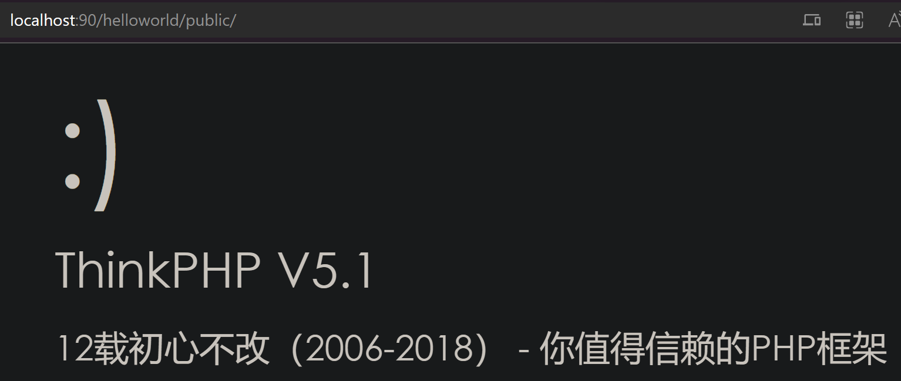

可以使用php自带webserver快速测试，切换到根目录后，启动命令：```php think run```

## ThinkPHP 3.1报错

### mysql 与 mysqli

thinkPHP的数据库配置文件为```App/Conf/db.config.php```
其中，
1. php7.4版本对应```'DB_TYPE' => 'mysqli'```
2. php5.6版本对应```'DB_TYPE' => 'mysql'```

### mysql 中 localhost 和 127.0.0.1 的区别

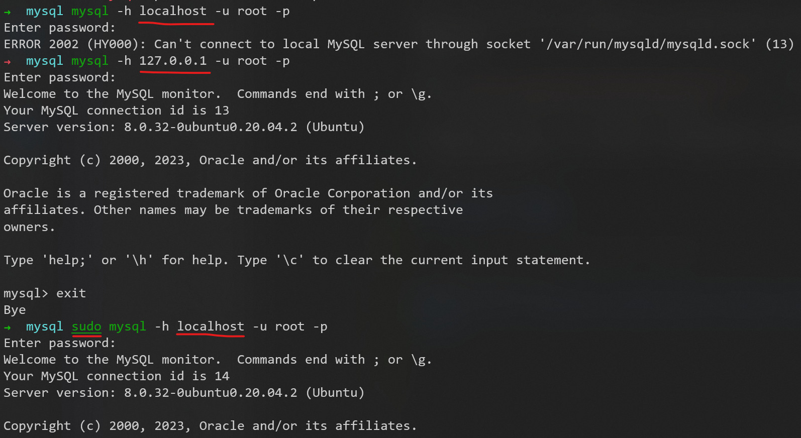
- localhost是通过UNIX的socket本地连接而没有通过端口3306
- 127.0.0.1是通过TCP的协议连接3306的端口

 localhot是不经网卡传输！这点很重要，它不受网络防火墙和网卡相关的的限制。 127.0.0.1是通过网卡传输，依赖网卡，并受到网络防火墙和网卡相关的限制。一般设置程序时本地服务用localhost是最好的，localhost不会解析成ip，也不会占用网卡、网络资源。 有时候用localhost可以，但用127.0.0.1就不可以的情况就是在于此。猜想localhost访问时，系统带的本机当前用户的权限去访问，而用ip的时候，等于本机是通过网络再去访问本机，可能涉及到网络用户的权限。   

### 报错 The server requested authentication method unknown to the client

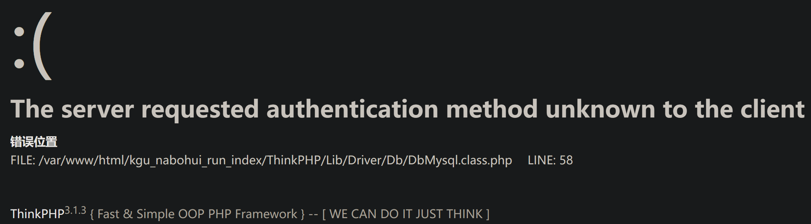

抛出错误的代码：
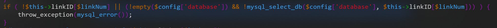

mysql版本为8.0
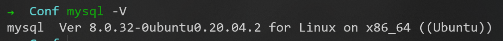

查阅一些相关的资料后发现是由于新版本的mysql账号密码解锁机制不一致导致的
在MySQL 8.0中，```caching_sha2_password```是默认的身份验证插件，而不是以往的```mysql_native_password```

如下改成以往的```mysql_native_password```
在mysql的配置文件中添加如下内容
```
[mysqld]
default_authentication_plugin=mysql_native_password
```
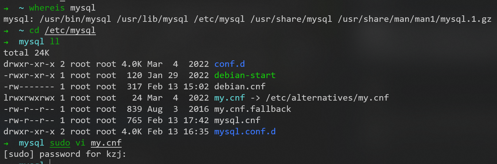

还要确保mysql的root用户的plugin是```mysql_native_password```
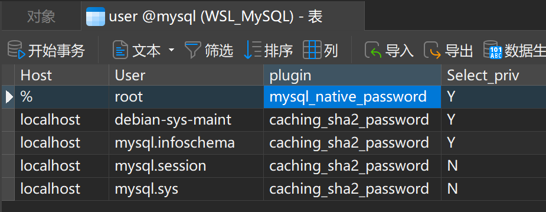

并重启mysql
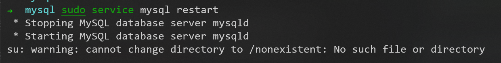

经测试，报错解决
