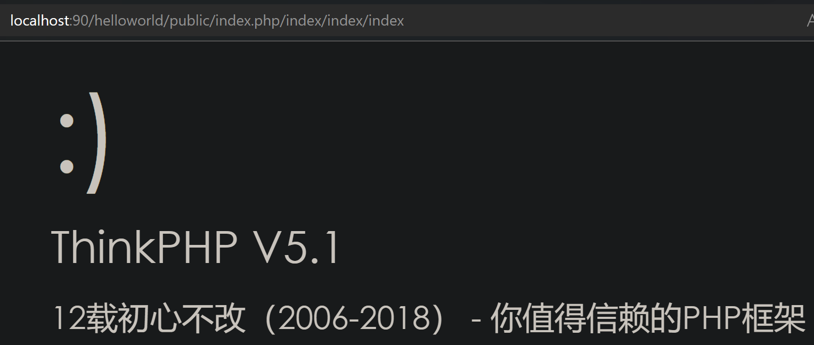
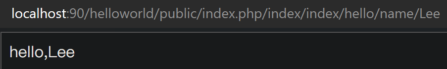
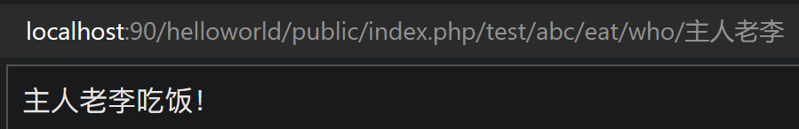

# URL

## URL解析

- ThinkPHP 框架非常多的操作都是通过 URL 来实现的
```url
http://serverName/index.php/模块/控制器/操作/参数/值…
```

- index.php 为**入口文件**，在 public 目录内的 **index.php** 文件
- **模块**在 application 目录下默认有一个 **index** 目录
- 而在 index 目录下有一个 controller 控制器目录的 **Index**.php **控制器**
Index.php 控制器的类名也必须是 class Index，否则错误
- 而**操作**就是控制器 class Index 里面的方法，比如：**index** 或 hello
那么完整形式为：```public/index.php/index/index/index```
官方给的默认模块，默认控制器，默认操作都是 index，所以出现四个 index


- 而操作还另给了一个带名为 **name** 的**参数**的**操作**：**hello**，**值**为 **Lee**，如下:
那么完整形式为：```public/index.php/index/index/hello/name/Lee```


- 为了更清晰的了解 URL 路径的执行过程，我们自己创建一个完全不重复的 URL
- 在 application 目录下创建一个 test 目录（模块）
- 在 test 模块下创建控制器目录 controller，并在旗下创建 Abc.php（控制器）内容如下：
```php
<?php
namespace app\test\controller;
class Abc
{
    public function eat($who = '隔壁老王')
    {
        return $who.'吃饭！';
    }
}
```
- 代码中 eat 是方法（操作），$who 是参数，'隔壁老王’是值
完整形式为：```public/index.php/test/abc/eat/who/主人老李```


