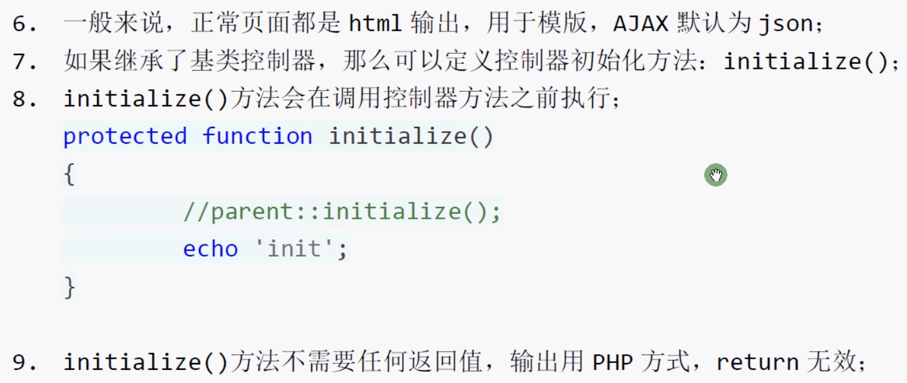

# 模块设计

## 目录结构

初始的目录结构如下：

```xml
www  WEB部署目录（或者子目录）
├─application           应用目录
│  ├─common             公共模块目录（可以更改）
│  ├─module_name        模块目录
│  │  ├─common.php      模块函数文件
│  │  ├─controller      控制器目录
│  │  ├─model           模型目录
│  │  ├─view            视图目录
│  │  └─ ...            更多类库目录
│  │
│  ├─command.php        命令行定义文件
│  ├─common.php         公共函数文件
│  └─tags.php           应用行为扩展定义文件
│
├─config                应用配置目录
│  ├─module_name        模块配置目录
│  │  ├─database.php    数据库配置
│  │  ├─cache           缓存配置
│  │  └─ ...            
│  │
│  ├─app.php            应用配置
│  ├─cache.php          缓存配置
│  ├─cookie.php         Cookie配置
│  ├─database.php       数据库配置
│  ├─log.php            日志配置
│  ├─session.php        Session配置
│  ├─template.php       模板引擎配置
│  └─trace.php          Trace配置
│
├─route                 路由定义目录
│  ├─route.php          路由定义
│  └─...                更多
│
├─public                WEB目录（对外访问目录）
│  ├─index.php          入口文件
│  ├─router.php         快速测试文件
│  └─.htaccess          用于apache的重写
│
├─thinkphp              框架系统目录
│  ├─lang               语言文件目录
│  ├─library            框架类库目录
│  │  ├─think           Think类库包目录
│  │  └─traits          系统Trait目录
│  │
│  ├─tpl                系统模板目录
│  ├─base.php           基础定义文件
│  ├─console.php        控制台入口文件
│  ├─convention.php     框架惯例配置文件
│  ├─helper.php         助手函数文件
│  ├─phpunit.xml        phpunit配置文件
│  └─start.php          框架入口文件
│
├─extend                扩展类库目录
├─runtime               应用的运行时目录（可写，可定制）
├─vendor                第三方类库目录（Composer依赖库）
├─build.php             自动生成定义文件（参考）
├─composer.json         composer 定义文件
├─LICENSE.txt           授权说明文件
├─README.md             README 文件
├─think                 命令行入口文件
```

```app.php```文件中配置了默认模块

所以使用```localhost:90/helloworld/public/```就可以访问默认模块

## 绑定默认的模块和控制器


## 空模块


## 单一模块


## 环境变量


# 控制器

## 控制器定义


## 渲染输出




## 控制器操作

### 前置操作


### 跳转和重定向


### 空方法和空控制器


