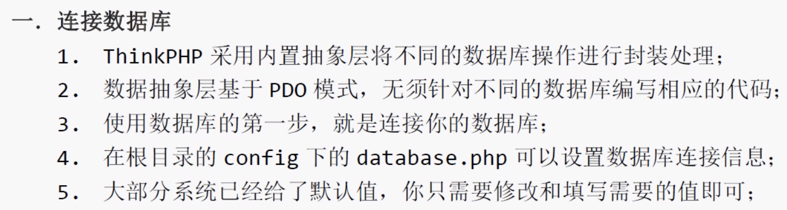
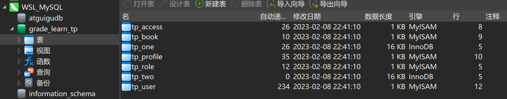
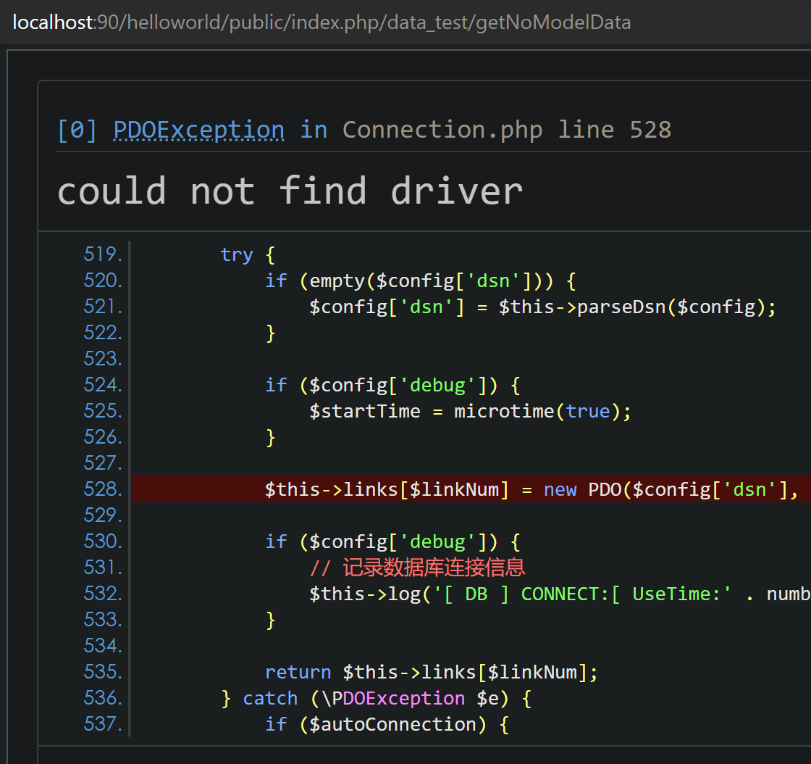
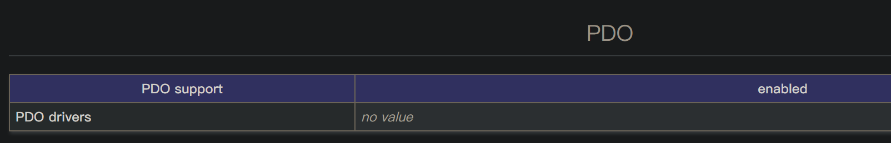
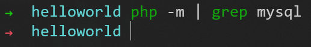
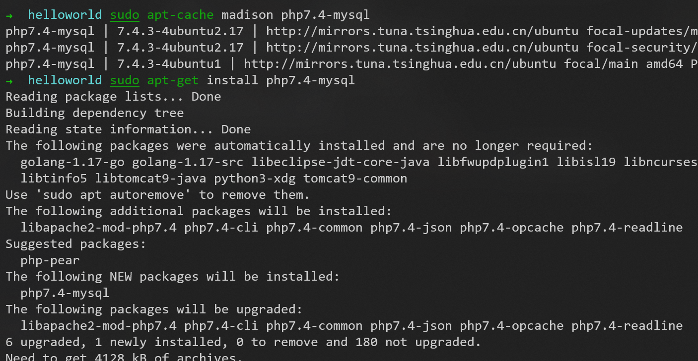
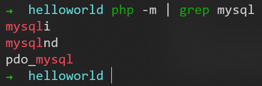
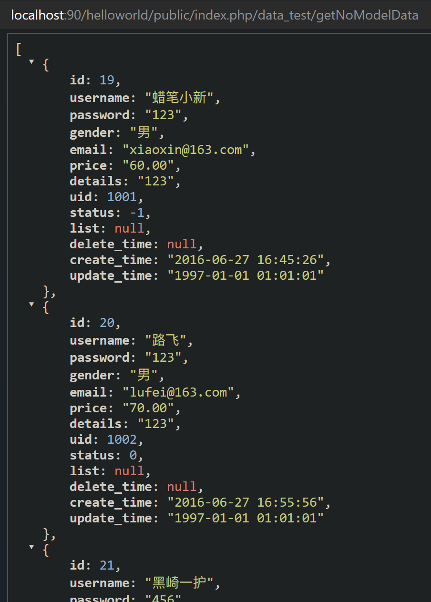

# 数据库与模型

## 连接数据库



```php
    // 数据库类型
    'type'            => 'mysql',
    // 服务器地址
    'hostname'        => '127.0.0.1',
    // 数据库名
    'database'        => 'grade_learn_tp',
    // 用户名
    'username'        => 'root',
    // 密码
    'password'        => '1',
    // 端口
    'hostport'        => '3306',
    // 连接dsn
    'dsn'             => '',
    // 数据库连接参数
    'params'          => [],
    // 数据库编码默认采用utf8
    'charset'         => 'utf8',
    // 数据库表前缀
    'prefix'          => 'tp_',
    // 数据库调试模式
    'debug'           => true,
```

注意数据库表前缀的配置


在controller目录下新建DataTest.php文件，内容如下
```php
<?php
namespace app\controller;
use think\Controller;
use think\Db;

class DataTest extends Controller
{
    public function index()
    {
        return 'index';
    }

    public function getNoModelData()
    {
        $data = Db::table("tp_user")->select();
        return json($data);
    }
}
```

访问```localhost:90/helloworld/public/index.php/data_test/getNoModelData```，报错


解决方法：
[出现could not find driver的解决方法](https://blog.csdn.net/qq_43175099/article/details/84329738)

直接用```phpinfo()```函数查看

发现是PDO驱动没有安装mysql数据库驱动

使用命令```php -m```查看已安装的模块
找不到已安装的mysql驱动


使用命令```sudo apt-cache madison [软件名]```查找可安装的软件
安装```php7.4-mysql```


安装成功


还需要使用命令```sudo service apache2 restart```重启apache2服务

再次访问```localhost:90/helloworld/public/index.php/data_test/getNoModelData```，成功



---
Laravel

到P5


