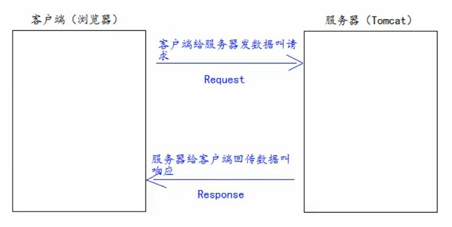
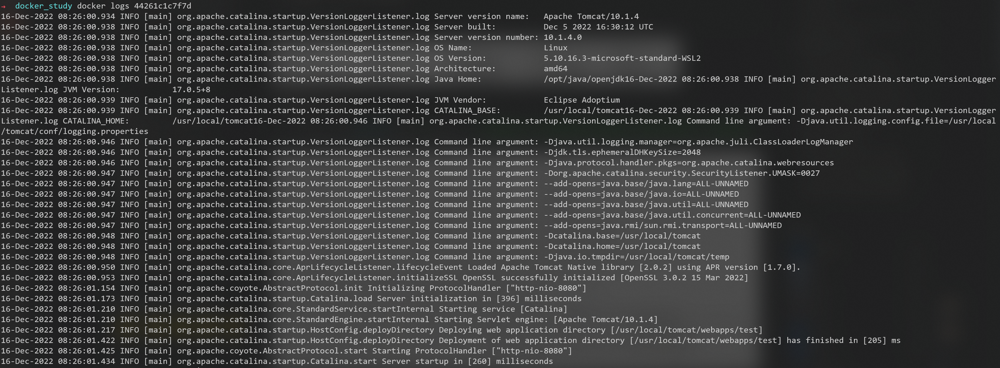
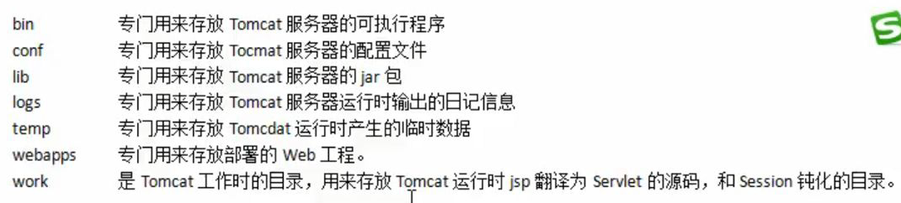

# JavaWeb概念

通过 Java 语言编写可以通过浏览器访问的程序的总称， 是基于请求和响应来开发的。

## 请求 Request 和 响应 Response

请求和响应是成对出现的


## Web资源的分类

1. 静态资源： html、css、js、txt、mp4 视频、jpg 图片
2. 动态资源： jsp 页面、Servlet 程序

# Tomcat

Tomcat 服务器是一个免费的开放源代码的Web 应用服务器，属于轻量级应用服务器，在中小型系统和并发访问用户不是很多的场合下被普遍使用，是开发和调试JSP 程序的首选。对于一个初学者来说，可以这样认为，当在一台机器上配置好Apache 服务器，可利用它响应HTML（标准通用标记语言下的一个应用）页面的访问请求。实际上Tomcat是Apache 服务器的扩展，但运行时它是独立运行的，所以当你运行tomcat 时，它实际上作为一个与Apache 独立的进程单独运行的。

## 安装

[官方文档](https://linuxize.com/post/how-to-install-tomcat-9-on-ubuntu-20-04/)

太麻烦，直接用docker中的tomcat镜像


在当前目录下创建test文件夹（可以不提前创建，添加容器数据卷命令会帮我们创建）

运行容器
```docker run --name tomcat -p 8080:8080 -v $PWD/test:/usr/local/tomcat/webapps/test -d tomcat```

命令说明：
```-p 8080:8080```：将主机的 8080 端口映射到容器的 8080 端口。
```-v $PWD/test:/usr/local/tomcat/webapps/test```：将主机中当前目录下的```test```目录挂载到容器的 ```/usr/local/tomcat/webapps/test```目录。

日志信息为


浏览器访问8080端口，显示404


以交互方式进入容器


发现webapps文件夹下缺文件
将webapps.dist中的文件复制粘贴到webapps下


再浏览器访问8080端口，显示正常


## 目录结构



钝化就是把东西写到磁盘上

## 部署Web工程到Tomcat

### 第一种部署方法

当我们访问http://localhost:8080时，其实访问对应的是我们Tomcat服务器中的webapps目录


之前，为了操作方便，用参数```-v $PWD/test:/usr/local/tomcat/webapps/test```将主机中当前目录下的 test 挂载到容器的 /test。

现在，将自己的Web工程存放到之前创建的test文件夹中


按照下图的URL访问


即可访问自己的工程


### 第二种部署方法


## 访问原理


约定


ROOT工程的位置和内容


