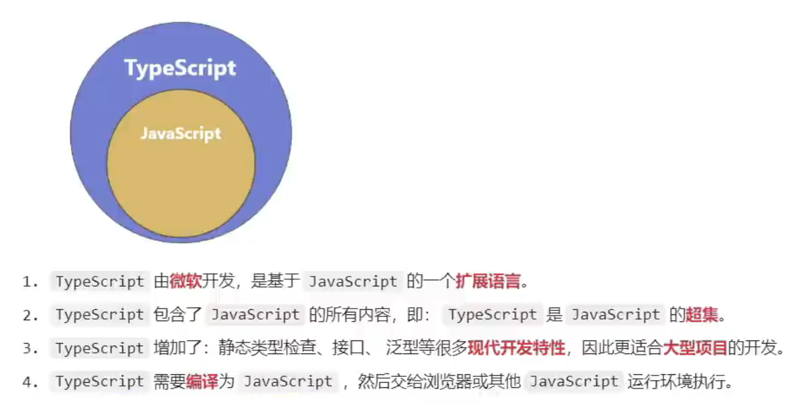

# TypeScript 快速入门

## 简介



## js中的困扰

### 1. 数据类型不明确

```js
let x = 'hello';
x();
```

### 2. 逻辑漏洞

```js
const str = Date.now() % 2 ? '奇数' : '偶数';
if (str !== '奇数') {
    console.log('1');
} else if (str === '偶数') {
    console.log('2');                               // 永远执行不到    
}
```

### 3. 访问不存在的属性

```js
const obj = { width: 10, height: 15 };
const area = obj.width * obj.heigth;				// 单词拼错不飘红
```

### 4. 低级的拼写错误

```js
const message = 'hello,world';
message.toUperCase();
```

## ts的核心：静态类型检查

TypeScript的核心是**静态类型检查**，可以**将运行时的错误前置**，在编写代码时就发现并修正错误

## 编译ts

### 命令行编译

先要全局安装ts `npm i typescript -g`

然后编译 `tsc xxxxx.ts`
会在同目录下看到生成的文件 `xxxxx.js`

### 自动化编译

使用命令 `tsc --init`
生成配置文件 `tsconfig.json`

使用命令 `tsc --watch` 监视目录中 `.ts` 文件的变化，并自动编译，生成 `.js` 文件
小优化，使用命令 `tsc --noEmitOnError --watch` ，当编译出错时，不生成 `.js` 文件

### 使用前端框架时

当使用 Vue 或 React 前端框架时，不需要手动编译 ts 文件，集成到了 **webpack** 或 **vite** 中，自动编译 ts 文件


