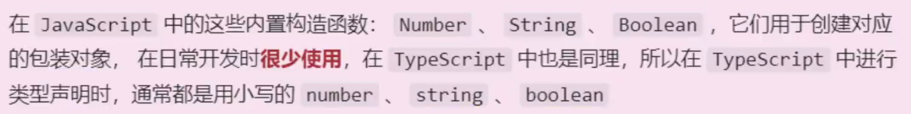
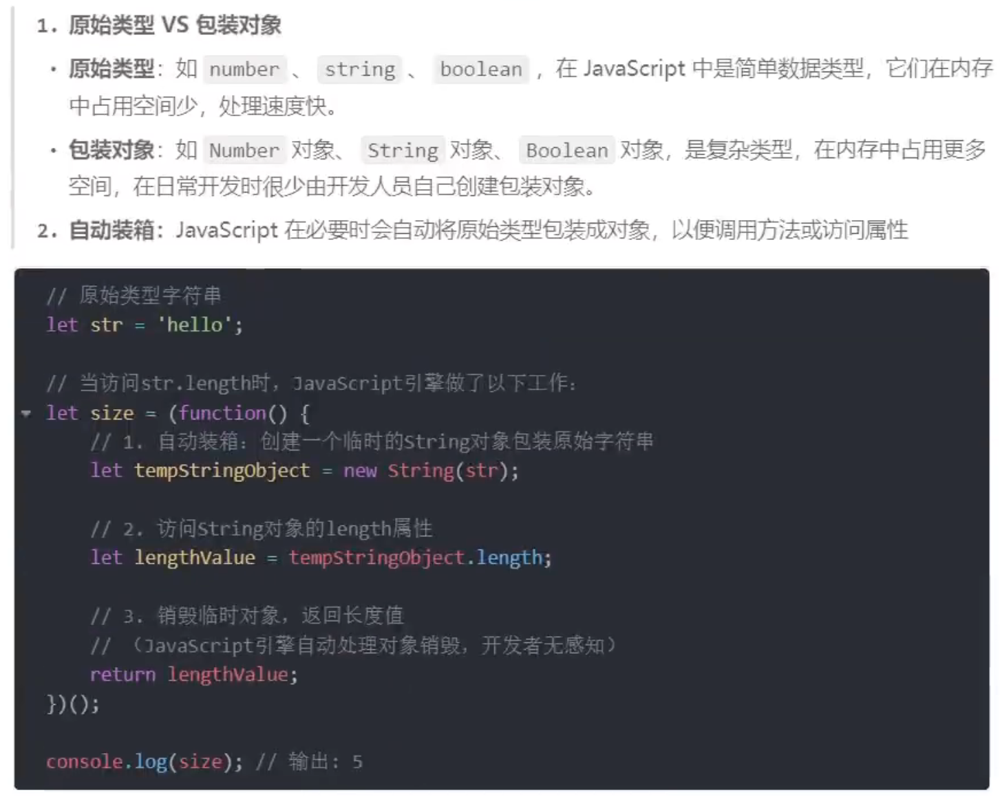
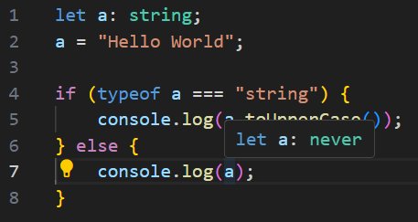
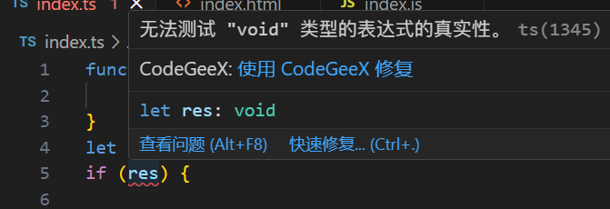
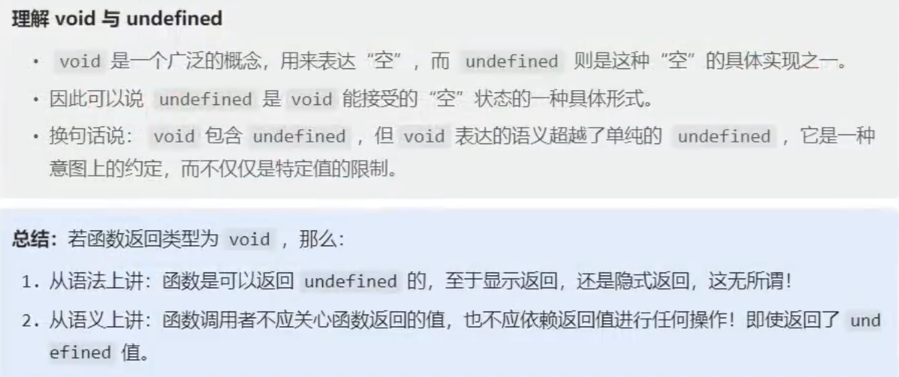
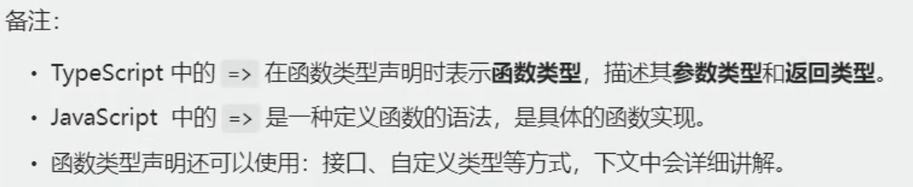
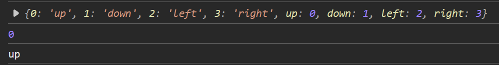
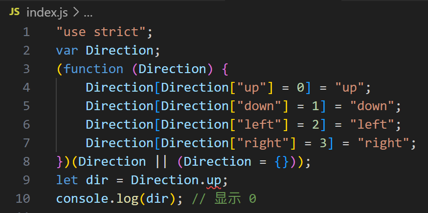
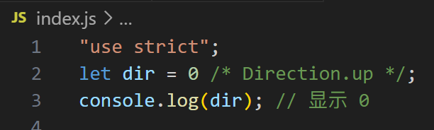
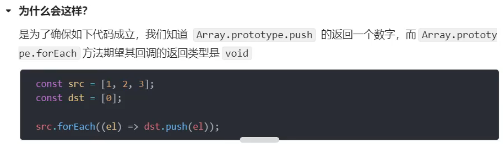

# 类型声明

对 **变量**、**函数形参**、**函数返回值** 进行类型声明

```ts
let a: string; // 类型限定
let b: number;
let c: boolean;
// a = 1; // error
a = 'Hello';
b = -99;
c = true;

function count(x: number, y: number): number {
    return x + y;
}
let result = count(5, 10);
// let res2 = count(1); // error
// let res3 = count(1, 2, 3); // error

let d: 'hello'; // 字面量类型
// d = 'h'; // error
```

# 类型推断

ts会根据我们的代码，进行**类型推断**，下面代码中的变量d，只能存储数字

```ts
let d = 99;
// d = 'h'; // error
```

但不推荐这样做，尽量明确地编写类型声明

# 类型总览

## js中的数据类型

- 值类型(原始类型)：`number`、`string`、`boolean`、`null`、`undefined`、`symbol`、`bigint`
- 引用类型：`object`（包含 `Array`、`Function`、`Date`、`Error`）

## ts中的数据类型

- 上述所有js中的数据类型
- 6个**新类型**：`any`、`unknown`、`never`、`void`、`tuple`、`enum`
- 2个用于**自定义类型**的方式：`type`、`interface`

## 注意：原始类型 VS 包装对象



```ts
let str1: string; // ts官方推荐的写法
let str2: String;
// string 和 String 区别是什么

str1 = 'hello'; // 可以存基本类型(值类型)
// str1 = new String('hello'); // 不可以存引用类型(包装对象)

str2 = 'hello'; // 都可以
str2 = new String('hello'); // 都可以，但这样做对内存不友好

console.log(typeof str1); // 显示 string
console.log(typeof str2); // 显示 object
```



# 常用类型

## any

`any` 的含义：任意类型，一旦将变量类型限制为 `any`，那就意味着**放弃**对该变量的类型检查

```ts
let a: any; // 显式指定any类型
let b; // 没有指定类型，默认为any类型
a = 5;
a = "hello";
a = true;
```

注意：`any`类型的变量，**可以赋值给任意类型的变量**
所以不要随便用`any`类型，`any`类型的变量赋值给谁，就是对谁的**破坏**
```ts
// 接上面的代码
let str: string;
str = a; // 无警告
```

## unknown

`unknown` 的含义：未知类型，可以理解为一个类型安全的 `any`，适用于不确定数据具体类型的情况

```ts
let a: unknown;
a = 5;
a = "hello";
a = true;
```

`unknown`会**强制**开发者在使用前进行**类型检查**，从而提供更强的类型安全

```ts
let a: unknown;
a = "hello";

let str: string;
// str = a; // error

// 要让ts放行，才不会报错
// 第1种
if (typeof a === "string") {
    str = a;
}
// 第2种(断言)
str = a as string;
// 第3种(断言的另一种写法)
str = <string>a;
```

读取`any`类型数据的任何属性都不会报错，而`unknown`正好与之相反

```ts
let str1: string;
str1 = "Hello World";
str1.toUpperCase(); // 无警告

let str2: any;
str2 = "Hello World";
str2.toUpperCase(); // 无警告
str2.abc; // 无警告
str2.def; // 无警告

let str3: unknown;
str3 = "Hello World";
str3.toUpperCase(); // 警告："str3"的类型为"unknown"，不能保证调用到"toUpperCase()"方法，所以报错
// 强制断言
(str3 as string).toUpperCase();  // 无警告
```

## never

`never` 的含义：任何值都不是，简而言之就是**不能有值**，`undefined`、`null`、`''`、`0` 都不行

几乎不用`never`去直接限制变量，因为没有意义

```ts
let a: never;
a = 9; // error
```

`never`类型一般用于限制**函数返回值**，表示函数**永远**不会返回值

```ts
function demo(): never {
    // 如果不自己return，函数自己也会 return undefined
    // 只能有2种情况，函数不会return
    // 1. 函数不能顺利结束
    throw new Error("demo error");
    // 2. 函数永远执行不完
    // 函数自己调用自己，递归，死循环
}
```

`never`一般是ts主动推断出来的，例如：


```ts
let a: string;
a = "Hello World";

if (typeof a === "string") {
    console.log(a.toUpperCase());
} else {
    console.log(a); // ts会推断出此处的a是never，因为没有任何一个值符合此处的逻辑
}
```

## void

`void` 通常用于**函数返回值的声明**，含义：函数不返回任何值，调用者也**不应该依赖其返回值进行任何操作**

```ts
function logMessage(message: string): void {
    console.log(message);
    // 函数有隐式的返回值，return undefined
}
logMessage("Hello, world!");
```


以下写法均符合规范
```ts
function logMessage1(message: string): void {
    console.log(message);
}

function logMessage2(message: string): void {
    console.log(message);
    return;
}

function logMessage3(message: string): void {
    console.log(message);
    return undefined;
}
```

**限制函数返回值**时，`undefined` 和 `void` 的区别：
```ts
function demo1(): void { // 这里的void在暗示其他的函数调用者，不要关注返回值，更不要拿着返回值做后续操作
    console.log("@");
}
let res = demo1();
if (res) { //警告：无法测试 "void" 类型的表达式的真实性

}

function demo2(): undefined {
    console.log("@");
}
let res2 = demo2();
if (res2) { //无警告

}
```



### void 和 undefined 的区别



## object 和 Object

`object`（首字母小写）的含义：**所有非原始类型**，可存储对象、函数、数组等，由于限制的范围比较宽泛，在实际开发中使用的相对较少

`Object`（首字母大写）的含义：**所有可以调用`Object`方法的类型**，除了 `null` 和 `undefined`，谁都能存，所以实际开发中使用频率极低

```ts
let a: object; // a能存储非原始类型
let b: Object; // b能存储的类型是可以调用到Object方法的类型
// 以下可以存储
a = {};
a = {name: 'hello'};
a = [1, 2, 3];
a = function() {};
a = new String('hello');
class Person1 {}
a = new Person1();
// 以下不能存储
a = 1;
a = true;
a = 'hello';
a = null;
a = undefined;
// 以下可以存储
b = {};
b = {name: 'hello'};
b = [1, 2, 3];
b = function() {};
b = new String('hello');
class Person2 {}
b = new Person2();
b = 1;
b = true;
b = 'hello';
// 以下不能存储
b = null;
b = undefined;
```

`object` 和 `Object` 的限制都太宽泛，如何声明具体的对象类型？

### 声明对象类型

实际开发中，限制一般对象，通常使用以下形式：
```ts
let person: {
    name: string, // 必有属性
    age?: number // ? 代表可选属性
};

person = {
    name: "John",
    age: 30
};

// person = {
//     name: "John",
//     age: "30"
// };

person = {
    name: "John"
};

// person = {
//     name: "John",
//     age: 30,
//     gender: "male"
// };
```

#### 索引签名

**索引签名**允许定义对象可以具有**任意数量的属性**，这些属性的key和value类型是可变的，常用于描述类型不确定的属性（包含在**具有动态属性的对象**）

```ts
let person: {
    name: string,
    age?: number, // ? 代表可选属性
    [key: string]: any // 代表任意数量、任意类型的属性
};

person = {
    name: "John",
    age: 30
};

person = {
    name: "John",
    age: 30,
    gender: "male",
    city: "New York"
};
```

### 声明函数类型

```ts
let count: (a: number, b: number) => number; // 这里的 => 不是箭头函数，而是一个分隔符

count = (x, y) => x + y; // 这是箭头函数

count = function (x, y) {
    return x + y;
}
```



### 声明数组类型

有两种写法，其中 `Array<string>` 属于**泛型**

```ts
let arr1: string[];
let arr2: Array<string>;

arr1 = ['a', 'b'];
// arr1 = ['a', 'b', 1];
arr2 = ['a', 'b'];
```

## tuple

`tuple`（元组）是一种特殊的**数组类型**，可以存储**固定数量**的元素，并且每个元素的类型是**已知的**并且**可以不同**。元组用于精确描述一组值的类型，`?`表示可选元素

注意`tuple`不是关键字，不要直接把`tuple`写到代码里，而是用`[]`表示元组

```ts
let arr1: [string, number];
let arr2: [string, number?]; // ? 代表可有可无
let arr3: [string, ...number[]]; // ...number[] 代表可以放任意多个number类型的数据

arr1 = ["hello", 5];
arr2 = ["hello"];
arr3 = ["hello", 1, 2, 3, 4, 5];
```

## enum

`enum`（枚举）可以定义**一组命名常量**，它能增强代码的**可读性**和**可维护性**

如果不使用枚举：
```ts
function walk(str: string) {
    if (str === 'up') {
        console.log('上');
    } else if (str === 'down') {
        console.log('下');
    } else if (str === 'left') {
        console.log('左');
    } else if (str === 'right') {
        console.log('右');
    } else {
        console.log('未知');
    }
}

walk('donw'); // 写错没有提示
```

存在的问题是，调用`walk`函数时，传参时没有任何提示，容易写错字符串内容

### 数字枚举

**数字枚举**，其成员的值会**自动递增**，且数字枚举还具备**反向映射**的特点，可以通过**值**来获取对应的枚举**成员名称**

```ts
enum Direction {
    up,
    down,
    left,
    right
}

console.log(Direction);
console.log(Direction.up);
console.log(Direction[0]);
```



实际开发中，使用**数字枚举**：
```ts
// 实际开发中，把一组一组的相关值，放在枚举里，方便维护
enum Direction {
    up,
    down,
    left,
    right
}

function walk(data: Direction) {
    if (data === Direction.up) {
        console.log('上');
    } else if (data === Direction.down) {
        console.log('下');
    } else if (data === Direction.left) {
        console.log('左');
    } else if (data === Direction.right) {
        console.log('右');
    } else {
        console.log('未知');
    }
}

walk(Direction.down);
```

### 字符串枚举

**字符串枚举**，枚举成员的值是字符串，与数字枚举相比，字符串枚举没有自动递增的行为，也不能反向映射

```ts
enum Direction {
    up = 'up',
    down = 'down',
    left = 'left',
    right = 'right'
}

let dir: Direction = Direction.up;
console.log(dir); // 显示 up
```

### 常量枚举

**常量枚举**，使用`const`关键字定义，常量枚举在编译阶段会被**内联**，不会为枚举类型编译生成任何**运行时**代码


如果**不使用**常量枚举：
```ts
enum Direction {
    up,
    down,
    left,
    right
}

let dir: Direction = Direction.up;
console.log(dir); // 显示 0
```
生成的`.js`代码为：


如果**使用**常量枚举：
```ts
const enum Direction { // enum 前加 const
    up,
    down,
    left,
    right
}

let dir: Direction = Direction.up;
console.log(dir); // 显示 0
```
生成的`.js`代码为：

代码量明显变小

## type

`type` 可以为任意类型创建**类型别名**，让代码更简洁、可读性更强，同时能更方便地进行**类型复用和扩展**

创建类型别名：
```ts
type shuzi = number;
let a:shuzi = 1;
```

### 联合类型（或类型）

**联合类型**是一种高级类型，它表示一个值可以是**几种不同类型之一**，使用`|`符号来间隔不同类型

```ts
type Status = number | string; // 联合类型

function printStatus(data: Status): void {
    console.log(data);
}

printStatus(200);
printStatus("200");

type Gender = '男' | '女';

function printGender(data: Gender): void {
    console.log(data);
}

printGender('男');
```

### 交叉类型（并且类型）

**交叉类型**允许将多个类型合并为一个类型，合并后的类型将**拥有所有被合并类型的成员**，交叉类型通常用于**对象类型**，使用`&`符号来间隔被合并类型

```ts
// 面积类型
type Area = {
    height: number;
    width: number;
}

// 地址类型
type Address = {
    num: number; // 楼号
    cell: number; // 单元号
    room: string; // 房间号
}

type House = Area & Address; // 交叉类型

const house: House = {
    height: 10,
    width: 20,
    num: 1,
    cell: 2,
    room: '101'
}

type Demo = number & string; // 不要乱来
let x: Demo; // never
```

## 一个特殊情况

先来观察如下两段代码：
```ts
function demo(): void {
    // 返回undefined合法
    return undefined;
    // 以下返回均不合法
    // return 123;
    // return 'hello';
    // return true;
    // return null;
    // return [];
}
```

```ts
type LogFunc = () => void; // 类型
// let LogFunc: () => void; // 变量

// LogFunc = function () { // LogFunc是一个类型，而不是变量，所以不能赋值

// }

const f1: LogFunc = function () { // f1是一个变量，所以可以赋值
    return 999; // 为什么没有警告，void限定好像不起效了
}
const f2: LogFunc = () => 666;
const f3: LogFunc = function () {
    // 啥也没写
}

let a = f1(); // 调用函数
console.log(a); // 显示 999
if (a === 999) { // 但是不能拿返回值进行任何逻辑上的操作
    
}
```

在**函数定义**时，限制函数返回值为`void`，那么**函数的返回值就必须为空**，否则会报错
使用**类型声明**限制函数返回值为`void`时，**ts并不会严格要求函数返回空**


**箭头函数的副作用**：箭头函数的函数体如果只有一句，会把这句话的执行结果作为默认的返回值


---


# 类型断言

## 类型断言的两种方式

```ts
let someValue: any = 'this is a string';
let strLength: number = (someValue as string).length;
```


---


学习视频
https://www.bilibili.com/video/BV1YS411w7Bf

P3

