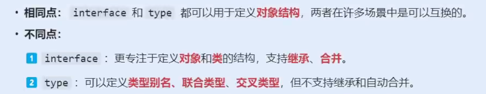

# 复习类（class）相关知识

和js中的类相似，多了类型声明

```ts
class Person {
    name: string;
    age: number;
    constructor(name: string, age: number) {
        this.name = name;
        this.age = age;
    }
    greet() {
        console.log(`Hello, my name is ${this.name} and I am ${this.age} years old.`);
    }
}

let carPerson = new Person("Ford", 2014);
carPerson.greet();

class Student extends Person {
    grade: string;
    constructor(name:string, age:number, grade:string){
        super(name, age);
        this.grade = grade;
    }
    study() {
        console.log(`${this.grade}的${this.name}努力学习中`)
    }
    // 重写父类的方法
    override greet() {
        console.log(`Hello, 我是学生, my name is ${this.name} and I am ${this.age} years old.`);
    }
}

let s1 = new Student("李", 16, "高三");
s1.study();
s1.greet();
```

## 属性修饰符

- public
- protected
- private
- readonly


## 属性的简写形式

```ts
// 简写前
class Person1 {
    // 这里的 public 和 private 在语法上可以省略，省略则默认为 public
    public name: string;
    private age: number;
    constructor(name: string, age: number) {
        this.name = name;
        this.age = age;
    }
}

// 简写后
class Person2 {
    // 这里的 public 和 private 在语法上不可以省略
    constructor(public name: string, private age: number) {
    }
}

// 可换行
class Person2 {
    constructor(
        // 这里的 public 和 private 在语法上不可以省略
        public name: string,
        private age: number
    ) { }
}
```

## 抽象（abstract）类


```ts
abstract class Package {
    // 构造方法
    constructor(public weight: number) { }
    // 抽象方法
    abstract calculate(): number
    // 具体方法
    printPackage() {
        console.log(`weight: ${this.weight}, fee: ${this.calculate()}`);
    }
}

// 实现抽象类
class StandardPackage extends Package {
    constructor(
        weight: number,
        public unitPrice: number
    ) { super(weight) }
    // 实现抽象方法
    calculate(): number {
        return this.weight * this.unitPrice;
    }
}

// 实现抽象类
class ExpressPackage extends Package {
    constructor(
        weight: number,
        public unitPrice: number,
        public additional: number
    ) { super(weight) }
    // 实现抽象方法
    calculate(): number {
        if (this.weight > 10) {
            return this.weight * this.unitPrice + (this.weight - 10) * this.additional;
        } else {
            return this.weight * this.unitPrice;
        }
    }
}

const s1 = new StandardPackage(10, 5);
s1.printPackage();
const e1 = new ExpressPackage(13, 8, 2);
e1.printPackage();
```


## 接口（interface）


### 接口定义类结构

```ts
// 接口
interface PersonInterface {
    name: string;
    age: number;
    speak(n: number): void;
}

// 实现接口
class Person implements PersonInterface {
    constructor(
        public name: string,
        public age: number
    ) { }
    speak(n: number): void {
        for(let index = 0; index < n; index++){
            console.log(`Hello, my name is ${this.name} and I am ${this.age} years old.`);
        }
    }
}

const p1 = new Person('tom', 18);
p1.speak(3);
```

### 接口定义对象结构

```ts
interface UserInterface {
    name: string;
    readonly gender: string;
    age?: number;
    run: (n: number) => void
}

// const a: number = 1;
// 把接口当成类型来用
const user: UserInterface = {
    name: "kong",
    gender: "male",
    age: 18,
    run(n) {
        console.log(`奔跑了${n}米`);
    }
};
```

### 接口定义函数结构

```ts
interface CountInterface {
    (a: number, b: number): number;
}

const count:CountInterface = (x,y) => {
    return x + y;
}
```

### 接口之间的继承

```ts
interface PersonInterface {
    name: string;
    age: number;
}

interface StudentInterface extends PersonInterface {
    grade: string;
}

const stu: StudentInterface = {
    name: 'kong',
    age: 18,
    grade: '高三'
}
```

### 接口自动合并

```ts
interface PersonInterface {
    name: string;
    age: number;
}

interface PersonInterface {
    grade: string;
}

const person: PersonInterface = {
    name: 'kong',
    age: 18,
    grade: '高三'
}
```

### 总结


# 一些相似概念的区别

## interface 与 type 的区别



### 相同点

在这个示例中，`interface` 和 `type` 都定义了对象结构，可互换
```ts
// 使用 interface 定义 Person 对象
interface PersonInterface {
    name: string;
    age: number;
    speak(): void;
}

// 使用 type 定义 Person 对象
type PersonType = {
    name: string;
    age: number;
    speak(): void;
}

let p1: PersonInterface = {
    name: 'tom',
    age: 18,
    speak(){
        console.log(`I am ${this.name}`);
    }
}

let p2: PersonType = {
    name: 'tom',
    age: 18,
    speak(){
        console.log(`I am ${this.name}`);
    }
}
```

### 不同点

使用 `interface`：
```ts
interface PersonInterface {
    name: string;
    age: number;
}

interface PersonInterface {
    // 效果等同 speak(): void;
    speak: () => void;
}

interface StudentInterface extends PersonInterface {
    grade: string;
}

const student: StudentInterface = {
    name: 'kong',
    age: 18,
    grade: '高三',
    speak() {
        console.log(`I am ${this.name}`);
    }
}
```

`interface` 的 **自动合并** 和 **继承**，都可以由 `type` 的 **交叉类型**（`&`）来替代，但是 `interface` 更好用也更直观

使用 `type`：
```ts
type PersonType = {
    name: string;
    age: number;
} & {
    // 效果等同 speak(): void;
    speak: () => void;
};

type StudentType = PersonType & {
    grade: string;
}

const student: StudentType = {
    name: 'kong',
    age: 18,
    grade: '高三',
    speak() {
        console.log(`I am ${this.name}`);
    }
}
```

## interface 与 抽象类 的区别


使用 `interface`：
```ts
interface FlyInterface {
    fly(): void;
}

interface SwimInterface {
    swim(): void;
}

class Duck implements FlyInterface, SwimInterface {
    fly(): void {
        console.log('飞翔');
    }
    swim(): void {
        console.log('游泳');
    }
}
```

使用 `abstract class`：
```ts
abstract class Animal {
    run(): void {
        console.log('跑');
    }
    abstract eat(): void;
}

class Duck extends Animal {
    override eat(): void {
        console.log('吃');
    }
}
```
