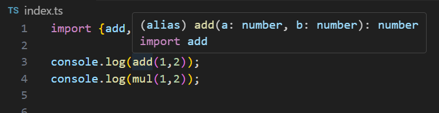

# 泛型（Generics）


## 泛型函数

```ts
function logData<T>(data: T) {
    console.log(data);
}

logData<number>(100);
logData<string>('hi');
```

### 泛型可以有多个

```ts
function logData<T, U>(data1: T, data2: U): T | U {
    console.log(data1, data2);
    return Date.now() % 2 ? data1 : data2;
}

let res1 = logData<number, string>(100, 'hi');
let res2 = logData<string, boolean>('ok', true);
console.log(res1);
console.log(res2);
```

## 泛型接口

```ts
interface PersonInterface<T> {
    name: string;
    age: number;
    extraInfo: T;
}

let p:PersonInterface<string> = {
    name: 'kong',
    age: 18,
    extraInfo: 'good'
}
```

### 给泛型传入高级类型

```ts
interface PersonInterface<T> {
    name: string;
    age: number;
    extraInfo: T;
}

type JobInfo = {
    title: string;
    company: string;
}

let p:PersonInterface<JobInfo> = {
    name: 'kong',
    age: 18,
    extraInfo: {
        title: 'lover',
        company: 'hotcity'
    }
}
```

## 泛型类

```ts
class Person<T> {
    constructor(
        public name: string,
        public age: number,
        public extraInfo: T
    ) { }
    speak () {
        console.log(`Hello, my name is ${this.name} and I am ${this.age} years old.`);
        console.log(this.extraInfo);
    }
}

const p1 = new Person<number>('tom', 30, 250);
p1.speak();
```

# 类型声明文件


新建一个文件，名为`demo.js`：
```js
export function add(a, b) {
    return a + b;
}

export function mul(a, b) {
    return a * b;
}
```

在原先的文件`index.ts`中引入上面的`demo.js`文件：
```ts
import {add, mul} from './demo.js'

console.log(add(1,2));
console.log(mul(1,2));
```
确实能引入`.js`文件并使用，但是引入的东西都是隐式具有**any类型**的，所以需要使用**类型声明文件**来声明类型

新建一个文件，名为`demo.d.ts`：
```ts
declare function add(a: number, b: number): number;
declare function mul(a: number, b: number): number;

export { add, mul };
```

就能看到具体的类型提示了，这就是`demo.d.ts`的作用


在实际开发中，我们不会自己写类型声明文件，而是使用社区已有的类型声明文件，比如`@types/jquery`，`@types/react`等

## exports is not defined 错误

[TS文件编译错误Uncaught ReferenceError: exports is not defined以及应对方案](https://www.cnblogs.com/chenyingzuo/p/12734062.html)


解决方法：

在`tsconfig.json`文件中注释掉这一行：
```json
// "module": "commonjs",
```

然后，在`index.html`文件中修改`<script>`标签的`type`属性：
```html
<script type="module" src="index.js"></script>
```

然后，刷新网页即可


具体原理，在 **webpack** 中讲


---


学习视频
https://www.bilibili.com/video/BV1YS411w7Bf

P4

