# 在windows中打开GUI界面

## code .
Vscode

## gedit
文本编辑器

## IDEA

好像不能用命令行的方式打开，暂时在windows系统中点击图标


我按照这个教程安装的：
[网页链接](https://juejin.cn/post/6966630345915498526)

# windows下的WSL管理命令

## 查看、安装、运行子系统

查看已安装的子系统
```wsl -l -v```

查看可安装的子系统
```wsl -l -o```
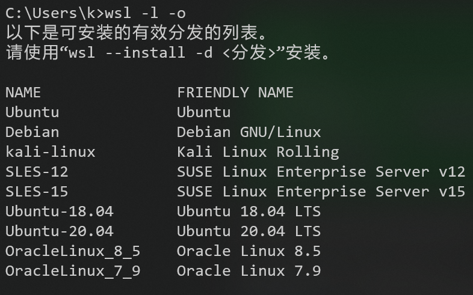

安装指定的发行版
```wsl --install -d <Distribution Name>```
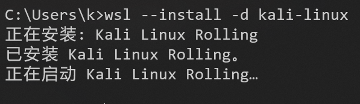

运行指定的子系统
```wsl -d <Distribution Name>```
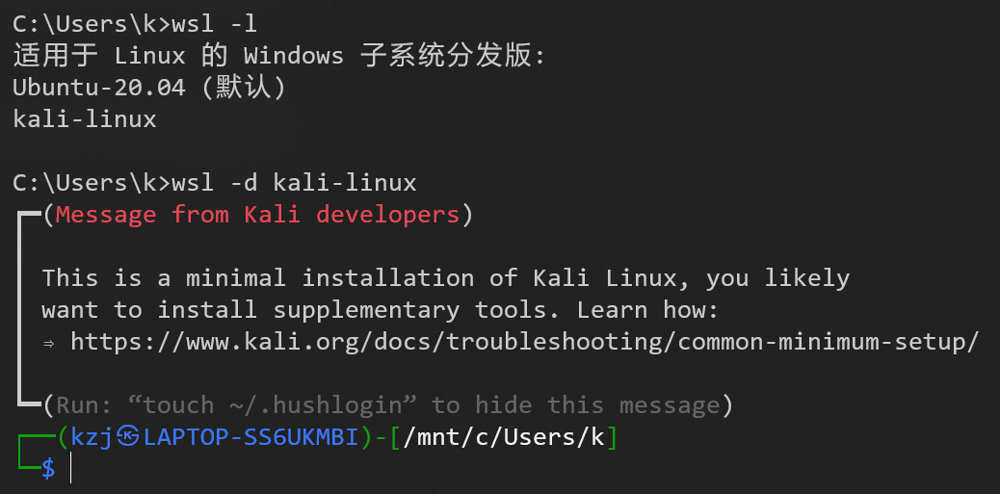

## 备份、还原子系统

```wsl --export Ubuntu-20.04 D:\Ubuntu-20.04.tar```
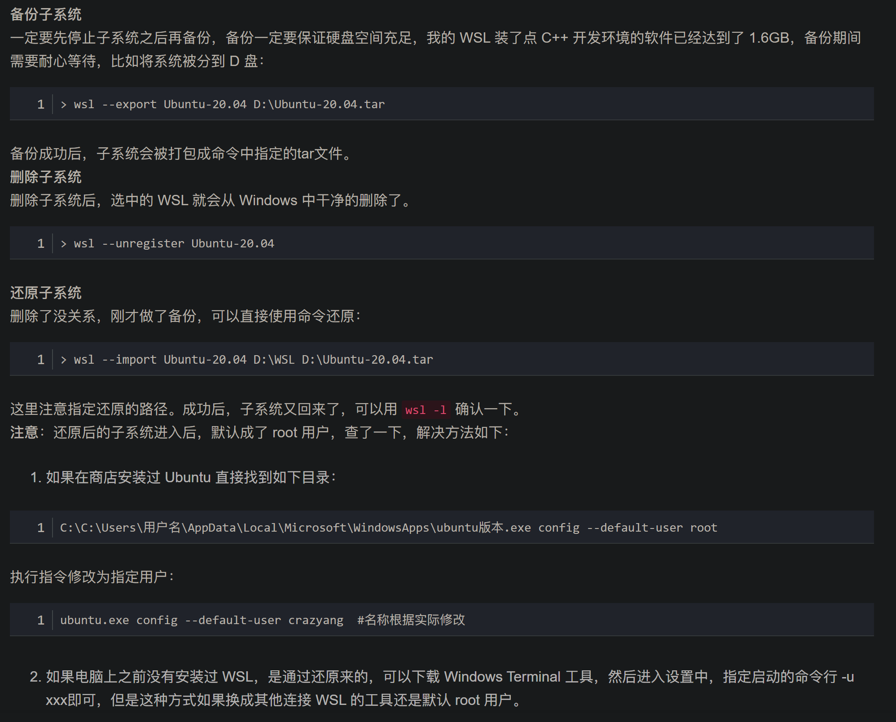

## 更改子系统文件的位置

看到kali子系统文件默认位置在C盘
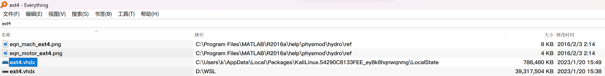

开始迁移，从C盘迁移到D盘以节省空间：
1. 导出
2. 注销原来的
3. 导入

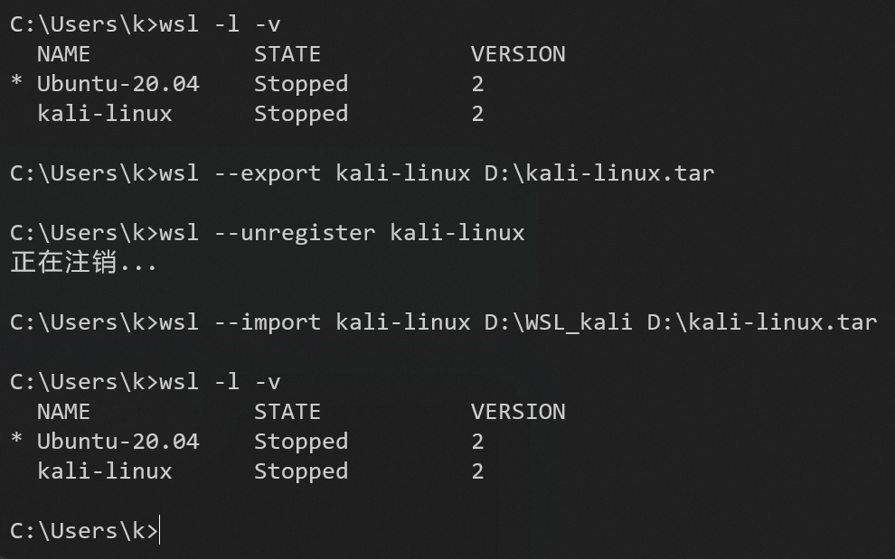

看到kali子系统文件迁移到了D盘
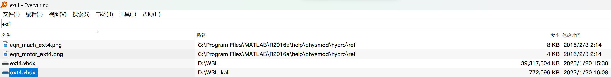

# zsh

```sudo apt install zsh```

## 安装 oh-my-zsh

[ohmyzsh官网](https://ohmyz.sh/)里面有安装教程

配置文件位置如图
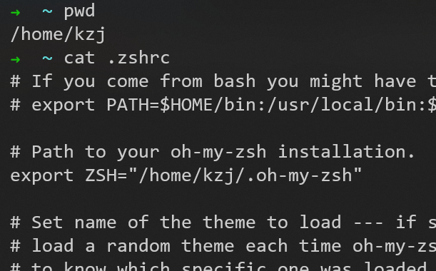

### 安装 plugin

oh-my-zsh的内置插件可以在```～/.oh-my-zsh/plugins```中查看（这样还不能使用，还需要添加到配置文件中）
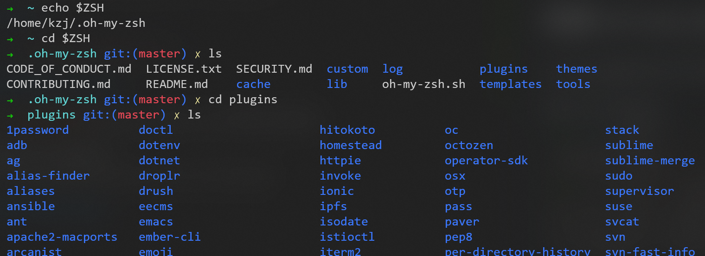

这里用安装```zsh-syntax-highlighting```插件来举例：

1. 使用命令```git clone https://github.com/zsh-users/zsh-syntax-highlighting.git ${ZSH_CUSTOM:-~/.oh-my-zsh/custom}/plugins/zsh-syntax-highlighting ```，把插件下载到本地的```~/.oh-my-zsh/custom/plugins```目录

2. 在配置文件```.zshrc```中，把```zsh-syntax-highlighting```加入插件列表
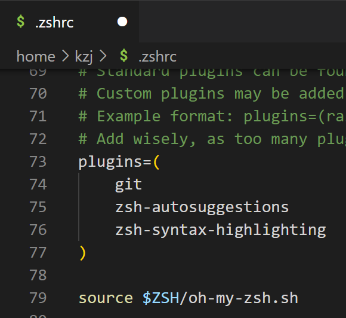

3. 开启新的Shell或执行```source ~/.zshrc```，就可以开始体验插件了

### 我选择的插件

```
plugins=(
    git
    zsh-autosuggestions
    zsh-syntax-highlighting
    safe-paste
    colored-man-pages
    history-substring-search
)
 ```

# wsl网络

## wsl和windows之间的网络访问

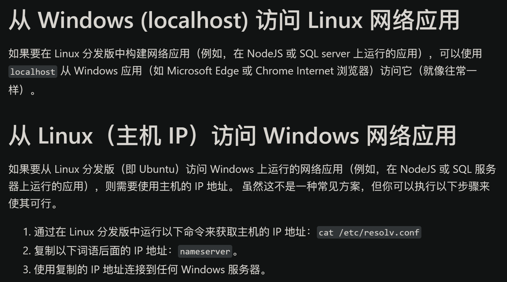

## 多个子系统共用一个IP地址

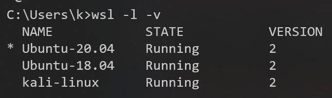

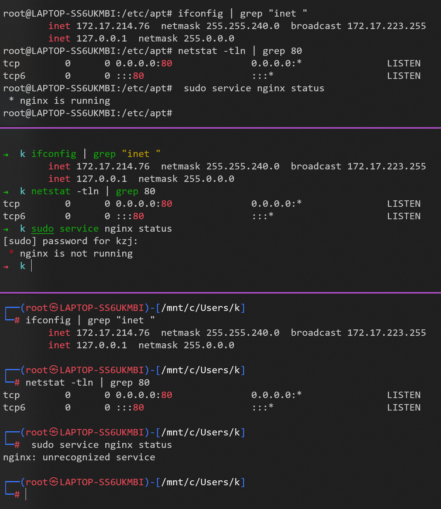

WSL 2 不支持将每个 Linux 系统分配独立的 IP 地址
在 WSL 2 中，所有的 Linux 系统都共享同一个 IP 地址

# 释放wsl占用空间

[教程](https://juejin.cn/post/7148427154194169892)

先在wsl子系统中清理
清理完后，还需主动压缩wsl空间。diskpart操作有风险，注意备份ext4.vhdx

```shell
wsl --shutdown
diskpart
select vdisk file="自己的目录\ext4.vhdx"
attach vdisk readonly
compact vdisk
detach vdisk
exit
 ```

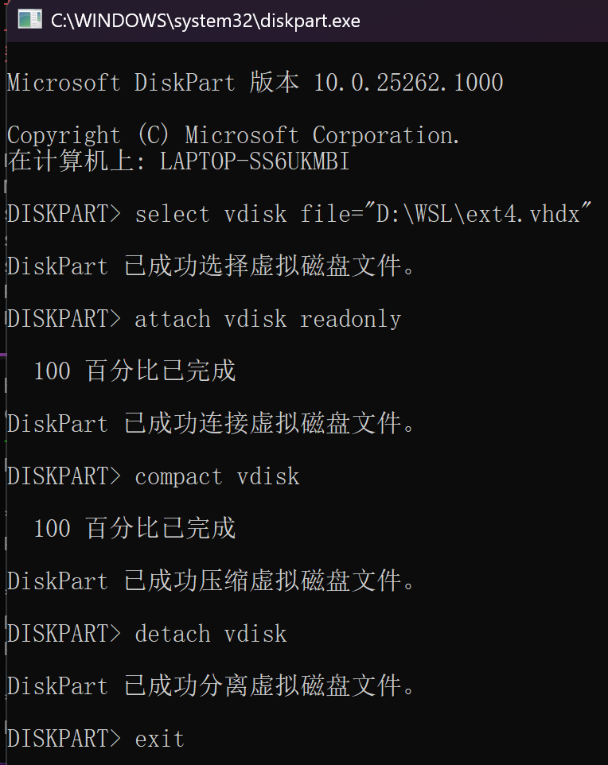


