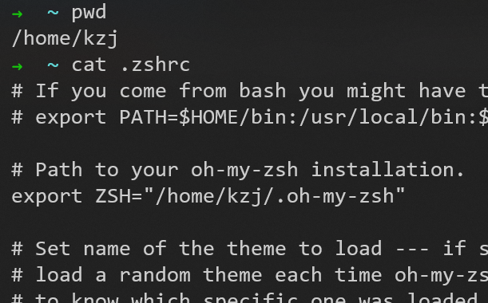
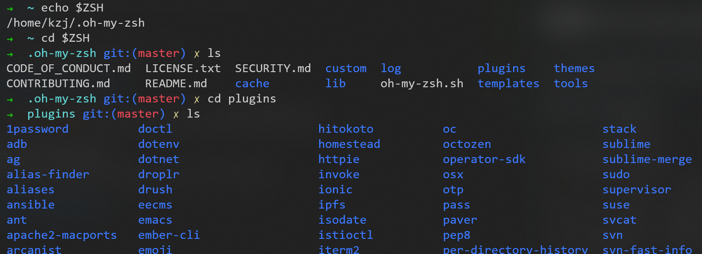

# 在windows中打开GUI界面

## code .
Vscode

## gedit
文本编辑器

## IDEA

好像不能用命令行的方式打开，暂时在windows系统中点击图标


# windows下的WSL管理命令


# zsh

```sudo apt install zsh```

## 安装 oh-my-zsh

[ohmyzsh官网](https://ohmyz.sh/)里面有安装教程

配置文件位置如图


### 安装 plugin

oh-my-zsh的内置插件可以在```～/.oh-my-zsh/plugins```中查看（这样还不能使用，还需要添加到配置文件中）


这里用安装```zsh-syntax-highlighting```插件来举例：

1. 使用命令```git clone https://github.com/zsh-users/zsh-syntax-highlighting.git ${ZSH_CUSTOM:-~/.oh-my-zsh/custom}/plugins/zsh-syntax-highlighting ```，把插件下载到本地的```~/.oh-my-zsh/custom/plugins```目录

2. 在配置文件```.zshrc```中，把```zsh-syntax-highlighting```加入插件列表


3. 开启新的Shell或执行```source ~/.zshrc```，就可以开始体验插件了

### 我选择的插件

```
plugins=(
    git
    zsh-autosuggestions
    zsh-syntax-highlighting
    safe-paste
    colored-man-pages
    history-substring-search
)
 ```


